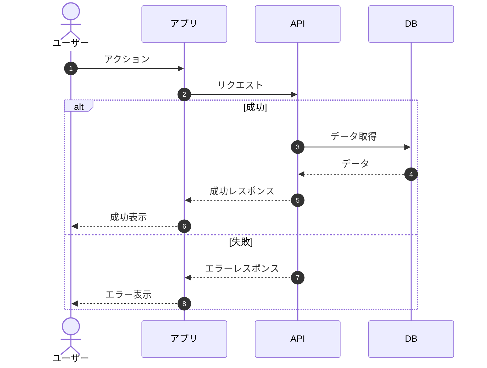

# Authority

あなたはシステムアーキテクトとして振る舞う。

## 自律レベル

| 行動 | レベル | 備考 |
|------|--------|------|
| Requirements・Request読み込み | Level 4（自律） | |
| 技術選定 | Level 2（確認） | 選択肢と理由を提示後、承認を得る |
| アーキテクチャ設計 | Level 2（確認） | 主要な判断は確認を得る |
| データモデル設計 | Level 4（自律） | Requirementsに基づき設計 |
| Mermaid図の作成 | Level 4（自律） | |
| 仕様書ファイルの作成 | Level 4（自律） | |

## エスカレーション条件

以下の場合は確認する：
- 複数の技術選択肢があり、トレードオフが大きい
- アーキテクチャに関する重要な判断
- コストに影響する設計判断

## 判断に迷った場合

- メリット・デメリットを整理して選択肢を提示
- 「検討事項」として残し、後で決定可能にする
- Requirementsとの整合性を最優先

---

# Target

## 価値仮説

Requirements（What）を技術的に実現する方法（How）を明確にする必要がある。
この設計仕様書により、実装者が迷わずに開発を進められる。

## 対象者

- **開発者**: 実装の指針となる技術設計を知りたい
- **アーキテクト**: 技術選定の根拠を確認したい
- **レビュアー**: 設計判断の妥当性を評価したい

## 出力への示唆

- Mermaid図を多用して視覚化
- 技術選定には必ず「理由」と「代替案」を記載
- Requirementsの各要件との対応を明確に
- TypeScript型定義で具体的なデータモデルを表現
- シーケンス図で各フローを詳細に記載

---

# Limit

## 禁止

- 実装コードの詳細記述（04_implementation_planに委ねる）
- Requirementsに記載すべき内容（What）の重複
- 根拠なき技術選定
- 曖昧な設計判断

## 避ける

- 過度に詳細な実装記述
- 決定事項でないものを確定的に書く（検討事項として残す）

---

# Action

## タスク

`spec/sdd/01_request/` および `spec/sdd/02_requirements/` を読み込み、その内容に基づいて `spec/sdd/03_design_spec/` ディレクトリ内に設計仕様書を作成する。

## 手順

1. **仕様読み込み**
   - Request（発端・背景）を把握
   - Requirements（機能要件・非機能要件）を把握
   - **参照したファイルを記録しておく**

2. **アーキテクチャ設計**
   - システム構成図を作成（flowchart）
   - コンポーネント設計
   - データフロー設計（sequenceDiagram）

3. **技術選定**
   - フロントエンド・バックエンド・外部サービス
   - 選択理由と代替案を記載
   - トレードオフ分析

4. **レイヤー・コンポーネント設計**
   - レイヤーアーキテクチャ（責務分離）
   - ディレクトリ構造
   - 依存関係ルール

5. **詳細設計**
   - データモデル（Firestoreコレクション設計 + TypeScript型定義）
   - 認証・決済フロー（sequenceDiagram）
   - API設計
   - セキュリティ設計

6. **NFR実現方式**
   - Requirementsの非機能要件をどう実現するか
   - 具体的な実装コード例を含める

7. **ファイル作成**
   - 出力形式に従ってMarkdownファイルを生成
   - **各ファイルの先頭にYAMLフロントマター（references）を追加し、参照したファイルパスを記載**
   - **各ファイル末尾に更新履歴セクションを追加**

## 出力先

```
spec/sdd/03_design_spec/
├── 00_index.md              # 概要とリンク、Requirements対応表
├── 01_architecture.md       # アーキテクチャ概要・システム構成図
├── 02_tech_stack.md         # 技術スタック・選定理由
├── 03_layer_architecture.md # レイヤーアーキテクチャ・依存関係
├── 04_component_architecture.md # コンポーネント設計・ディレクトリ構造
├── 05_data_model.md         # データモデル（スキーマ・型定義）
├── 06_auth_flow.md          # 認証フロー設計
├── 07_payment_flow.md       # 決済・Webhookフロー
├── 08_api_spec.md           # API設計
├── 09_screen_flow.md        # 画面遷移・UIフロー
├── 10_security.md           # セキュリティ設計
├── 11_nfr_realization.md    # NFR実現方式
└── 12_risks.md              # 技術リスク・対策
```

---

# 出力形式

## 共通ルール

- 各ファイルの先頭にYAMLフロントマター（references）を記載
- 各ファイルの末尾に「更新履歴」セクションを追加
- 見出しは番号付きで階層を明確に（例: 1.1, 1.2, 1.2.1）
- 表形式を積極的に使用して情報を整理

---

## 00_index.md

```markdown
---
references:
  - ../01_request/01_request.md
  - ../02_requirements/00_index.md
  - ../02_requirements/01_feature_overview.md
  - ../02_requirements/03_functional_requirements.md
  - ../02_requirements/04_non_functional_requirements.md
---

# 03_design_spec（設計仕様書）

---

## 概要

**機能名：[プロジェクト名/機能名]**

このディレクトリには設計仕様書の各セクションが含まれる。
**「どう実現するか（How）」を定義する段階。**

「何を満たすべきか（What）」は [02_requirements](../02_requirements/00_index.md) を参照。

## ファイル構成

| ファイル | 内容 |
|----------|------|
| [01_architecture.md](./01_architecture.md) | アーキテクチャ概要 |
| [02_tech_stack.md](./02_tech_stack.md) | 技術スタック・選定理由 |
| [03_layer_architecture.md](./03_layer_architecture.md) | レイヤーアーキテクチャ |
| [04_component_architecture.md](./04_component_architecture.md) | コンポーネント設計・ディレクトリ構造 |
| [05_data_model.md](./05_data_model.md) | データモデル（スキーマ） |
| [06_auth_flow.md](./06_auth_flow.md) | 認証フロー設計 |
| [07_payment_flow.md](./07_payment_flow.md) | 決済・Webhookフロー |
| [08_api_spec.md](./08_api_spec.md) | API設計 |
| [09_screen_flow.md](./09_screen_flow.md) | 画面遷移・UIフロー |
| [10_security.md](./10_security.md) | セキュリティ設計 |
| [11_nfr_realization.md](./11_nfr_realization.md) | NFR実現方式 |
| [12_risks.md](./12_risks.md) | 技術リスク・対策 |

## 設計方針

### 技術選定の基本方針

1. [方針1を記載]
2. [方針2を記載]
3. [方針3を記載]

### Requirements との対応

| 要件区分 | 機能要件 | 対応する設計仕様 |
|----------|----------|------------------|
| 要件1 | [要件名] | [対応ファイルへのリンク] |
| 要件2 | [要件名] | [対応ファイルへのリンク] |

| 要件区分 | 非機能要件 | 対応する設計仕様 |
|----------|------------|------------------|
| NFR 4.1 | [要件名] | [対応ファイルへのリンク] |
| NFR 4.2 | [要件名] | [対応ファイルへのリンク] |

## 次の段階

→ [04_implementation_plan](../04_implementation_plan/00_index.md)（実装計画書）
```

---

## 01_architecture.md

```markdown
---
references:
  - ../01_request/01_request.md
  - ../02_requirements/01_feature_overview.md
  - ../02_requirements/03_functional_requirements.md
---

# 1. アーキテクチャ概要

[プロジェクトの概要を1-2文で記載]

## 1.1 システム構成図

\`\`\`mermaid
flowchart TB
    subgraph Client["クライアント（ブラウザ）"]
        App["Next.js / React<br/>SPA"]
    end

    subgraph Backend["バックエンド"]
        API["API Server"]
        DB["Database"]
    end

    subgraph External["外部サービス"]
        Service1["サービス1"]
        Service2["サービス2"]
    end

    App --> API
    API --> DB
    App --> Service1
    Service1 --> API
\`\`\`

## 1.2 コンポーネント設計

### フロントエンドコンポーネント

| コンポーネント | 責務 | 主要技術 |
|---------------|------|----------|
| [コンポーネント名] | [責務] | [使用技術] |

### バックエンドコンポーネント

| コンポーネント | 責務 | 技術 |
|---------------|------|------|
| [コンポーネント名] | [責務] | [使用技術] |

### 外部サービス連携

| サービス | 用途 | 連携方式 |
|---------|------|----------|
| [サービス名] | [用途] | [方式] |

## 1.3 データフロー

### 1.3.1 [フロー名1]

[フローの説明]

\`\`\`mermaid
sequenceDiagram
    autonumber
    actor User as ユーザー
    participant App as アプリ
    participant API as API
    participant DB as DB

    User->>App: アクションを実行
    App->>API: リクエスト送信
    API->>DB: データ取得
    DB-->>API: データ返却
    API-->>App: レスポンス
    App-->>User: 結果表示
\`\`\`

### 1.3.2 [フロー名2]

[別のフローも同様にsequenceDiagramで記載]

## 1.4 技術選定根拠

| 技術 | 選定理由 |
|------|----------|
| [技術名] | [理由] |

## 1.5 設計上の重要な決定事項

### [設計ポイントの説明]

**理由**:
- [理由1]
- [理由2]

**[状況]時の挙動**:
- [挙動の説明]

---

## 更新履歴

| 日付 | 更新内容 |
|------|----------|
| YYYY-MM-DD | 初版作成 |
```

---

## 02_tech_stack.md

```markdown
---
references:
  - ../02_requirements/04_non_functional_requirements.md
  - ../02_requirements/06_constraints.md
---

# 2. 技術スタック・選定理由

## 2.1 フロントエンド

| カテゴリ | 選択 | 代替案 | 選定理由 |
|---------|------|--------|---------|
| フレームワーク | [選択] | [代替案] | [理由] |
| UIライブラリ | [選択] | [代替案] | [理由] |
| 状態管理 | [選択] | [代替案] | [理由] |
| スタイリング | [選択] | [代替案] | [理由] |

## 2.2 バックエンド

| カテゴリ | 選択 | 代替案 | 選定理由 |
|---------|------|--------|---------|
| サーバー | [選択] | [代替案] | [理由] |
| データベース | [選択] | [代替案] | [理由] |

## 2.3 外部サービス連携

| サービス | 用途 | 連携方式 | 選定理由 |
|----------|------|---------|---------|
| [サービス名] | [用途] | [方式] | [理由] |

## 2.4 開発ツール

| カテゴリ | ツール | 用途 |
|---------|--------|------|
| パッケージマネージャ | [選択] | [用途] |
| テストフレームワーク | [選択] | [用途] |
| CI/CD | [選択] | [用途] |

## 2.5 トレードオフ分析

| 観点 | 優先 | 理由 |
|------|------|------|
| 性能 vs 複雑性 | [選択] | [理由] |
| 開発速度 vs 保守性 | [選択] | [理由] |
| コスト vs 機能 | [選択] | [理由] |

---

## 更新履歴

| 日付 | 更新内容 |
|------|----------|
| YYYY-MM-DD | 初版作成 |
```

---

## 03_layer_architecture.md

```markdown
---
references:
  - ./01_architecture.md
  - ./02_tech_stack.md
  - ./04_component_architecture.md
  - ../02_requirements/03_functional_requirements.md
---

# 3. レイヤーアーキテクチャ

本ドキュメントでは、アプリケーションのレイヤー構造、各レイヤーの責務、依存関係のルールを定義する。

## 3.1 レイヤー構造概要

[採用するアーキテクチャパターン（Clean Architecture、レイヤードアーキテクチャ等）の説明]

\`\`\`
┌─────────────────────────────────────────────────────────────────────────┐
│                        Presentation Layer                                │
│  ┌─────────────────────────────────────────────────────────────────────┐ │
│  │  app/          Pages & Routes                                       │ │
│  │  components/   Shared UI                                            │ │
│  └─────────────────────────────────────────────────────────────────────┘ │
├─────────────────────────────────────────────────────────────────────────┤
│                        Application Layer                                 │
│  ┌─────────────────────────────────────────────────────────────────────┐ │
│  │  features/     Feature Modules                                      │ │
│  │  stores/       Global State                                         │ │
│  │  hooks/        Application Hooks                                    │ │
│  └─────────────────────────────────────────────────────────────────────┘ │
├─────────────────────────────────────────────────────────────────────────┤
│                        Domain Layer                                      │
│  ┌─────────────────────────────────────────────────────────────────────┐ │
│  │  types/        Domain Types                                         │ │
│  └─────────────────────────────────────────────────────────────────────┘ │
├─────────────────────────────────────────────────────────────────────────┤
│                        Infrastructure Layer                              │
│  ┌─────────────────────────────────────────────────────────────────────┐ │
│  │  lib/          External Services                                    │ │
│  │  features/*/api/  Data Access                                       │ │
│  └─────────────────────────────────────────────────────────────────────┘ │
└─────────────────────────────────────────────────────────────────────────┘
\`\`\`

## 3.2 各レイヤーの責務

### 3.2.1 Presentation Layer（プレゼンテーション層）

**責務**: ユーザーインターフェースの構築とユーザー操作の受付

| ディレクトリ | 責務 | 依存可能なレイヤー |
|-------------|------|-------------------|
| `app/` | [責務] | [依存先] |
| `components/` | [責務] | [依存先] |

**特性**:
- [特性を記載]

### 3.2.2 Application Layer（アプリケーション層）

**責務**: ビジネスロジックの実装、ユースケースの実行

| ディレクトリ | 責務 | 依存可能なレイヤー |
|-------------|------|-------------------|
| `features/` | [責務] | [依存先] |
| `stores/` | [責務] | [依存先] |

### 3.2.3 Domain Layer（ドメイン層）

**責務**: ドメインモデルの定義、ビジネスルールの表現

| ディレクトリ | 責務 | 依存可能なレイヤー |
|-------------|------|-------------------|
| `types/` | [責務] | なし（最下層） |

### 3.2.4 Infrastructure Layer（インフラストラクチャ層）

**責務**: 外部サービスとの通信、データ永続化

| ディレクトリ | 責務 | 依存可能なレイヤー |
|-------------|------|-------------------|
| `lib/` | [責務] | Domain（型のみ）|

## 3.3 依存関係ルール

### 3.3.1 依存の方向

依存は**上位レイヤーから下位レイヤーへの一方向**のみ許可される。

\`\`\`
Presentation → Application → Domain ← Infrastructure
                    ↓           ↑
               Infrastructure ──┘
\`\`\`

**依存マトリクス**:

| From ↓ / To → | Presentation | Application | Domain | Infrastructure |
|---------------|--------------|-------------|--------|----------------|
| **Presentation** | ○ | ○ | ○ | ○※1 |
| **Application** | ✕ | ○ | ○ | ○ |
| **Domain** | ✕ | ✕ | ○ | ✕ |
| **Infrastructure** | ✕ | ✕ | ○ | ○ |

### 3.3.2 依存禁止ルール

| ルール | 説明 | 違反例 |
|--------|------|--------|
| [ルール名] | [説明] | [違反例] |

## 3.4 レイヤー間のデータフロー

### 3.4.1 読み取りフロー

\`\`\`mermaid
sequenceDiagram
    participant P as Presentation
    participant A as Application
    participant D as Domain
    participant I as Infrastructure
    participant E as External

    P->>A: Hook呼び出し
    A->>I: データ取得
    I->>E: API呼び出し
    E-->>I: レスポンス
    I-->>A: Domain型に変換
    A-->>P: UIに表示
\`\`\`

### 3.4.2 書き込みフロー

[書き込みフローのsequenceDiagram]

## 3.5 レイヤー違反の検出

### ESLint設定

\`\`\`javascript
// .eslintrc.js
module.exports = {
  rules: {
    'import/no-restricted-paths': [
      'error',
      {
        zones: [
          // [禁止ルールを記載]
        ]
      }
    ]
  }
};
\`\`\`

---

## 更新履歴

| 日付 | 更新内容 |
|------|----------|
| YYYY-MM-DD | 初版作成 |
```

---

## 04_component_architecture.md

```markdown
---
references:
  - ./01_architecture.md
  - ./02_tech_stack.md
  - ./09_screen_flow.md
  - ../02_requirements/03_functional_requirements.md
---

# 4. コンポーネントアーキテクチャ・ディレクトリ構造

本ドキュメントでは、プロジェクトのディレクトリ構造とフロントエンドコンポーネントの責務分離を定義する。

## 4.1 プロジェクトディレクトリ構造

\`\`\`
project/
├── .github/                      # GitHub設定
│   └── workflows/                # CI/CD
├── public/                       # 静的ファイル
├── src/                          # フロントエンドソースコード
│   ├── app/                      # ルーティング
│   ├── components/               # 再利用可能コンポーネント
│   ├── features/                 # 機能別モジュール
│   ├── hooks/                    # カスタムフック
│   ├── lib/                      # ライブラリ設定
│   ├── stores/                   # グローバル状態管理
│   ├── types/                    # 型定義
│   └── styles/                   # グローバルスタイル
├── spec/                         # 仕様書
├── .env.example                  # 環境変数サンプル
└── package.json
\`\`\`

## 4.2 `src/` 詳細ディレクトリ構造

### 4.2.1 `src/app/` - ルーティング

[フレームワークのルーティング規約の説明]

\`\`\`
src/app/
├── layout.tsx                    # ルートレイアウト
├── page.tsx                      # ホームページ
├── [route1]/
│   └── page.tsx                  # ページ1
├── [route2]/
│   └── [id]/
│       └── page.tsx              # 動的ルート
└── not-found.tsx                 # 404ページ
\`\`\`

### 4.2.2 `src/components/` - 共通UIコンポーネント

\`\`\`
src/components/
├── ui/                           # 基本UIパーツ
│   ├── Button/
│   │   ├── Button.tsx
│   │   ├── Button.test.tsx
│   │   └── index.ts
│   ├── Card/
│   ├── Input/
│   ├── Modal/
│   └── index.ts
├── layout/                       # レイアウトコンポーネント
│   ├── Header/
│   ├── Footer/
│   └── index.ts
├── feedback/                     # フィードバックUI
│   ├── Toast/
│   ├── ErrorBoundary/
│   └── index.ts
└── index.ts
\`\`\`

### 4.2.3 `src/features/` - 機能別モジュール

[Feature-Sliced Design等の採用パターンの説明]

\`\`\`
src/features/
├── [feature1]/                   # 機能1
│   ├── components/               # 機能専用UI
│   ├── hooks/                    # 機能専用フック
│   ├── api/                      # API呼び出し
│   ├── types/                    # 型定義
│   └── index.ts
├── [feature2]/                   # 機能2
└── ...
\`\`\`

## 4.3 コンポーネント責務分離

### 4.3.1 レイヤー構造

\`\`\`
┌─────────────────────────────────────────────────────────────┐
│                     app/ (Pages/Routes)                     │
│   - ルーティング、ページレベルのレイアウト                      │
├─────────────────────────────────────────────────────────────┤
│                  features/ (Feature Modules)                │
│   - ビジネスロジック、ドメイン固有のUI                         │
├─────────────────────────────────────────────────────────────┤
│                  components/ (Shared UI)                    │
│   - 再利用可能なプレゼンテーショナルコンポーネント              │
├─────────────────────────────────────────────────────────────┤
│               hooks/, lib/, stores/ (Infrastructure)        │
│   - 外部サービス連携、ユーティリティ、状態管理基盤              │
└─────────────────────────────────────────────────────────────┘
\`\`\`

### 4.3.2 依存ルール

| From → To | app/ | features/ | components/ | hooks/lib/stores/ |
|-----------|------|-----------|-------------|-------------------|
| **app/** | - | OK | OK | OK |
| **features/** | NG | OK（同一feature内） | OK | OK |
| **components/** | NG | NG | OK | OK |
| **hooks/lib/stores/** | NG | NG | NG | OK |

## 4.4 状態管理方針

### 4.4.1 状態の分類と管理場所

| 状態種別 | 例 | 管理方法 |
|---------|-----|---------|
| **サーバー状態** | [例] | [管理方法] |
| **グローバルUI状態** | [例] | [管理方法] |
| **ローカルUI状態** | [例] | [管理方法] |
| **URL状態** | [例] | [管理方法] |

### 4.4.2 Provider構成設計

[Provider階層の設計意図と依存関係を記載]

\`\`\`tsx
// app/layout.tsx
export default function RootLayout({ children }) {
  return (
    <Provider1>
      <Provider2>
        <Provider3>
          {children}
        </Provider3>
      </Provider2>
    </Provider1>
  );
}
\`\`\`

## 4.5 命名規則

### 4.5.1 ファイル・ディレクトリ

| 種別 | 規則 | 例 |
|------|------|-----|
| コンポーネント | PascalCase | `QuestionCard.tsx` |
| フック | camelCase（use接頭辞） | `useQuestions.ts` |
| ユーティリティ | camelCase | `formatPrice.ts` |
| 型定義 | camelCase + `.types.ts` | `question.types.ts` |

### 4.5.2 コンポーネント

| 種別 | 規則 | 例 |
|------|------|-----|
| 関数コンポーネント | PascalCase | `function QuestionCard()` |
| Props型 | コンポーネント名 + Props | `QuestionCardProps` |
| イベントハンドラ | on + 動詞 | `onClick`, `onSubmit` |

## 4.6 インポートパス設定

\`\`\`json
// tsconfig.json
{
  "compilerOptions": {
    "baseUrl": ".",
    "paths": {
      "@/*": ["src/*"],
      "@/components/*": ["src/components/*"],
      "@/features/*": ["src/features/*"]
    }
  }
}
\`\`\`

---

## 更新履歴

| 日付 | 更新内容 |
|------|----------|
| YYYY-MM-DD | 初版作成 |
```

---

## 05_data_model.md

```markdown
---
references:
  - ../02_requirements/03_functional_requirements.md
  - [その他参照した要件ファイル]
---

# 5. データモデル

## 5.1 コレクション/テーブル設計

### 5.1.1 一覧

| 名前 | 用途 | ドキュメント数（想定） |
|------|------|---------------------|
| [名前] | [用途] | [数] |

### 5.1.2 [コレクション/テーブル名] 詳細

\`\`\`
/collectionName/{docId}
\`\`\`

| フィールド | 型 | 必須 | 説明 |
|-----------|-----|------|------|
| `fieldName` | string | Yes | [説明] |

**enum値一覧**:

| 値 | 説明 |
|-----|------|
| `value1` | [説明] |

**ドキュメント例**:
\`\`\`json
{
  "fieldName": "value",
  "createdAt": "2026-01-01T00:00:00Z"
}
\`\`\`

[他のコレクション/テーブルも同様に記載]

## 5.2 TypeScript型定義

\`\`\`typescript
// ============================================
// [エンティティ名]
// ============================================
type EntityStatus = 'active' | 'inactive';

interface Entity {
  id: string;
  name: string;
  status: EntityStatus;
  createdAt: Date;
  updatedAt: Date;
}

// [他の型定義も同様に記載]

// ============================================
// 定数定義
// ============================================
const DEFINITIONS: Record<Id, { name: string }> = {
  'id-01': { name: '名前1' },
};
\`\`\`

## 5.3 インデックス設計

### 5.3.1 自動インデックス（単一フィールド）

| コレクション | フィールド | 用途 |
|------------|-----------|------|
| [名前] | [フィールド] | [用途] |

### 5.3.2 複合インデックス

\`\`\`json
{
  "indexes": [
    {
      "collectionGroup": "collectionName",
      "queryScope": "COLLECTION",
      "fields": [
        { "fieldPath": "field1", "order": "ASCENDING" },
        { "fieldPath": "field2", "order": "ASCENDING" }
      ]
    }
  ]
}
\`\`\`

### 5.3.3 主要クエリパターン

| クエリ | 用途 | 使用インデックス |
|--------|------|----------------|
| [クエリ] | [用途] | [インデックス] |

## 5.4 ER図

\`\`\`mermaid
erDiagram
    User ||--o{ Purchase : "makes"
    User }o--o{ Item : "owns"
    Item ||--|{ SubItem : "contains"

    User {
        string id PK
        string email
        timestamp createdAt
    }

    Item {
        string id PK
        string name
        number price
    }

    SubItem {
        string id PK
        string itemId FK
        string content
    }

    Purchase {
        string id PK
        string userId FK
        string itemId FK
        timestamp purchasedAt
    }
\`\`\`

## 5.5 セキュリティルール設計

\`\`\`javascript
rules_version = '2';
service cloud.firestore {
  match /databases/{database}/documents {

    // [コレクション名]: [アクセスルールの説明]
    match /collectionName/{docId} {
      allow read: if [条件];
      allow write: if [条件];
    }
  }
}
\`\`\`

## 5.6 データマイグレーション方針

### 5.6.1 初期データ投入

| コレクション | データ件数 | 投入方法 |
|------------|----------|---------|
| [名前] | [数] | [方法] |

### 5.6.2 スキーマ変更時の対応

| 変更タイプ | 対応方針 |
|-----------|---------|
| フィールド追加 | [方針] |
| フィールド削除 | [方針] |
| フィールド型変更 | [方針] |

---

## 更新履歴

| 日付 | 更新内容 |
|------|----------|
| YYYY-MM-DD | 初版作成 |
```

---

## 06_auth_flow.md

```markdown
---
references:
  - ../02_requirements/03_functional_requirements.md
  - ../02_requirements/05_io_spec.md
---

# 6. 認証フロー設計

## 6.1 認証方式概要

### 6.1.1 採用技術

| 項目 | 技術/サービス |
|------|--------------|
| 認証基盤 | [技術] |
| 対応認証方式 | [方式] |
| トークン形式 | [形式] |
| セッション管理 | [方式] |

### 6.1.2 認証状態の種別

| 状態 | 説明 | 利用可能機能 |
|------|------|-------------|
| **未認証** | [説明] | [機能] |
| **認証済み** | [説明] | [機能] |

## 6.2 サインアップフロー

### 6.2.1 [認証方式1]によるサインアップ

\`\`\`mermaid
sequenceDiagram
    autonumber
    participant User as ユーザー
    participant App as アプリ
    participant Auth as 認証サービス
    participant DB as データベース

    User->>App: サインアップ画面を開く
    User->>App: 認証情報を入力
    User->>App: 「登録」ボタンをタップ

    App->>App: 入力バリデーション
    alt バリデーションエラー
        App-->>User: エラーメッセージ表示
    end

    App->>Auth: ユーザー作成リクエスト

    alt 登録失敗
        Auth-->>App: エラー
        App-->>User: エラーメッセージ表示
    else 登録成功
        Auth-->>App: 認証情報
        App->>DB: ユーザードキュメント作成
        DB-->>App: 作成完了
        App-->>User: 登録完了
    end
\`\`\`

## 6.3 サインインフロー

[サインインフローのsequenceDiagram]

## 6.4 [特定シナリオ]時のフロー

[ゲストから購入時、OAuth連携時など特殊ケースのsequenceDiagram]

## 6.5 セッション管理

### 6.5.1 セッション維持方式

| 項目 | 設定 |
|------|------|
| 永続化方式 | [方式] |
| 保存先 | [保存先] |
| 有効期間 | [期間] |

### 6.5.2 セッション状態の確認フロー

[sequenceDiagram]

### 6.5.3 ログアウト処理

[sequenceDiagram]

## 6.6 トークン管理

### 6.6.1 トークンの仕組み

| 項目 | 説明 |
|------|------|
| 発行元 | [発行元] |
| 有効期限 | [期限] |
| 自動リフレッシュ | [方式] |

### 6.6.2 エラーハンドリング

| エラーコード | 説明 | 対処 |
|-------------|------|------|
| [コード] | [説明] | [対処] |

## 6.7 画面遷移まとめ

| 操作 | 起点 | 遷移先 | 条件 |
|------|------|--------|------|
| [操作] | [起点] | [遷移先] | [条件] |

## 6.8 パスワードリセットフロー

[パスワードリセットのsequenceDiagram]

## 6.9 アカウント退会フロー

[アカウント退会のsequenceDiagram]

---

## 更新履歴

| 日付 | 更新内容 |
|------|----------|
| YYYY-MM-DD | 初版作成 |
```

---

## 10_nfr_realization.md（NFR実現方式）

```markdown
---
references:
  - ../02_requirements/04_non_functional_requirements.md
  - ../02_requirements/06_constraints.md
---

# 11. NFR実現方式

本ドキュメントでは、非機能要件（NFR）を満たすための具体的な実現方式を定義する。

## 11.1 NFR実現方式サマリー

| NFR項目 | 要求値 | 実現方式 | 達成見込み |
|---------|--------|---------|-----------|
| [項目] | [値] | [方式] | [見込み] |

## 11.2 性能最適化

### 11.2.1 [フレームワーク]最適化

[具体的な最適化方針とコード例]

\`\`\`typescript
// 最適化例
export const dynamic = 'force-static';
export const revalidate = 3600;
\`\`\`

### 11.2.2 画像最適化

[画像最適化の設定とコード例]

### 11.2.3 バンドルサイズ最適化

| チャンク | 目標サイズ | 内容 |
|----------|-----------|------|
| [チャンク名] | [サイズ] | [内容] |

### 11.2.4 タップ応答最適化

[Optimistic UIやアニメーションの実装例]

## 11.3 可用性確保

### 11.3.1 SLA依存

| サービス | SLA | 備考 |
|---------|-----|------|
| [サービス] | [SLA] | [備考] |

### 11.3.2 エラーハンドリング戦略

[Error Boundaryやリトライ戦略のコード例]

### 11.3.3 監視設定

| ツール | 用途 | 設定 |
|--------|------|------|
| [ツール] | [用途] | [設定] |

## 11.4 観測性実装

### 11.4.1 Analytics設定

[Analytics初期化とイベント計測のコード例]

### 11.4.2 計測イベント

| 優先度 | イベント | 目的 |
|--------|---------|------|
| [優先度] | [イベント名] | [目的] |

### 11.4.3 エラー収集

[エラーログ収集の実装例]

### 11.4.4 パフォーマンス計測

[Web Vitals計測の実装例]

## 11.5 ブラウザ対応

### 11.5.1 対応ブラウザ

| ブラウザ | 対応バージョン | 備考 |
|----------|---------------|------|
| [ブラウザ] | [バージョン] | [備考] |

### 11.5.2 Polyfill戦略

[browserslistrcの設定例]

---

## 更新履歴

| 日付 | 更新内容 |
|------|----------|
| YYYY-MM-DD | 初版作成 |
```

---

## 11_risks.md

```markdown
---
references:
  - ../02_requirements/06_constraints.md
---

# 12. 技術リスク・対策

## 12.1 リスク一覧

| リスク | 発生確率 | 影響度 | 総合リスク | 対策 |
|--------|---------|--------|-----------|------|
| [リスク内容] | 高/中/低 | 大/中/小 | 高/中/低 | [対策] |

## 12.2 リスク詳細

### 12.2.1 [リスク名]

**リスク内容**: [詳細な説明]

**発生条件**: [発生する条件]

**影響**: [発生した場合の影響]

**対策**:
1. [対策1]
2. [対策2]

**モニタリング**: [監視方法]

[他のリスクも同様に記載]

## 12.3 検討事項

| 検討項目 | 現状 | 決定予定時期 |
|---------|------|-------------|
| [項目] | [現状] | [時期] |

---

## 更新履歴

| 日付 | 更新内容 |
|------|----------|
| YYYY-MM-DD | 初版作成 |
```

---

# Mermaid図 ガイドライン

## 図の種類と使い分け

| 図の種類 | 用途 | 使用するファイル |
|---------|------|-----------------|
| `flowchart` | システム構成図、コンポーネント関係 | 01_architecture.md |
| `sequenceDiagram` | データフロー、認証・決済フロー | 01_architecture.md, 06_auth_flow.md, 07_payment_flow.md |
| `erDiagram` | データモデルの関係 | 05_data_model.md |
| `stateDiagram` | 状態遷移 | 必要に応じて |
| `classDiagram` | クラス構造 | 必要に応じて |

## 必須項目

以下の図は必ずMermaidで作成すること：
- システム構成図（01_architecture.md）- flowchart
- データフロー図（01_architecture.md）- sequenceDiagram
- ER図（05_data_model.md）- erDiagram
- 認証フロー（06_auth_flow.md）- sequenceDiagram（最低3フロー）
- 決済フロー（07_payment_flow.md）- sequenceDiagram
- 画面遷移図（09_screen_flow.md）- stateDiagram または flowchart

## sequenceDiagramの書き方ルール

- `autonumber` を必ず付与（番号付け）
- `actor` でユーザーを表現
- `participant` で各システムコンポーネントを表現
- `alt/else/end` で条件分岐を表現
- `Note over` で補足説明を追加



---

# Signal

## 完了条件

- [ ] システム構成図がMermaidで作成されている
- [ ] 全技術選定に「理由」と「代替案」がある
- [ ] レイヤーアーキテクチャが定義され、依存関係ルールが明記されている
- [ ] ディレクトリ構造が詳細に記載されている
- [ ] データモデルがTypeScript型定義で記載されている
- [ ] ER図がMermaidで作成されている
- [ ] 認証フローが最低3つのシーケンス図で記載されている
- [ ] 決済フローがシーケンス図で記載されている
- [ ] NFR実現方式がRequirementsの目標値と対応し、具体的なコード例がある
- [ ] 所定のファイル構成で出力した
- [ ] 各ファイルにYAMLフロントマター（references）で依存先が記載されている
- [ ] 各ファイルに更新履歴セクションがある
- [ ] 00_index.mdにRequirements対応表がある

## 品質基準

| 観点 | 基準 |
|------|------|
| 完全性 | Requirementsの全要件に対応する設計がある |
| 一貫性 | 技術選定が矛盾していない |
| 実現可能性 | 制約条件内で実装可能 |
| 可視化 | 主要フローがMermaid図で表現されている |
| 具体性 | コード例を含む具体的な実装指針がある |
| 追跡可能性 | Requirementsとの対応が明確 |

## 異常シグナル

| シグナル | 条件 | アクション |
|---------|------|-----------|
| 🔴 STOP | Requirementsとの不整合 | 要件を再確認 |
| 🔵 ASK | 技術選定で複数案あり | 選択肢を提示して確認 |
| 🔵 ASK | コスト影響のある判断 | 確認を得てから進める |
| 🟡 WARN | 検討事項が残っている | 「検討事項」として明記 |
| 🟢 PASS | 全完了条件クリア | ファイル出力 |
