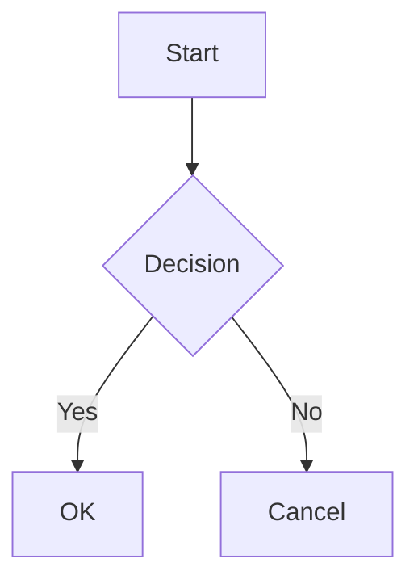

# markdown-viewer

> Serve Markdown files as HTML with live features

A lightweight local server that renders Markdown files as beautiful HTML pages, with support for GitHub Flavored Markdown, syntax highlighting, Mermaid diagrams, and MathJax formulas.

## Features

- **GitHub-style Markdown** - Full GFM support with tables, task lists, and more
- **Syntax Highlighting** - Code blocks with automatic language detection
- **Mermaid Diagrams** - Flowcharts, sequence diagrams, and more
- **MathJax Support** - LaTeX math formulas (`$...$` and `$$...$$`)
- **Directory Browsing** - Navigate through your files with ease
- **Dark Mode** - Automatic theme switching based on system preferences
- **Search** - Find files quickly with built-in search
- **Keyboard Navigation** - Navigate with vim-style keys (j/k)
- **Security** - Path traversal protection and security headers

## Installation

```bash
npm install -g md-lv
```

Or use npx:
```bash
npx md-lv
```

## Usage

### Basic Usage

```bash
# Serve current directory
mdlv

# Serve specific directory
mdlv --dir /path/to/docs

# Serve on custom port
mdlv --port 8080

# Open README.md automatically
mdlv readme
```

### CLI Options

| Option | Short | Default | Description |
|--------|-------|---------|-------------|
| `--port` | `-p` | `3000` | Server port |
| `--host` | `-H` | `localhost` | Bind address |
| `--dir` | `-d` | `.` | Document root |
| `--no-watch` | | `false` | Disable file watching |
| `--quiet` | `-q` | `false` | Suppress output |
| `--debug` | | `false` | Enable debug mode |

### Subcommands

#### `mdlv readme`

Find and display the nearest README.md file:

```bash
cd /path/to/project
mdlv readme
```

This command searches up the directory tree to find README.md and opens it in your browser.

## Supported Content

### Markdown Features

- Headings, paragraphs, lists
- Tables (GFM)
- Task lists
- Code blocks with syntax highlighting
- Blockquotes
- Links and images
- Horizontal rules

### Mermaid Diagrams

````markdown

````

### Math Formulas

Inline: `$E = mc^2$`

Block:
```markdown
$$
\sum_{i=1}^n i = \frac{n(n+1)}{2}
$$
```

## Keyboard Shortcuts

| Shortcut | Action |
|----------|--------|
| `Alt + ←` | Go to parent directory |
| `Alt + Home` | Go to root |
| `j` / `↓` | Next item (in directory listing) |
| `k` / `↑` | Previous item |
| `Enter` | Open selected item |
| `/` | Focus search |
| `Escape` | Close search results |

## Requirements

- Node.js 18.0.0 or higher

## Development

```bash
# Clone repository
git clone https://github.com/your-username/markdown-viewer.git
cd markdown-viewer

# Install dependencies
npm install

# Run tests
npm test

# Start development server
npm start
```

## Contributing

Contributions are welcome! Please read our [Contributing Guide](CONTRIBUTING.md) for details.

## License

MIT License - see [LICENSE](LICENSE) for details.

## Acknowledgments

- [marked](https://marked.js.org/) - Markdown parser
- [highlight.js](https://highlightjs.org/) - Syntax highlighting
- [Mermaid](https://mermaid.js.org/) - Diagram rendering
- [MathJax](https://www.mathjax.org/) - Math formulas
