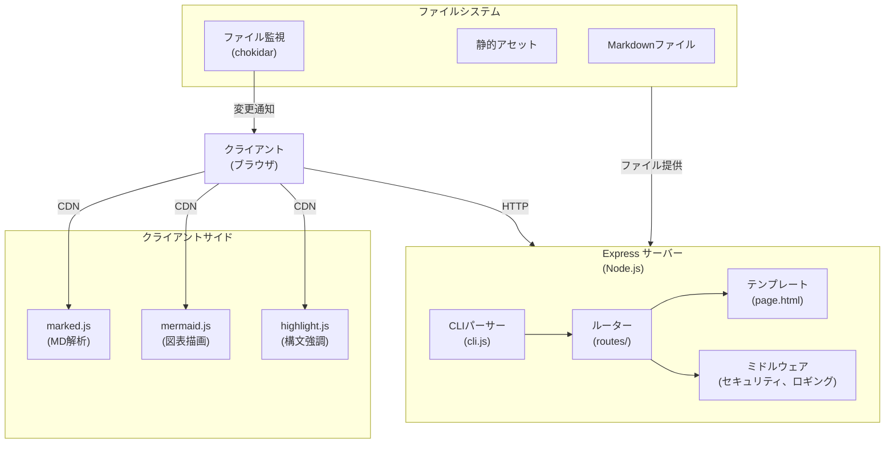
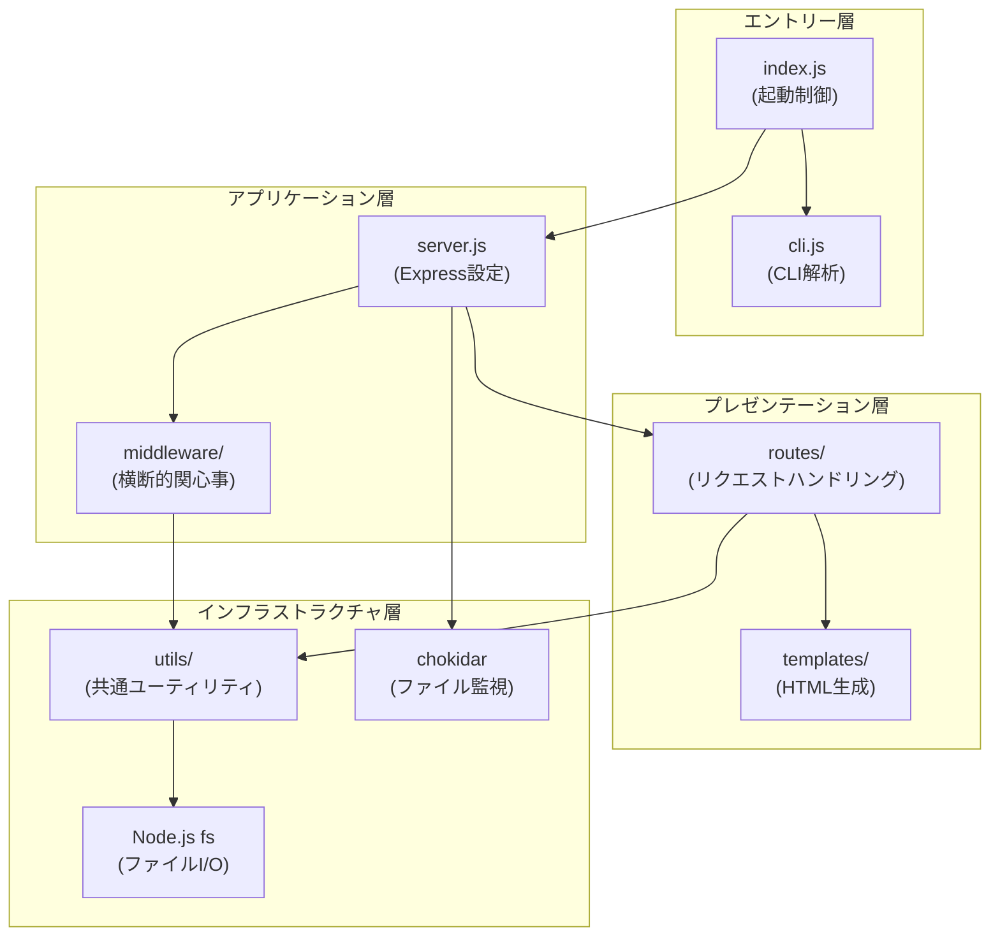

---
references:
  - ../02_requirements/
description: "設計仕様書：Mark Server のアーキテクチャ、技術スタック、コンポーネント設計、セキュリティ設計を定義"
---

# 03_design_spec（設計仕様書）

**最終更新**: 2026-01-24

---

## 概要

このドキュメントは、Mark Server の実装アーキテクチャと技術設計を定義する。
**「どう実現するか（How）」を定義する段階。**

「何を満たすべきか（What）」は [02_requirements](../02_requirements/) を参照。

---

## 1. アーキテクチャ概要

### 1.1 システムアーキテクチャ

Mark Server は、シンプルかつスケーラブルなExpressベースのHTTPサーバーとして設計される。



### 1.2 設計原則

- **シンプルさの優先**: ESM形式の単一言語実装で保守性を確保
- **開発体験の最優先**: ファイル変更の即座なリフレッシュで迅速な開発サイクル
- **セキュリティ第一**: パストラバーサル防止など基本的なセキュリティ対策を組み込み
- **クライアント処理の優先**: レンダリングやシンタックスハイライトはクライアント側で実行

### 1.3 レイヤー設計

Mark Server は3層アーキテクチャを採用し、各レイヤーの責務を明確に分離する。



#### 1.3.1 レイヤー責務

| レイヤー | 責務 | 含まれるモジュール |
|---------|------|-------------------|
| **エントリー層** | プロセス起動、CLI解析、設定読込 | `index.js`, `cli.js` |
| **プレゼンテーション層** | HTTPリクエスト処理、レスポンス生成、HTML出力 | `routes/*`, `templates/*` |
| **アプリケーション層** | Express設定、ルーティング登録、ミドルウェア適用 | `server.js`, `middleware/*` |
| **インフラストラクチャ層** | ファイルI/O、パス検証、ロギング、外部ライブラリ連携 | `utils/*`, `chokidar` |

#### 1.3.2 依存関係ルール

レイヤー間の依存は **上位から下位への一方向のみ** 許可する。

```
エントリー層 → アプリケーション層 → プレゼンテーション層 → インフラストラクチャ層
                    ↓                        ↓
              インフラストラクチャ層    インフラストラクチャ層
```

**許可される依存**:
- エントリー層 → アプリケーション層
- アプリケーション層 → プレゼンテーション層
- アプリケーション層 → インフラストラクチャ層
- プレゼンテーション層 → インフラストラクチャ層

**禁止される依存**:
- 下位層から上位層への依存（例: `utils/` → `routes/`）
- 同一レイヤー内の循環依存

#### 1.3.3 コンポーネント配置

```
src/
├── index.js              # [エントリー層] プロセス起動
├── cli.js                # [エントリー層] CLI解析
├── server.js             # [アプリケーション層] Express設定
├── routes/               # [プレゼンテーション層]
│   ├── markdown.js       #   Markdownレンダリング
│   ├── static.js         #   静的ファイル配信
│   └── raw.js            #   rawコード表示
├── middleware/           # [アプリケーション層]
│   ├── security.js       #   セキュリティヘッダー
│   └── cors.js           #   CORS設定
├── utils/                # [インフラストラクチャ層]
│   ├── path.js           #   パス検証・正規化
│   └── logger.js         #   統一ロガー
└── templates/            # [プレゼンテーション層]
    └── page.html         #   HTMLテンプレート
```

#### 1.3.4 レイヤー間インターフェース

各レイヤー間は明確なインターフェースを通じて通信する。

| 呼出元 | 呼出先 | インターフェース |
|--------|--------|-----------------|
| index.js | cli.js | `parseCLI(argv): Options` |
| index.js | server.js | `createServer(options): Express` |
| server.js | routes/* | `router: express.Router` |
| server.js | middleware/* | `middleware: RequestHandler` |
| routes/* | utils/path.js | `validatePath(reqPath, rootDir): string` |
| routes/* | utils/logger.js | `logger.info/warn/error(msg)` |

---

## 2. 技術スタック

### 2.1 実行環境

| 項目 | 選定技術 | バージョン | 理由 |
|------|---------|----------|------|
| **Runtime** | Node.js | 18+ | 標準的で安定した環境。ESM対応。 |
| **Package Manager** | npm | 最新 | Node.js標準。 |
| **Module Format** | ESM | - | 最新のJavaScript標準。CommonJSとの混在を回避。 |

### 2.2 HTTP サーバー

| コンポーネント | 技術 | バージョン | 用途 |
|----------|-----|----------|------|
| **HTTP Framework** | Express | 5.x | 標準的でシンプルなルーティングとミドルウェア |
| **Server Port** | 3000（デフォルト） | - | ローカル開発向けのデフォルトポート |

### 2.3 Markdown 処理

| コンポーネント | 技術 | 実行位置 | 理由 |
|----------|-----|--------|------|
| **MD Parser** | marked | クライアント(CDN) | サーバー側処理を最小化。キャッシュ効率良好。 |
| **Mermaid 図表** | mermaid.js | クライアント(CDN) | インタラクティブな図表レンダリング |
| **Syntax Highlighting** | highlight.js | クライアント(CDN) | 軽量で多言語対応 |

### 2.4 ファイル操作

| コンポーネント | 技術 | 用途 |
|----------|-----|------|
| **File Watcher** | chokidar | ファイル変更検知によるライブリロード |
| **Path Handling** | Node.js path module | パス正規化とセキュリティ検証 |

### 2.5 CSP（Content Security Policy）

| ディレクティブ | 設定値 | 理由 |
|----------|-------|------|
| **default-src** | 'self' | 同一オリジンのみ許可 |
| **script-src** | 'self' https://cdn.jsdelivr.net https://cdn.skypack.dev | CDN経由のライブラリ許可 |
| **style-src** | 'self' 'unsafe-inline' | インラインスタイルを許可（テンプレート側で使用） |
| **img-src** | 'self' data: | 自オリジンと base64画像 |

---

## 3. コンポーネント設計

> **Note**: 各コンポーネントのレイヤー配置については [1.3 レイヤー設計](#13-レイヤー設計) を参照。

### 3.1 ディレクトリ構造

```
src/
├── index.js              # エントリーポイント
├── cli.js                # CLIパーサー（コマンドライン引数処理）
├── server.js             # Expressサーバー設定（アプリケーション初期化）
├── routes/
│   ├── markdown.js       # GET /*.md → Markdownレンダリング
│   ├── directory.js      # GET / → ディレクトリ一覧
│   ├── static.js         # GET /static/* → 静的ファイル配信
│   ├── raw.js            # GET /* → rawコード表示
│   └── api.js            # GET /api/* → API エンドポイント
├── utils/
│   ├── path.js           # パス検証・正規化（パストラバーサル防止）
│   ├── logger.js         # 統一ロガー（デバッグ/エラー出力）
│   ├── template.js       # テンプレートレンダリング
│   ├── html.js           # HTMLエスケープ等のユーティリティ
│   ├── navigation.js     # ブレッドクラム生成等
│   ├── icons.js          # ファイルアイコンマッピング
│   ├── language.js       # 拡張子→言語マッピング
│   └── port.js           # ポート検索ユーティリティ
├── middleware/
│   ├── security.js       # セキュリティヘッダー設定
│   └── error.js          # エラーハンドリング
└── templates/
    └── page.html         # HTMLテンプレート（レイアウト）
```

### 3.2 各コンポーネントの責務

#### 3.2.1 index.js（エントリーポイント）

**責務**:
- Node.js プロセスの起動
- CLIパーサーの初期化
- サーバーの起動

```javascript
// 疑似コード
import { createServer } from './server.js';
import { parseCLI } from './cli.js';

const options = parseCLI(process.argv.slice(2));
const server = createServer(options);
server.listen(options.port, options.host);
```

#### 3.2.2 cli.js（CLIパーサー）

**責務**:
- コマンドライン引数の解析
- 設定値の検証
- デフォルト値の適用

**サポートオプション**:
```
--port <number>       # サーバーポート（デフォルト: 3000）
--host <string>       # バインドアドレス（デフォルト: localhost）
--dir <path>          # ドキュメントルートディレクトリ
--no-watch            # ファイル監視を無効化
--quiet               # ログ出力を抑制
```

#### 3.2.3 server.js（Expressサーバー設定）

**責務**:
- Express アプリケーションの初期化
- ルートの登録
- ミドルウェアの設定

**初期化フロー**:
1. Express インスタンスの作成
2. セキュリティミドルウェアの適用
3. ルートハンドラーの登録
4. エラーハンドリングミドルウェアの設定

#### 3.2.4 routes/markdown.js（Markdownレンダリング）

**責務**:
- .md ファイルの読込
- HTML テンプレートへの埋め込み
- ブラウザへの配信

**処理フロー**:
1. リクエスト URL から ファイルパスを抽出
2. パス検証（`path.js` を使用）
3. ファイルシステムから .md ファイルを読込
4. `page.html` テンプレートに content を埋め込み
5. `Content-Type: text/html` で レスポンス

#### 3.2.5 routes/static.js（静的ファイル配信）

**責務**:
- CSS、JavaScript、画像等の配信
- MIME タイプの自動判定
- キャッシュヘッダーの設定

**対応ファイルタイプ**:
- text/css (*.css)
- application/javascript (*.js)
- image/* (*.png, *.jpg, *.svg, *.gif)
- application/json (*.json)

#### 3.2.6 routes/raw.js（rawコード表示）

**責務**:
- 非.md ファイルのテキスト表示
- コード表示用の HTML ラッパー

**処理フロー**:
1. ファイルを読込
2. `<pre><code>` タグでラップ
3. シンタックスハイライト対象言語を判定
4. `page.html` にembed

#### 3.2.7 utils/path.js（パス検証・正規化）

**責務**:
- リクエスト URL からファイルパスへの変換
- パストラバーサル攻撃の検出・防止
- シンボリックリンク の検証

**検証ロジック**:
```javascript
// 疑似コード
const validatePath = (requestPath, rootDir) => {
  // 1. URL パスをファイルシステムパスに変換
  const normalizedPath = path.normalize(requestPath);

  // 2. ドキュメントルート からの相対パスに統一
  const absolutePath = path.resolve(rootDir, normalizedPath);

  // 3. realpath で シンボリックリンク を解決
  const realPath = fs.realpathSync(absolutePath);

  // 4. rootDir 以下に収まっているか確認
  if (!realPath.startsWith(fs.realpathSync(rootDir))) {
    throw new Error('Path traversal detected');
  }

  return realPath;
};
```

#### 3.2.8 utils/logger.js（統一ロガー）

**責務**:
- 統一的なログ出力
- ログレベルの制御（INFO, WARN, ERROR）

**ログレベル**:
| レベル | 用途 | デフォルト出力 |
|--------|------|----------|
| INFO | サーバー起動、ファイル配信 | ✓ |
| WARN | パス検証失敗、非推奨API | ✓ |
| ERROR | サーバーエラー、ファイル読込失敗 | ✓ |
| DEBUG | リクエスト詳細、メモリ使用量 | - |

#### 3.2.9 middleware/security.js（セキュリティヘッダー）

**責務**:
- HTTP セキュリティヘッダーの設定

**設定ヘッダー**:
```javascript
{
  'Content-Security-Policy': "default-src 'self'; script-src 'self' https://cdn.jsdelivr.net; style-src 'self' 'unsafe-inline'",
  'X-Content-Type-Options': 'nosniff',
  'X-Frame-Options': 'DENY',
  'X-XSS-Protection': '1; mode=block',
  'Strict-Transport-Security': 'max-age=31536000; includeSubDomains'
}
```

#### 3.2.10 templates/page.html（HTMLテンプレート）

**責務**:
- HTML ページ構造の定義
- クライアント側スクリプトの読込

**構成要素**:
```html
<!DOCTYPE html>
<html lang="ja">
<head>
  <meta charset="UTF-8">
  <meta name="viewport" content="width=device-width, initial-scale=1.0">
  <title>{{ title }}</title>
  <style>
    /* 基本スタイル */
  </style>
  <!-- CDN スクリプトの読込 -->
  <script src="https://cdn.jsdelivr.net/npm/marked/marked.min.js"></script>
  <script src="https://cdn.jsdelivr.net/npm/mermaid/dist/mermaid.min.js"></script>
  <script src="https://cdn.jsdelivr.net/npm/highlight.js@11/dist/highlight.min.js"></script>
</head>
<body>
  <div id="content">{{ content }}</div>
  <script src="/static/js/app.js"></script>
</body>
</html>
```

### 3.3 データフロー

#### 3.3.1 Markdown レンダリング フロー

```
ブラウザ リクエスト (GET /docs/example.md)
  ↓
Express ルーター
  ↓
routes/markdown.js
  ↓
utils/path.js → パス検証・正規化
  ↓
ファイルシステム → .md ファイル読込
  ↓
templates/page.html → コンテンツ埋め込み
  ↓
ブラウザ HTML 受信
  ↓
marked.js (クライアント)
  ↓
mermaid.js (図表レンダリング)
  ↓
highlight.js (コード強調)
  ↓
ブラウザ レンダリング完了
```

#### 3.3.2 ファイル監視 フロー

```
chokidar → ファイル変更検知
  ↓
WebSocket または Server-Sent Events (SSE)
  ↓
ブラウザ 受信
  ↓
location.reload() または 差分更新
```

---

## 4. セキュリティ設計

### 4.1 パストラバーサル攻撃防止

**脅威**: 攻撃者が `/../../../etc/passwd` のようなパスでアクセス権限外のファイルにアクセスする

**対策**:
1. **realpath 検証**: すべてのファイルパスを `fs.realpathSync()` で解決
2. **ルート範囲確認**: 解決済みパスがドキュメントルート以下に収まっているか確認
3. **シンボリックリンク 検証**: シンボリックリンクを自動解決し、対象ファイルの位置を確認

```javascript
// 疑似コード
const docRoot = fs.realpathSync('/home/user/docs');
const requestPath = '/../../../etc/passwd';
const absolutePath = path.resolve(docRoot, requestPath);
const realPath = fs.realpathSync(absolutePath);

if (!realPath.startsWith(docRoot)) {
  // ❌ 拒否
  throw new Error('Access denied');
}
```

### 4.2 Content-Security-Policy (CSP)

**目的**: XSS 攻撃から保護

**実装**:
```
Content-Security-Policy:
  default-src 'self';
  script-src 'self' https://cdn.jsdelivr.net https://cdn.skypack.dev;
  style-src 'self' 'unsafe-inline';
  img-src 'self' data:
```

### 4.3 HTTP セキュリティヘッダー

| ヘッダー | 値 | 効果 |
|---------|-----|------|
| X-Content-Type-Options | nosniff | MIME タイプスニッフィング防止 |
| X-Frame-Options | DENY | クリックジャッキング防止 |
| X-XSS-Protection | 1; mode=block | XSS 保護（レガシーブラウザ対応） |
| Strict-Transport-Security | max-age=31536000 | HTTPS 強制 |

### 4.4 入力検証

- **ファイルパス**: 全パスを正規化 + realpath 検証
- **クエリパラメータ**: URLデコード + XSS エスケープ
- **ファイルタイプ**: MIME タイプ検証（拡張子のみでなく）

### 4.5 ファイルアクセス制限

**許可対象**:
- ドキュメントルート配下のファイル
- `.md`、`.txt`、`.json`、`.html` 等のテキストファイル
- 静的アセット（CSS、画像、JavaScript）

**拒否対象**:
- バイナリファイル（`.bin`、`.exe` 等）
- システムファイル（`.env`、`.git` 等）
- ドキュメントルート外のファイル

---

## 5. APIエンドポイント設計

### 5.1 エンドポイント一覧

| メソッド | パス | 説明 | レスポンス | ステータス |
|----------|------|------|-----------|----------|
| GET | / | ルートディレクトリ一覧 | HTML(ディレクトリ一覧) | 200 |
| GET | /*.md | Markdown レンダリング | HTML(レンダリング済み) | 200 |
| GET | /* | 非MD ファイルのraw表示 | HTML(コード表示) | 200 |
| GET | /static/* | 静的ファイル配信 | ファイルコンテンツ | 200 |
| GET | /api/search | ファイル検索API | JSON(検索結果) | 200 |
| GET | /health | ヘルスチェック | JSON(status) | 200 |

### 5.2 エンドポイント詳細

#### 5.2.1 GET / - ルートディレクトリ一覧

**リクエスト例**:
```
GET / HTTP/1.1
Host: localhost:3000
```

**レスポンス例** (200 OK):
```html
<!DOCTYPE html>
<html>
<head><title>Directory Listing</title></head>
<body>
  <h1>Folder: /</h1>
  <ul>
    <li><a href="/docs/">docs/</a></li>
    <li><a href="/README.md">README.md</a></li>
  </ul>
</body>
</html>
```

**エラーレスポンス**:
```html
<!-- 404 Not Found -->
<h1>404 - Directory not found</h1>
```

#### 5.2.2 GET /*.md - Markdownレンダリング

**リクエスト例**:
```
GET /README.md HTTP/1.1
Host: localhost:3000
```

**レスポンス例** (200 OK):
```html
<!DOCTYPE html>
<html lang="ja">
<head>
  <meta charset="UTF-8">
  <title>README.md</title>
  <link rel="stylesheet" href="/static/styles/base.css">
</head>
<body>
  <div id="content">
    <!-- Markdown HTML が埋め込まれる -->
    <h1>プロジェクト概要</h1>
    <p>このプロジェクトは...</p>
  </div>
  <script src="https://cdn.jsdelivr.net/npm/marked/marked.min.js"></script>
  <script src="/static/js/app.js"></script>
</body>
</html>
```

**エラーレスポンス**:
```html
<!-- 404 Not Found -->
<h1>404 - File not found</h1>

<!-- 403 Forbidden (パストラバーサル検出時) -->
<h1>403 - Access Denied</h1>
```

#### 5.2.3 GET /* - 非MDファイルのraw表示

**リクエスト例**:
```
GET /src/index.js HTTP/1.1
Host: localhost:3000
```

**レスポンス例** (200 OK):
```html
<!DOCTYPE html>
<html lang="ja">
<head>
  <meta charset="UTF-8">
  <title>index.js</title>
  <link rel="stylesheet" href="/static/styles/base.css">
</head>
<body>
  <pre><code class="language-javascript">
import express from 'express';

const app = express();
...
  </code></pre>
  <script src="https://cdn.jsdelivr.net/npm/highlight.js@11/dist/highlight.min.js"></script>
  <script src="/static/js/app.js"></script>
</body>
</html>
```

**対応ファイル拡張子**:
- `.js`, `.ts`, `.jsx`, `.tsx`
- `.html`, `.css`, `.scss`
- `.json`, `.yaml`, `.yml`
- `.py`, `.rb`, `.go`, `.rs`, `.java`, `.cpp`, `.c`, `.h`
- `.sh`, `.bash`, `.zsh`
- `.md`, `.txt`

#### 5.2.4 GET /static/* - 静的ファイル配信

**リクエスト例**:
```
GET /static/style.css HTTP/1.1
Host: localhost:3000
```

**レスポンス例** (200 OK):
```
Content-Type: text/css
Cache-Control: public, max-age=86400

body { font-family: sans-serif; }
...
```

**キャッシュ戦略**:
| ファイルタイプ | キャッシュ期間 | 理由 |
|----------|----------|------|
| CSS, JS | 1日（86400秒） | 変更頻度低 |
| 画像 | 7日 | 変更頻度低 |
| HTML | キャッシュなし | ライブリロード対応 |

---

## 6. ライブリロード実装

### 6.1 概要

ファイルシステムの変更を監視し、ブラウザを自動リロードする。

### 6.2 実装方式

**選択肢の検討**:

| 方式 | 長所 | 短所 | 採用 |
|------|------|------|------|
| WebSocket | リアルタイム、双方向通信 | ポーラーフロー追加 | ✓ |
| Server-Sent Events (SSE) | 単方向、シンプル | 接続数制限あり | - |
| ポーリング | 古いブラウザ対応 | リソース消費多 | - |

**採用**: **WebSocket** による push 型通知

### 6.3 実装フロー

```javascript
// サーバー側：chokidar で ファイル監視
import chokidar from 'chokidar';

const watcher = chokidar.watch(docDir, { ignored: /(^|[\/\\])\.|node_modules/ });

watcher.on('change', (filePath) => {
  // WebSocket で クライアント に通知
  broadcastToClients({ type: 'reload', path: filePath });
});
```

```javascript
// クライアント側：WebSocket で 通知受信
const ws = new WebSocket('ws://localhost:3000');

ws.onmessage = (event) => {
  const data = JSON.parse(event.data);
  if (data.type === 'reload') {
    location.reload();
  }
};
```

---

## 7. パフォーマンス設計

### 7.1 最適化戦略

| 項目 | 最適化方法 | 目標 |
|------|----------|------|
| **マークダウン解析** | クライアント側で marked.js を使用 | サーバー CPU 削減 |
| **シンタックスハイライト** | クライアント側で highlight.js | サーバー応答時間短縮 |
| **静的ファイル** | HTTP キャッシュヘッダー設定 | ブラウザキャッシュ利用 |
| **ファイル監視** | chokidar の debounce 設定 | 連続変更時の過剰リロード防止 |

### 7.2 計測項目

| 項目 | 目標値 | 測定方法 |
|------|--------|---------|
| 初期ロード時間 | < 1秒 | ブラウザ DevTools |
| ファイル変更から表示まで | < 500ms | ブラウザ DevTools |
| 大規模MD（> 10MB） | graceful degrade | アクセス制限 |

---

## 8. 運用設計

### 8.1 ロギング

**ログレベルと出力先**:

| レベル | 出力先 | ログ例 |
|--------|--------|--------|
| INFO | stdout | `[INFO] Server started on http://localhost:3000` |
| WARN | stdout | `[WARN] Path traversal attempt detected: /../etc/passwd` |
| ERROR | stderr | `[ERROR] Failed to read file: ENOENT /docs/missing.md` |
| DEBUG | stdout (--debug flag時) | `[DEBUG] Request: GET /README.md` |

### 8.2 エラーハンドリング

**エラー種別と対応**:

| エラー | 対応 | HTTPステータス |
|--------|------|---------|
| ファイル不在 | エラーページ表示 | 404 |
| パストラバーサル | アクセス拒否 | 403 |
| サーバーエラー | スタックトレース記録 | 500 |
| 不正なリクエスト | BAD REQUEST | 400 |

### 8.3 ヘルスチェック

**エンドポイント** (Phase 1 で実装):
```
GET /health HTTP/1.1

レスポンス:
{
  "status": "ok",
  "timestamp": "2026-01-24T10:00:00Z"
}
```

---

## 9. デプロイメント設計

### 9.1 デプロイ方式

| 環境 | 実行方式 | ノート |
|------|--------|--------|
| **ローカル開発** | `npm start` または `node src/index.js` | ライブリロード有効 |
| **本番環境** | Docker コンテナ または systemd サービス | - |

### 9.2 環境変数

| 変数 | デフォルト | 説明 |
|------|---------|------|
| NODE_ENV | development | 実行環境 |
| PORT | 3000 | バインドポート |
| HOST | localhost | バインドアドレス |
| DOC_DIR | ./ | ドキュメントルート |
| WATCH | true | ファイル監視有効 |

### 9.3 Dockerfile (参考)

```dockerfile
FROM node:18-alpine

WORKDIR /app

COPY package*.json ./
RUN npm ci --only=production

COPY src ./src

EXPOSE 3000

CMD ["node", "src/index.js"]
```

---

## 10. 今後の拡張ポイント

### 10.1 短期（MVP後）

- [ ] 検索機能（クライアント側全文検索）
- [ ] テーマ切替（ダークモード対応）
- [ ] 目次自動生成

### 10.2 中期

- [ ] 多言語対応（i18n）
- [ ] プラグインシステム
- [ ] 認証・アクセス制御

### 10.3 長期

- [ ] データベース連携
- [ ] API モード（JSON 出力）
- [ ] CMS 連携

---

## 更新履歴

| 日付 | 更新内容 |
|------|----------|
| 2026-01-24 | 初版作成：アーキテクチャ、技術スタック、コンポーネント設計、セキュリティ設計、API エンドポイント を定義 |
| 2026-01-24 | ディレクトリ構造に不足ファイル追加（directory.js, api.js, template.js, html.js, navigation.js, icons.js, language.js, port.js, error.js）、APIエンドポイントに /api/search と /health を追加、スタイルシートパス修正 |
