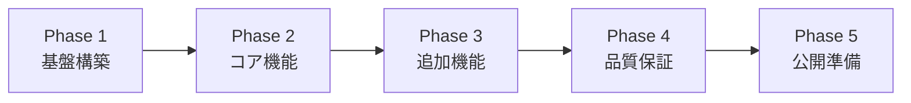
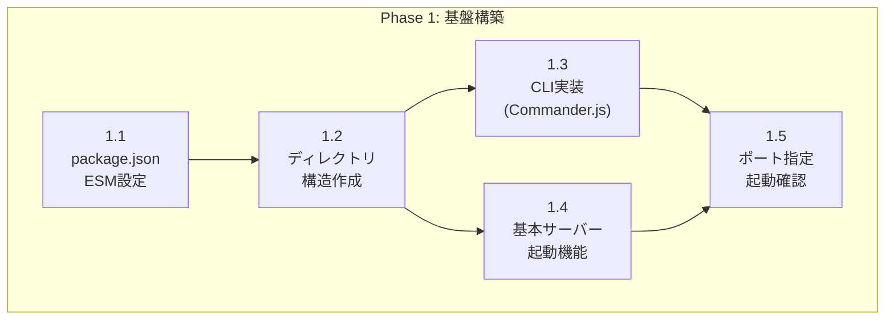
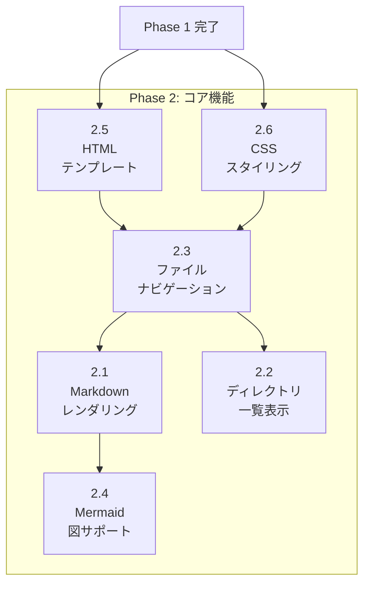
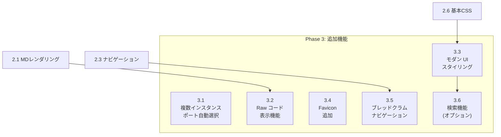
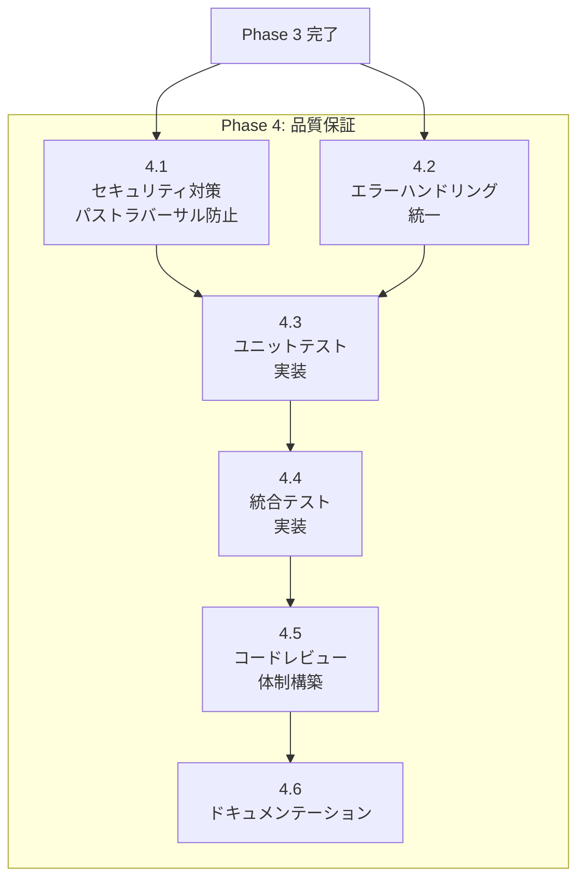
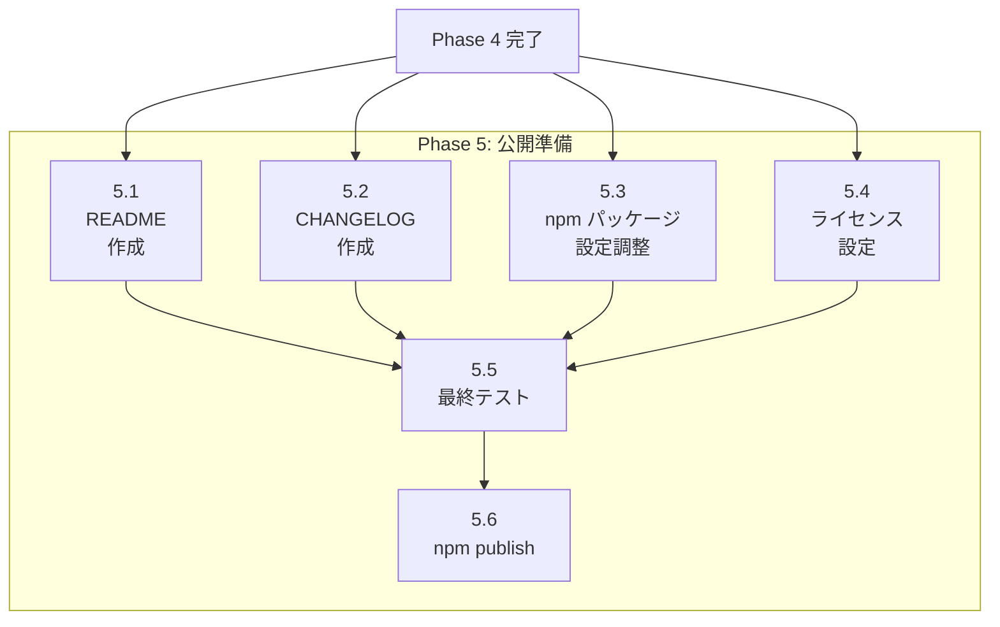

# 04. タスク定義と依存関係

## 概要

本ドキュメントは、markserv モダナイゼーションプロジェクトのタスク定義とタスク間の依存関係を整理したものです。
**各タスクには詳細な実装手順、参照ファイル、変更対象ファイルを明記しています。**

---

## フェーズ全体の依存関係



---

## Phase 1: 基盤構築

### タスク一覧

| ID | タスク | 予想工数 |
|----|--------|---------|
| 1.1 | package.json と ESM 設定 | 2h |
| 1.2 | ディレクトリ構造作成 | 1h |
| 1.3 | Commander.js による CLI 実装 | 3h |
| 1.4 | 基本サーバー起動機能 | 2h |
| 1.5 | ポート指定と起動確認 | 1h |

### 依存関係図



---

### タスク 1.1: package.json と ESM 設定

#### 概要
既存の `package.json` を ESM (ECMAScript Modules) 対応に改修し、必要な依存関係を整理する。

#### 参照ファイル（既存コードの確認）

| ファイル | 確認内容 | 備考 |
|---------|---------|------|
| `package.json` | 現在の依存関係、scripts、bin設定 | 全体を確認 |
| `lib/cli.js:1-10` | 現在の import 文の形式 | CommonJS → ESM 変換の参考 |
| `lib/server.js:1-50` | 現在の依存関係読み込み | ESM 形式への変換対象 |

#### 変更対象ファイル

| ファイル | 変更内容 |
|---------|---------|
| `package.json` | `"type": "module"` 追加、ESM対応依存関係への更新 |

#### 設計仕様参照
- [03_design_spec.md § 2.1 実行環境](./03_design_spec.md#21-実行環境)

#### 実装詳細

**1. package.json の必須変更**:

```json
{
  "name": "markserv",
  "version": "2.0.0",
  "type": "module",
  "engines": {
    "node": ">=18.0.0"
  },
  "main": "src/index.js",
  "bin": {
    "mdv": "bin/mdv.js"
  }
}
```

**2. 依存関係の整理**:

| 種別 | パッケージ | 用途 |
|------|-----------|------|
| 追加 | `express@^5.0.0` | HTTPサーバーフレームワーク |
| 追加 | `commander@^11.0.0` | CLIパーサー |
| 追加 | `chokidar@^3.5.0` | ファイル監視 |
| 削除 | `connect` | Express に置換 |
| 削除 | `meow` | Commander.js に置換 |
| 削除 | `bluebird` | Native Promise を使用 |

#### 確認項目

- [ ] `"type": "module"` が設定されている
- [ ] `engines.node` が `">=18.0.0"` に設定されている
- [ ] 不要な依存関係が削除されている

---

### タスク 1.2: ディレクトリ構造作成

#### 概要
設計仕様に基づいた新しいディレクトリ構造を作成する。

#### 参照ファイル（既存コードの確認）

| ファイル | 確認内容 | 備考 |
|---------|---------|------|
| `lib/` ディレクトリ全体 | 現在のファイル構成 | 移行元として確認 |
| `lib/templates/` | テンプレートファイル | 移行対象 |
| `lib/icons/` | アイコンファイル | 移行対象 |

#### 変更対象ファイル

| 操作 | パス | 説明 |
|------|------|------|
| 作成 | `src/` | ソースコードルート |
| 作成 | `src/index.js` | エントリーポイント |
| 作成 | `src/cli.js` | CLIパーサー |
| 作成 | `src/server.js` | Expressサーバー設定 |
| 作成 | `src/routes/` | ルートハンドラー |
| 作成 | `src/utils/` | ユーティリティ関数 |
| 作成 | `src/utils/template.js` | テンプレートレンダリング |
| 作成 | `src/utils/html.js` | HTMLエスケープ等 |
| 作成 | `src/middleware/` | Expressミドルウェア |
| 作成 | `bin/mdv.js` | 実行可能ファイル |
| 移行 | `templates/` ← `lib/templates/` | テンプレート移行 |
| 作成 | `public/styles/` | スタイルシート |
| 作成 | `public/js/` | クライアントサイドJS |

#### 設計仕様参照
- [03_design_spec.md § 3.1 ディレクトリ構造](./03_design_spec.md#31-ディレクトリ構造)

#### 実装詳細

**新ディレクトリ構造**:

```
markserv/
├── bin/
│   └── mdv.js                # 実行可能ファイル
├── src/
│   ├── index.js              # エントリーポイント
│   ├── cli.js                # CLIパーサー
│   ├── server.js             # Expressサーバー設定
│   ├── routes/
│   │   ├── markdown.js       # Markdownレンダリング
│   │   ├── directory.js      # ディレクトリ一覧
│   │   ├── static.js         # 静的ファイル配信
│   │   └── raw.js            # rawコード表示
│   ├── utils/
│   │   ├── path.js           # パス検証・正規化
│   │   └── logger.js         # 統一ロガー
│   └── middleware/
│       ├── security.js       # セキュリティヘッダー
│       └── error.js          # エラーハンドリング
├── templates/
│   └── page.html             # メインテンプレート
├── public/
│   ├── styles/
│   │   └── base.css          # 基本スタイル
│   └── js/
│       └── app.js            # クライアントサイドJS
└── tests/
    ├── unit/
    └── integration/
```

#### 確認項目

- [ ] すべてのディレクトリが作成されている
- [ ] `bin/mdv.js` に実行権限が付与されている (`chmod +x`)
- [ ] 既存テンプレートが `templates/` に移行されている

---

### タスク 1.3: Commander.js による CLI 実装

#### 概要
Commander.js を使用して、コマンドライン引数を解析する CLI モジュールを実装する。

#### 参照ファイル（既存コードの確認）

| ファイル | 確認内容 | 位置 |
|---------|---------|------|
| `lib/cli.js` | 現在のCLI実装全体 | 全ファイル |
| `lib/cli-defs.js` | CLIオプション定義 | 全ファイル |
| `lib/cli-help.txt` | ヘルプテキスト | 全ファイル |
| `lib/splash.js` | スプラッシュスクリーン | 全ファイル |

#### 変更対象ファイル

| ファイル | 変更内容 |
|---------|---------|
| `src/cli.js` | 新規作成：Commander.js ベースの CLI |
| `bin/mdv.js` | 新規作成：実行可能エントリーポイント |

#### 設計仕様参照
- [03_design_spec.md § 3.2.2 cli.js](./03_design_spec.md#322-clijs（cliパーサー）)

#### 実装詳細

**1. bin/mdv.js（実行可能ファイル）**:

```javascript
#!/usr/bin/env node

import { run } from '../src/cli.js';

run(process.argv);
```

**2. src/cli.js（CLIパーサー）**:

```javascript
import { Command } from 'commander';
import { createServer } from './server.js';

const program = new Command();

export function parseCLI(argv) {
  program
    .name('mdv')
    .description('Serve Markdown files as HTML')
    .version('2.0.0')
    .option('-p, --port <number>', 'Server port', '3000')
    .option('-h, --host <string>', 'Bind address', 'localhost')
    .option('-d, --dir <path>', 'Document root directory', '.')
    .option('--no-watch', 'Disable file watching')
    .option('-q, --quiet', 'Suppress log output')
    .option('--debug', 'Enable debug logging')
    .parse(argv);

  return program.opts();
}

export function run(argv) {
  const options = parseCLI(argv);
  const server = createServer(options);
  server.listen(options.port, options.host, () => {
    console.log(`mdv running at http://${options.host}:${options.port}`);
  });
}
```

**3. サポートするオプション**:

| オプション | 短縮形 | デフォルト | 説明 |
|-----------|--------|-----------|------|
| `--port` | `-p` | `3000` | サーバーポート |
| `--host` | `-h` | `localhost` | バインドアドレス |
| `--dir` | `-d` | `.` | ドキュメントルート |
| `--no-watch` | - | `false` | ファイル監視無効化 |
| `--quiet` | `-q` | `false` | ログ抑制 |
| `--debug` | - | `false` | デバッグログ有効化 |

#### 確認項目

- [ ] `mdv --help` でヘルプが表示される
- [ ] `mdv --version` でバージョンが表示される
- [ ] 各オプションが正しくパースされる

---

### タスク 1.4: 基本サーバー起動機能

#### 概要
Express.js を使用して基本的な HTTP サーバーを実装する。

#### 参照ファイル（既存コードの確認）

| ファイル | 確認内容 | 位置 |
|---------|---------|------|
| `lib/server.js` | 現在のサーバー実装 | 全ファイル |
| `lib/server.js:startConnectApp` | Connect アプリ初期化 | 関数定義部分 |
| `lib/server.js:startHTTPServer` | HTTP サーバー起動 | 関数定義部分 |
| `lib/server.js:init` | 初期化シーケンス | 関数定義部分 |

#### 変更対象ファイル

| ファイル | 変更内容 |
|---------|---------|
| `src/server.js` | 新規作成：Express サーバー設定 |
| `src/index.js` | 新規作成：エントリーポイント |

#### 設計仕様参照
- [03_design_spec.md § 3.2.3 server.js](./03_design_spec.md#323-serverjsexpressサーバー設定)

#### 実装詳細

**1. src/server.js（Express サーバー設定）**:

```javascript
import express from 'express';
import path from 'path';

export function createServer(options) {
  const app = express();

  // ドキュメントルートの設定
  const docRoot = path.resolve(options.dir);

  // 基本ルーティング（Phase 2 で拡張）
  app.get('/', (req, res) => {
    res.send('mdv is running');
  });

  // ヘルスチェック
  app.get('/health', (req, res) => {
    res.json({ status: 'ok', timestamp: new Date().toISOString() });
  });

  return app;
}
```

**2. src/index.js（エントリーポイント）**:

```javascript
import { createServer } from './server.js';
import { parseCLI } from './cli.js';

const options = parseCLI(process.argv.slice(2));
const server = createServer(options);

server.listen(options.port, options.host, () => {
  console.log(`mdv running at http://${options.host}:${options.port}`);
});

export { createServer, parseCLI };
```

#### 確認項目

- [ ] `node src/index.js` でサーバーが起動する
- [ ] `http://localhost:3000/` にアクセスできる
- [ ] `/health` エンドポイントが JSON を返す

---

### タスク 1.5: ポート指定と起動確認

#### 概要
CLI から指定したポートでサーバーを起動し、CLI と サーバーの統合動作を確認する。

#### 参照ファイル（既存コードの確認）

| ファイル | 確認内容 | 位置 |
|---------|---------|------|
| `lib/server.js:startConnectApp` | ポート設定処理 | `port` プロパティ |
| `lib/cli.js:cliOpts` | CLI オプション処理 | 変数定義部分 |

#### 変更対象ファイル

| ファイル | 変更内容 |
|---------|---------|
| `src/cli.js` | ポート検証ロジック追加 |
| `src/server.js` | ポート設定統合 |

#### 設計仕様参照
- [03_design_spec.md § 2.2 HTTP サーバー](./03_design_spec.md#22-http-サーバー)

#### 実装詳細

**1. ポート検証ロジック（src/cli.js に追加）**:

```javascript
function validatePort(value) {
  const port = parseInt(value, 10);
  if (isNaN(port) || port < 1 || port > 65535) {
    throw new Error(`Invalid port number: ${value}`);
  }
  return port;
}

program
  .option('-p, --port <number>', 'Server port', validatePort, 3000)
```

**2. 統合テストコマンド**:

```bash
# デフォルトポートで起動
node bin/mdv.js

# カスタムポートで起動
node bin/mdv.js --port 8080

# ヘルプ表示
node bin/mdv.js --help
```

#### 確認項目

- [ ] `mdv` コマンドでデフォルトポート 3000 で起動する
- [ ] `mdv --port 8080` でポート 8080 で起動する
- [ ] 不正なポート番号でエラーメッセージが表示される
- [ ] `mdv --help` でヘルプが表示される

### Phase 1 成果物

| ファイル | 説明 |
|---------|------|
| `package.json` | ESM対応、依存関係更新済み |
| `src/index.js` | エントリーポイント |
| `src/cli.js` | Commander.js ベース CLI |
| `src/server.js` | Express サーバー設定 |
| `bin/mdv.js` | 実行可能ファイル |
| `src/routes/` | ルートディレクトリ（空） |
| `src/utils/` | ユーティリティディレクトリ（空） |
| `src/middleware/` | ミドルウェアディレクトリ（空） |

---

## Phase 2: コア機能

### タスク一覧

| ID | タスク | 予想工数 |
|----|--------|---------|
| 2.1 | Markdown レンダリング (marked + highlight.js) | 4h |
| 2.2 | ディレクトリ一覧表示機能 | 3h |
| 2.3 | ファイルナビゲーション機能 | 2h |
| 2.4 | Mermaid 図サポート | 3h |
| 2.5 | HTML テンプレート作成 | 3h |
| 2.6 | CSS スタイリング基本 | 2h |

### 依存関係図



---

### タスク 2.5: HTML テンプレート作成

#### 概要
Markdown レンダリング結果を埋め込む HTML テンプレートを作成する。

#### 参照ファイル（既存コードの確認）

| ファイル | 確認内容 | 位置 |
|---------|---------|------|
| `lib/templates/markdown.html` | 現在の Markdown テンプレート | 全ファイル (25行) |
| `lib/templates/directory.html` | 現在のディレクトリテンプレート | 全ファイル (20行) |
| `lib/templates/error.html` | エラーページテンプレート | 全ファイル |
| `lib/server.js:baseTemplate` | テンプレート読み込み処理 | 関数定義部分 |

#### 変更対象ファイル

| ファイル | 変更内容 |
|---------|---------|
| `templates/page.html` | 新規作成：統合テンプレート |

#### 設計仕様参照
- [03_design_spec.md § 3.2.10 templates/page.html](./03_design_spec.md#3210-templatespagehtml（htmlテンプレート）)

#### 実装詳細

**templates/page.html**:

```html
<!DOCTYPE html>
<html lang="ja">
<head>
  <meta charset="UTF-8">
  <meta name="viewport" content="width=device-width, initial-scale=1.0">
  <title>{{title}}</title>
  <link rel="stylesheet" href="/static/styles/base.css">
  <link rel="stylesheet"
    href="https://cdn.jsdelivr.net/npm/highlight.js@11/styles/github.min.css">
</head>
<body>
  <nav id="breadcrumbs">{{breadcrumbs}}</nav>
  <main id="content">
    {{content}}
  </main>
  <footer>
    <hr>
    Served by <a href="https://www.npmjs.com/package/markserv">markserv</a>
  </footer>

  <!-- クライアント側ライブラリ -->
  <script src="https://cdn.jsdelivr.net/npm/marked/marked.min.js"></script>
  <script src="https://cdn.jsdelivr.net/npm/highlight.js@11/dist/highlight.min.js"></script>
  <script type="module">
    import mermaid from 'https://cdn.jsdelivr.net/npm/mermaid@11/dist/mermaid.esm.min.mjs';
    mermaid.initialize({ startOnLoad: true });
  </script>
  <script src="/static/js/app.js"></script>
</body>
</html>
```

#### 確認項目

- [ ] テンプレート変数 `{{title}}`, `{{content}}`, `{{breadcrumbs}}` が定義されている
- [ ] CDN からのスクリプト読み込みが正しい
- [ ] CSP 設定と整合性がある

---

### タスク 2.6: CSS スタイリング基本

#### 概要
GitHub スタイルの Markdown 表示用基本 CSS を作成する。

#### 参照ファイル（既存コードの確認）

| ファイル | 確認内容 | 位置 |
|---------|---------|------|
| `lib/templates/markserv.css` | 現在の CSS スタイル | 全ファイル |
| `lib/templates/github.less` | GitHub スタイル LESS | 全ファイル |
| `lib/templates/highlight-js-github-gist.css` | シンタックスハイライト CSS | 全ファイル |

#### 変更対象ファイル

| ファイル | 変更内容 |
|---------|---------|
| `public/styles/base.css` | 新規作成：基本スタイルシート |

#### 設計仕様参照
- [03_design_spec.md § 2.3 Markdown 処理](./03_design_spec.md#23-markdown-処理)

#### 実装詳細

**public/styles/base.css**（主要セクション）:

```css
/* リセットと基本設定 */
*, *::before, *::after {
  box-sizing: border-box;
}

body {
  font-family: -apple-system, BlinkMacSystemFont, "Segoe UI", Helvetica, Arial, sans-serif;
  font-size: 16px;
  line-height: 1.6;
  color: #24292e;
  background-color: #ffffff;
  max-width: 980px;
  margin: 0 auto;
  padding: 45px;
}

/* Markdown コンテンツ */
#content {
  /* GitHub スタイル準拠 */
}

/* コードブロック */
pre {
  background-color: #f6f8fa;
  border-radius: 6px;
  padding: 16px;
  overflow: auto;
}

code {
  font-family: "SFMono-Regular", Consolas, "Liberation Mono", Menlo, monospace;
  font-size: 85%;
}

/* ディレクトリ一覧 */
.directory-listing {
  list-style: none;
  padding: 0;
}

.directory-listing li {
  padding: 8px 0;
  border-bottom: 1px solid #e1e4e8;
}

/* ブレッドクラム */
#breadcrumbs {
  font-size: 14px;
  margin-bottom: 20px;
}

#breadcrumbs a {
  color: #0366d6;
  text-decoration: none;
}
```

#### 確認項目

- [ ] 基本的なタイポグラフィが設定されている
- [ ] コードブロックのスタイルが適用されている
- [ ] レスポンシブ対応（max-width 設定）

---

### タスク 2.1: Markdown レンダリング

#### 概要
Markdown ファイルを読み込み、HTML テンプレートに埋め込んでレスポンスする。

#### 参照ファイル（既存コードの確認）

| ファイル | 確認内容 | 位置 |
|---------|---------|------|
| `lib/server.js:markdownToHTML` | 現在の Markdown 変換処理 | 関数定義部分 |
| `lib/server.js:md` | markdown-it 設定 | 変数定義部分 |
| `lib/server.js:createRequestHandler` | リクエストハンドラ | 関数定義部分 |
| `lib/server.js:getFile` | ファイル取得処理 | 関数定義部分 |

#### 変更対象ファイル

| ファイル | 変更内容 |
|---------|---------|
| `src/routes/markdown.js` | 新規作成：Markdown ルートハンドラ |
| `src/server.js` | ルート登録追加 |

#### 設計仕様参照
- [03_design_spec.md § 3.2.4 routes/markdown.js](./03_design_spec.md#324-routesmarkdownjsmarkdownレンダリング)
- [03_design_spec.md § 5.2.2 GET /*.md](./03_design_spec.md#522-get-md---markdownレンダリング)

#### 実装詳細

**src/routes/markdown.js**:

```javascript
import { Router } from 'express';
import fs from 'fs/promises';
import path from 'path';
import { validatePath } from '../utils/path.js';
import { renderTemplate } from '../utils/template.js';
import { escapeHtml } from '../utils/html.js';
import { generateBreadcrumbs } from '../utils/navigation.js';

const router = Router();

router.get('/*.md', async (req, res, next) => {
  try {
    const requestPath = req.path;
    const docRoot = req.app.get('docRoot');

    // パス検証（パストラバーサル防止）
    const filePath = validatePath(requestPath, docRoot);

    // ファイル読み込み
    const content = await fs.readFile(filePath, 'utf-8');

    // テンプレートにMarkdownを埋め込み（クライアント側でレンダリング）
    const html = renderTemplate('page', {
      title: path.basename(filePath),
      content: `<div id="markdown-source" style="display:none">${escapeHtml(content)}</div>
                <div id="markdown-rendered"></div>`,
      breadcrumbs: generateBreadcrumbs(requestPath)
    });

    res.type('html').send(html);
  } catch (error) {
    if (error.code === 'ENOENT') {
      res.status(404).send('File not found');
    } else if (error.message === 'Path traversal detected') {
      res.status(403).send('Access denied');
    } else {
      next(error);
    }
  }
});

export default router;
```

**src/server.js への追加**:

```javascript
import markdownRouter from './routes/markdown.js';

// ルート登録
app.use(markdownRouter);
```

#### 確認項目

- [ ] `.md` ファイルにアクセスすると HTML が返される
- [ ] ファイルが存在しない場合 404 エラー
- [ ] パストラバーサル試行で 403 エラー

---

### タスク 2.2: ディレクトリ一覧表示機能

#### 概要
ディレクトリにアクセスした際にファイル一覧を表示する。

#### 参照ファイル（既存コードの確認）

| ファイル | 確認内容 | 位置 |
|---------|---------|------|
| `lib/server.js:dirToHtml` | ディレクトリ→HTML 変換 | 関数定義部分 |
| `lib/server.js:lookUpIconClass` | アイコンクラス取得 | 関数定義部分 |
| `lib/icons/material-icons.json` | アイコン定義 | 全ファイル |
| `lib/templates/directory.html:15` | ディレクトリ一覧構造 | `{{{content}}}` 部分 |

#### 変更対象ファイル

| ファイル | 変更内容 |
|---------|---------|
| `src/routes/directory.js` | 新規作成：ディレクトリ一覧ルート |
| `src/utils/icons.js` | 新規作成：アイコンユーティリティ |
| `src/server.js` | ルート登録追加 |

#### 設計仕様参照
- [03_design_spec.md § 5.2.1 GET /](./03_design_spec.md#521-get----ルートディレクトリ一覧)

#### 実装詳細

**src/routes/directory.js**:

```javascript
import { Router } from 'express';
import fs from 'fs/promises';
import path from 'path';
import { validatePath } from '../utils/path.js';
import { getIconClass } from '../utils/icons.js';
import { renderTemplate } from '../utils/template.js';
import { generateBreadcrumbs } from '../utils/navigation.js';

const router = Router();

router.get('*', async (req, res, next) => {
  try {
    const requestPath = req.path;
    const docRoot = req.app.get('docRoot');
    const dirPath = validatePath(requestPath, docRoot);

    const stat = await fs.stat(dirPath);
    if (!stat.isDirectory()) {
      return next(); // ディレクトリでなければ次のハンドラへ
    }

    const entries = await fs.readdir(dirPath, { withFileTypes: true });

    // エントリーをソート（ディレクトリ優先、アルファベット順）
    const sorted = entries.sort((a, b) => {
      if (a.isDirectory() && !b.isDirectory()) return -1;
      if (!a.isDirectory() && b.isDirectory()) return 1;
      return a.name.localeCompare(b.name);
    });

    // HTML リスト生成
    const listHtml = sorted.map(entry => {
      const isDir = entry.isDirectory();
      const href = path.join(requestPath, entry.name) + (isDir ? '/' : '');
      const iconClass = getIconClass(entry.name, isDir);
      return `<li class="${iconClass}"><a href="${href}">${entry.name}${isDir ? '/' : ''}</a></li>`;
    }).join('\n');

    const html = renderTemplate('page', {
      title: `Index of ${requestPath}`,
      content: `<ul class="directory-listing">${listHtml}</ul>`,
      breadcrumbs: generateBreadcrumbs(requestPath)
    });

    res.type('html').send(html);
  } catch (error) {
    next(error);
  }
});

export default router;
```

#### 確認項目

- [ ] ディレクトリにアクセスするとファイル一覧が表示される
- [ ] ディレクトリが先に、ファイルが後に表示される
- [ ] 各エントリーがリンクになっている

---

### タスク 2.3: ファイルナビゲーション機能

#### 概要
ブレッドクラムナビゲーションとディレクトリ間の移動機能を実装する。

#### 参照ファイル（既存コードの確認）

| ファイル | 確認内容 | 位置 |
|---------|---------|------|
| `lib/server.js:createBreadcrumbs` | ブレッドクラム生成 | 関数定義部分 |
| `lib/templates/directory.html:15` | ブレッドクラム表示 | `{{#each breadcrumbs}}` 部分 |

#### 変更対象ファイル

| ファイル | 変更内容 |
|---------|---------|
| `src/utils/navigation.js` | 新規作成：ナビゲーションユーティリティ |
| `public/js/app.js` | クライアント側ナビゲーション追加 |

#### 設計仕様参照
- [03_design_spec.md § 3.3 データフロー](./03_design_spec.md#33-データフロー)

#### 実装詳細

**src/utils/navigation.js**:

```javascript
/**
 * パスからブレッドクラムを生成
 * @param {string} requestPath - リクエストパス
 * @returns {string} - ブレッドクラム HTML
 */
export function generateBreadcrumbs(requestPath) {
  const parts = requestPath.split('/').filter(Boolean);
  const breadcrumbs = [{ href: '/', text: 'Home' }];

  let currentPath = '';
  for (const part of parts) {
    currentPath += `/${part}`;
    breadcrumbs.push({ href: currentPath, text: part });
  }

  return breadcrumbs
    .map((crumb, index) => {
      const isLast = index === breadcrumbs.length - 1;
      if (isLast) {
        return `<span>${crumb.text}</span>`;
      }
      return `<a href="${crumb.href}">${crumb.text}</a>`;
    })
    .join(' / ');
}
```

#### 確認項目

- [ ] ブレッドクラムが正しく表示される
- [ ] 各パスセグメントがリンクになっている
- [ ] 現在のページはリンクではなくテキスト

---

### タスク 2.4: Mermaid 図サポート

#### 概要
Markdown 内の Mermaid 記法を図として表示する機能を実装する。

#### 参照ファイル（既存コードの確認）

| ファイル | 確認内容 | 位置 |
|---------|---------|------|
| `lib/templates/markdown.html:20-23` | 現在の Mermaid 読み込み | script タグ |
| `lib/server.js:fence` | フェンスブロック処理 | 関数定義部分 |

#### 変更対象ファイル

| ファイル | 変更内容 |
|---------|---------|
| `public/js/app.js` | Mermaid 初期化追加 |
| `templates/page.html` | Mermaid スクリプト確認 |

#### 設計仕様参照
- [03_design_spec.md § 2.3 Markdown 処理](./03_design_spec.md#23-markdown-処理)

#### 実装詳細

**public/js/app.js に追加**:

```javascript
// Mermaid ダイアグラムの処理
document.addEventListener('DOMContentLoaded', () => {
  // marked.js で Markdown をレンダリング
  const source = document.getElementById('markdown-source');
  const rendered = document.getElementById('markdown-rendered');

  if (source && rendered) {
    const markdown = source.textContent;

    // Mermaid コードブロックを一時的にプレースホルダに置換
    const mermaidBlocks = [];
    const processedMarkdown = markdown.replace(
      /```mermaid\n([\s\S]*?)```/g,
      (match, code) => {
        const id = `mermaid-${mermaidBlocks.length}`;
        mermaidBlocks.push({ id, code });
        return `<div class="mermaid" id="${id}">${code}</div>`;
      }
    );

    // Markdown をレンダリング
    rendered.innerHTML = marked.parse(processedMarkdown);

    // シンタックスハイライト
    document.querySelectorAll('pre code').forEach((block) => {
      hljs.highlightElement(block);
    });
  }
});
```

#### 確認項目

- [ ] Mermaid 記法が図としてレンダリングされる
- [ ] 複数の Mermaid ブロックが正しく表示される
- [ ] Mermaid エラー時にエラーメッセージが表示される

### Phase 2 成果物

| ファイル | 説明 |
|---------|------|
| `src/routes/markdown.js` | Markdown レンダリングルート |
| `src/routes/directory.js` | ディレクトリ一覧ルート |
| `src/utils/navigation.js` | ナビゲーションユーティリティ |
| `src/utils/icons.js` | アイコンユーティリティ |
| `templates/page.html` | メインテンプレート |
| `public/styles/base.css` | 基本スタイルシート |
| `public/js/app.js` | クライアントサイド JS |

---

## Phase 3: 追加機能

### タスク一覧

| ID | タスク | 予想工数 |
|----|--------|---------|
| 3.1 | 複数インスタンス対応（ポート自動選択） | 2h |
| 3.2 | Raw コード表示機能 | 1h |
| 3.3 | モダン UI スタイリング | 4h |
| 3.4 | Favicon 追加 | 1h |
| 3.5 | ナビゲーション強化（キーボード対応） | 2h |
| 3.6 | 検索機能 (オプション) | 3h |

### 依存関係図



---

### タスク 3.1: 複数インスタンス対応（ポート自動選択）

#### 概要
指定ポートが使用中の場合、自動的に空きポートを検索して起動する。

#### 参照ファイル（既存コードの確認）

| ファイル | 確認内容 | 位置 |
|---------|---------|------|
| `lib/server.js:startConnectApp` | 現在のポート設定 | `port` プロパティ |
| `tests/test.js` | テストでの get-port 使用 | import 文 |
| `package.json:106` | devDependencies の get-port | |

#### 変更対象ファイル

| ファイル | 変更内容 |
|---------|---------|
| `src/utils/port.js` | 新規作成：ポート検索ユーティリティ |
| `src/server.js` | ポート自動選択統合 |
| `package.json` | get-port を dependencies に移動 |

#### 実装詳細

**src/utils/port.js**:

```javascript
import net from 'net';

/**
 * 空きポートを検索
 * @param {number} preferredPort - 優先ポート
 * @param {number} maxAttempts - 最大試行回数
 * @returns {Promise<number>} - 利用可能なポート
 */
export async function findAvailablePort(preferredPort = 3000, maxAttempts = 10) {
  for (let i = 0; i < maxAttempts; i++) {
    const port = preferredPort + i;
    const isAvailable = await checkPortAvailable(port);
    if (isAvailable) {
      return port;
    }
  }
  throw new Error(`No available port found starting from ${preferredPort}`);
}

function checkPortAvailable(port) {
  return new Promise((resolve) => {
    const server = net.createServer();
    server.once('error', () => resolve(false));
    server.once('listening', () => {
      server.close();
      resolve(true);
    });
    server.listen(port);
  });
}
```

#### 確認項目

- [ ] ポート 3000 が使用中でも起動できる
- [ ] 実際に使用されたポートがコンソールに表示される

---

### タスク 3.2: Raw コード表示機能

#### 概要
非 Markdown ファイル（.js, .py 等）をシンタックスハイライト付きで表示する。

#### 参照ファイル（既存コードの確認）

| ファイル | 確認内容 | 位置 |
|---------|---------|------|
| `lib/server.js:fileTypes` | ファイルタイプ定義 | プロパティ定義部分 |
| `lib/server.js:getFile` | ファイル取得処理 | 関数定義部分 |

#### 変更対象ファイル

| ファイル | 変更内容 |
|---------|---------|
| `src/routes/raw.js` | 新規作成：Raw 表示ルート |
| `src/server.js` | ルート登録追加 |

#### 設計仕様参照
- [03_design_spec.md § 3.2.6 routes/raw.js](./03_design_spec.md#326-routesrawjsrawコード表示)
- [03_design_spec.md § 5.2.3 GET /*](./03_design_spec.md#523-get----非mdファイルのraw表示)

#### 実装詳細

**src/routes/raw.js**:

```javascript
import { Router } from 'express';
import fs from 'fs/promises';
import path from 'path';
import { validatePath } from '../utils/path.js';
import { renderTemplate } from '../utils/template.js';
import { getLanguageFromExtension } from '../utils/language.js';
import { escapeHtml } from '../utils/html.js';
import { generateBreadcrumbs } from '../utils/navigation.js';

const router = Router();

// 対応拡張子
const SUPPORTED_EXTENSIONS = [
  '.js', '.ts', '.jsx', '.tsx', '.json',
  '.html', '.css', '.scss', '.less',
  '.py', '.rb', '.go', '.rs', '.java', '.c', '.cpp', '.h',
  '.sh', '.bash', '.zsh', '.yml', '.yaml', '.toml',
  '.txt', '.xml', '.sql'
];

router.get('*', async (req, res, next) => {
  try {
    const requestPath = req.path;
    const ext = path.extname(requestPath).toLowerCase();

    if (!SUPPORTED_EXTENSIONS.includes(ext)) {
      return next();
    }

    const docRoot = req.app.get('docRoot');
    const filePath = validatePath(requestPath, docRoot);

    const content = await fs.readFile(filePath, 'utf-8');
    const language = getLanguageFromExtension(ext);

    const html = renderTemplate('page', {
      title: path.basename(filePath),
      content: `<pre><code class="language-${language}">${escapeHtml(content)}</code></pre>`,
      breadcrumbs: generateBreadcrumbs(requestPath)
    });

    res.type('html').send(html);
  } catch (error) {
    next(error);
  }
});

export default router;
```

#### 確認項目

- [ ] `.js` ファイルがシンタックスハイライト付きで表示される
- [ ] 対応していない拡張子は次のハンドラに渡される

---

### タスク 3.3: モダン UI スタイリング

#### 概要
視覚的に洗練された UI スタイルを追加する。

#### 参照ファイル（既存コードの確認）

| ファイル | 確認内容 | 位置 |
|---------|---------|------|
| `lib/templates/markserv.css` | 現在のスタイル | 全ファイル |
| `lib/templates/github.less` | GitHub スタイル | 全ファイル |

#### 変更対象ファイル

| ファイル | 変更内容 |
|---------|---------|
| `public/styles/modern.css` | 新規作成：モダンスタイル |
| `templates/page.html` | スタイルシート参照追加 |

#### 実装詳細

**public/styles/modern.css**（主要セクション）:

```css
/* ダークモード対応 */
@media (prefers-color-scheme: dark) {
  body {
    background-color: #0d1117;
    color: #c9d1d9;
  }
  pre {
    background-color: #161b22;
  }
  a {
    color: #58a6ff;
  }
}

/* アニメーション */
a {
  transition: color 0.2s ease;
}

/* ディレクトリアイコン改善 */
.directory-listing li::before {
  content: '';
  display: inline-block;
  width: 20px;
  height: 20px;
  margin-right: 8px;
  background-size: contain;
}

.directory-listing li.folder::before {
  background-image: url('/static/icons/folder.svg');
}
```

#### 確認項目

- [ ] ダークモード時に適切な配色になる
- [ ] アニメーションが滑らかに動作する

---

### タスク 3.4: Favicon 追加

#### 概要
ブラウザタブに表示される Favicon を設定する。

#### 参照ファイル（既存コードの確認）

| ファイル | 確認内容 | 位置 |
|---------|---------|------|
| `media/markserv-favicon-96x96.png` | 既存 Favicon | |
| `lib/server.js:faviconPath` | Favicon パス設定 | 変数定義部分 |
| `lib/server.js:faviconData` | Favicon データ | 変数定義部分 |

#### 変更対象ファイル

| ファイル | 変更内容 |
|---------|---------|
| `public/favicon.ico` | 新規作成/コピー |
| `public/favicon.svg` | 新規作成：SVG 版 |
| `templates/page.html` | link タグ追加 |

#### 実装詳細

**templates/page.html に追加**:

```html
<head>
  <!-- 既存の内容 -->
  <link rel="icon" type="image/svg+xml" href="/static/favicon.svg">
  <link rel="alternate icon" href="/static/favicon.ico">
</head>
```

#### 確認項目

- [ ] ブラウザタブに Favicon が表示される
- [ ] SVG と ICO 両方が正しく配置されている

---

### タスク 3.5: ナビゲーション強化（キーボード対応）

#### 概要
タスク 2.3 のブレッドクラムをより使いやすく強化する。

#### 参照ファイル（既存コードの確認）

| ファイル | 確認内容 | 位置 |
|---------|---------|------|
| `lib/server.js:createBreadcrumbs` | ブレッドクラム生成 | 関数定義部分 |
| `src/utils/navigation.js` | Phase 2 で作成 | |

#### 変更対象ファイル

| ファイル | 変更内容 |
|---------|---------|
| `public/js/navigation.js` | 新規作成：クライアント側ナビゲーション |
| `public/styles/modern.css` | ブレッドクラムスタイル追加 |

#### 実装詳細

**public/js/navigation.js**:

```javascript
// キーボードナビゲーション
document.addEventListener('keydown', (e) => {
  // Alt + ← で親ディレクトリへ
  if (e.altKey && e.key === 'ArrowLeft') {
    const breadcrumbs = document.querySelectorAll('#breadcrumbs a');
    if (breadcrumbs.length > 1) {
      breadcrumbs[breadcrumbs.length - 2].click();
    }
  }
});
```

#### 確認項目

- [ ] ブレッドクラムのスタイルが改善されている
- [ ] キーボードナビゲーションが動作する

---

### タスク 3.6: 検索機能 (オプション)

#### 概要
クライアント側でディレクトリ内のファイルを検索する機能を追加する。

#### 参照ファイル（既存コードの確認）

| ファイル | 確認内容 | 位置 |
|---------|---------|------|
| なし | 新規機能 | |

#### 変更対象ファイル

| ファイル | 変更内容 |
|---------|---------|
| `public/js/search.js` | 新規作成：検索 UI |
| `src/routes/api.js` | 新規作成：検索 API |
| `templates/page.html` | 検索ボックス追加 |

#### 実装詳細

**src/routes/api.js**:

```javascript
import { Router } from 'express';
import fs from 'fs/promises';
import path from 'path';

const router = Router();

router.get('/api/search', async (req, res) => {
  const { q, dir } = req.query;
  const docRoot = req.app.get('docRoot');
  const searchDir = path.resolve(docRoot, dir || '.');

  // 再帰的にファイル一覧取得
  const files = await getAllFiles(searchDir);

  // クエリでフィルタ
  const results = files.filter(f =>
    path.basename(f).toLowerCase().includes(q.toLowerCase())
  );

  res.json({ results: results.slice(0, 50) });
});

export default router;
```

#### 確認項目

- [ ] 検索ボックスが表示される
- [ ] ファイル名で検索できる
- [ ] 検索結果がリアルタイムで更新される

### Phase 3 成果物

| ファイル | 説明 |
|---------|------|
| `src/utils/port.js` | ポート自動選択ユーティリティ |
| `src/routes/raw.js` | Raw 表示ルート |
| `src/routes/api.js` | 検索 API |
| `public/styles/modern.css` | モダンスタイル |
| `public/favicon.ico` | Favicon |
| `public/favicon.svg` | SVG Favicon |
| `public/js/navigation.js` | ナビゲーション JS |
| `public/js/search.js` | 検索 JS |

---

## Phase 4: 品質保証

### タスク一覧

| ID | タスク | 予想工数 |
|----|--------|---------|
| 4.1 | セキュリティ対策（パストラバーサル防止） | 3h |
| 4.2 | エラーハンドリング統一 | 2h |
| 4.3 | ユニットテスト実装 | 5h |
| 4.4 | 統合テスト実装 | 4h |
| 4.5 | コードレビュー体制構築 | 1h |
| 4.6 | ドキュメンテーション | 3h |

### 依存関係図



---

### タスク 4.1: セキュリティ対策（パストラバーサル防止）

#### 概要
パストラバーサル攻撃を防止するセキュリティモジュールを実装する。

#### 参照ファイル（既存コードの確認）

| ファイル | 確認内容 | 位置 |
|---------|---------|------|
| `lib/server.js:secureUrl` | 現在の URL 検証 | 関数定義部分 |
| `lib/server.js:getFile` | ファイルアクセス処理 | 関数定義部分 |

#### 変更対象ファイル

| ファイル | 変更内容 |
|---------|---------|
| `src/utils/path.js` | 新規作成：パス検証ユーティリティ |
| `src/middleware/security.js` | 新規作成：セキュリティミドルウェア |

#### 設計仕様参照
- [03_design_spec.md § 3.2.7 utils/path.js](./03_design_spec.md#327-utilspathjs（パス検証・正規化）)
- [03_design_spec.md § 4. セキュリティ設計](./03_design_spec.md#4-セキュリティ設計)

#### 実装詳細

**src/utils/path.js**:

```javascript
import path from 'path';
import fs from 'fs';

/**
 * パストラバーサル攻撃を防止するパス検証
 * @param {string} requestPath - リクエストパス
 * @param {string} rootDir - ドキュメントルート
 * @returns {string} - 検証済み絶対パス
 * @throws {Error} - パストラバーサル検出時
 */
export function validatePath(requestPath, rootDir) {
  // 1. URL デコード
  const decodedPath = decodeURIComponent(requestPath);

  // 2. パス正規化
  const normalizedPath = path.normalize(decodedPath);

  // 3. 絶対パスに変換
  const absolutePath = path.resolve(rootDir, '.' + normalizedPath);

  // 4. realpath でシンボリックリンク解決
  const realRootDir = fs.realpathSync(rootDir);
  let realPath;
  try {
    realPath = fs.realpathSync(absolutePath);
  } catch (e) {
    if (e.code === 'ENOENT') {
      // ファイルが存在しない場合は親ディレクトリで検証
      const parentDir = path.dirname(absolutePath);
      const realParent = fs.realpathSync(parentDir);
      if (!realParent.startsWith(realRootDir)) {
        throw new Error('Path traversal detected');
      }
      throw e; // 元のエラーを再スロー
    }
    throw e;
  }

  // 5. ドキュメントルート以下か確認
  if (!realPath.startsWith(realRootDir)) {
    throw new Error('Path traversal detected');
  }

  return realPath;
}
```

**src/middleware/security.js**:

```javascript
/**
 * セキュリティヘッダーミドルウェア
 */
export function securityHeaders(req, res, next) {
  res.setHeader('Content-Security-Policy',
    "default-src 'self'; " +
    "script-src 'self' https://cdn.jsdelivr.net; " +
    "style-src 'self' 'unsafe-inline' https://cdn.jsdelivr.net; " +
    "img-src 'self' data:;"
  );
  res.setHeader('X-Content-Type-Options', 'nosniff');
  res.setHeader('X-Frame-Options', 'DENY');
  res.setHeader('X-XSS-Protection', '1; mode=block');
  next();
}
```

#### 確認項目

- [ ] `/../../../etc/passwd` へのアクセスが拒否される
- [ ] シンボリックリンクを使った攻撃が防止される
- [ ] CSP ヘッダーが正しく設定される

---

### タスク 4.2: エラーハンドリング統一

#### 概要
統一的なエラーハンドリングとエラーページ表示を実装する。

#### 参照ファイル（既存コードの確認）

| ファイル | 確認内容 | 位置 |
|---------|---------|------|
| `lib/server.js:errormsg` | 現在のエラーメッセージ | 変数定義部分 |
| `lib/server.js:warnmsg` | 警告メッセージ | 変数定義部分 |
| `lib/templates/error.html` | エラーテンプレート | 全ファイル |

#### 変更対象ファイル

| ファイル | 変更内容 |
|---------|---------|
| `src/middleware/error.js` | 新規作成：エラーハンドリングミドルウェア |
| `src/utils/logger.js` | 新規作成：統一ロガー |
| `templates/error.html` | 新規作成：エラーページテンプレート |

#### 設計仕様参照
- [03_design_spec.md § 3.2.8 utils/logger.js](./03_design_spec.md#328-utilsloggerjs（統一ロガー）)
- [03_design_spec.md § 8.2 エラーハンドリング](./03_design_spec.md#82-エラーハンドリング)

#### 実装詳細

**src/middleware/error.js**:

```javascript
import { renderTemplate } from '../utils/template.js';
import { logger } from '../utils/logger.js';

/**
 * 404 ハンドラ
 */
export function notFoundHandler(req, res, next) {
  res.status(404);
  const html = renderTemplate('error', {
    title: '404 - Not Found',
    message: `The requested file "${req.path}" was not found.`
  });
  res.type('html').send(html);
}

/**
 * グローバルエラーハンドラ
 */
export function errorHandler(err, req, res, next) {
  logger.error(`Error: ${err.message}`, { path: req.path, stack: err.stack });

  const statusCode = err.statusCode || 500;
  res.status(statusCode);

  const html = renderTemplate('error', {
    title: `${statusCode} - Error`,
    message: process.env.NODE_ENV === 'production'
      ? 'An internal error occurred.'
      : err.message
  });
  res.type('html').send(html);
}
```

**src/utils/logger.js**:

```javascript
const LOG_LEVELS = {
  DEBUG: 0,
  INFO: 1,
  WARN: 2,
  ERROR: 3
};

class Logger {
  constructor(level = 'INFO') {
    this.level = LOG_LEVELS[level] ?? LOG_LEVELS.INFO;
  }

  debug(message, meta = {}) {
    if (this.level <= LOG_LEVELS.DEBUG) {
      console.log(`[DEBUG] ${message}`, meta);
    }
  }

  info(message, meta = {}) {
    if (this.level <= LOG_LEVELS.INFO) {
      console.log(`[INFO] ${message}`, meta);
    }
  }

  warn(message, meta = {}) {
    if (this.level <= LOG_LEVELS.WARN) {
      console.warn(`[WARN] ${message}`, meta);
    }
  }

  error(message, meta = {}) {
    if (this.level <= LOG_LEVELS.ERROR) {
      console.error(`[ERROR] ${message}`, meta);
    }
  }
}

export const logger = new Logger(process.env.LOG_LEVEL);
```

#### 確認項目

- [ ] 404 エラーが適切なページで表示される
- [ ] サーバーエラーがログに記録される
- [ ] 本番環境ではスタックトレースが表示されない

---

### タスク 4.3: ユニットテスト実装

#### 概要
主要モジュールのユニットテストを Jest で実装する。

#### 参照ファイル（既存コードの確認）

| ファイル | 確認内容 | 位置 |
|---------|---------|------|
| `tests/test.js` | 現在のテスト | 全ファイル |
| `package.json:7-9` | 現在のテストスクリプト | scripts セクション |

#### 変更対象ファイル

| ファイル | 変更内容 |
|---------|---------|
| `tests/unit/path.test.js` | 新規作成 |
| `tests/unit/navigation.test.js` | 新規作成 |
| `tests/unit/port.test.js` | 新規作成 |
| `package.json` | Jest 設定追加 |
| `jest.config.js` | 新規作成：Jest 設定 |

#### 実装詳細

**tests/unit/path.test.js**:

```javascript
import { validatePath } from '../../src/utils/path.js';
import path from 'path';
import os from 'os';
import fs from 'fs';

describe('validatePath', () => {
  const testRoot = path.join(os.tmpdir(), 'markserv-test');

  beforeAll(() => {
    fs.mkdirSync(testRoot, { recursive: true });
    fs.writeFileSync(path.join(testRoot, 'test.md'), '# Test');
  });

  afterAll(() => {
    fs.rmSync(testRoot, { recursive: true });
  });

  test('正常なパスを検証する', () => {
    const result = validatePath('/test.md', testRoot);
    expect(result).toBe(path.join(testRoot, 'test.md'));
  });

  test('パストラバーサルを検出する', () => {
    expect(() => {
      validatePath('/../../../etc/passwd', testRoot);
    }).toThrow('Path traversal detected');
  });

  test('存在しないファイルでEnoentエラー', () => {
    expect(() => {
      validatePath('/nonexistent.md', testRoot);
    }).toThrow();
  });
});
```

**package.json への追加**:

```json
{
  "scripts": {
    "test": "jest",
    "test:unit": "jest tests/unit",
    "test:integration": "jest tests/integration",
    "test:coverage": "jest --coverage"
  },
  "jest": {
    "testEnvironment": "node",
    "transform": {}
  }
}
```

#### 確認項目

- [ ] `npm run test:unit` が成功する
- [ ] カバレッジが 80% 以上

---

### タスク 4.4: 統合テスト実装

#### 概要
サーバー全体の統合テストを Supertest で実装する。

#### 参照ファイル（既存コードの確認）

| ファイル | 確認内容 | 位置 |
|---------|---------|------|
| `tests/test.js` | 現在の統合テスト | 全ファイル |

#### 変更対象ファイル

| ファイル | 変更内容 |
|---------|---------|
| `tests/integration/server.test.js` | 新規作成 |
| `tests/integration/markdown.test.js` | 新規作成 |
| `tests/integration/security.test.js` | 新規作成 |

#### 実装詳細

**tests/integration/server.test.js**:

```javascript
import request from 'supertest';
import { createServer } from '../../src/server.js';

describe('Server Integration', () => {
  let app;

  beforeAll(() => {
    app = createServer({ dir: './tests/fixtures' });
  });

  test('GET / returns directory listing', async () => {
    const res = await request(app).get('/');
    expect(res.status).toBe(200);
    expect(res.type).toBe('text/html');
  });

  test('GET /health returns ok', async () => {
    const res = await request(app).get('/health');
    expect(res.status).toBe(200);
    expect(res.body.status).toBe('ok');
  });

  test('GET /nonexistent returns 404', async () => {
    const res = await request(app).get('/nonexistent.md');
    expect(res.status).toBe(404);
  });
});
```

**tests/integration/security.test.js**:

```javascript
import request from 'supertest';
import { createServer } from '../../src/server.js';

describe('Security Tests', () => {
  let app;

  beforeAll(() => {
    app = createServer({ dir: './tests/fixtures' });
  });

  test('パストラバーサルが拒否される', async () => {
    const res = await request(app).get('/../../../etc/passwd');
    expect(res.status).toBe(403);
  });

  test('CSP ヘッダーが設定される', async () => {
    const res = await request(app).get('/');
    expect(res.headers['content-security-policy']).toBeDefined();
  });

  test('X-Content-Type-Options が設定される', async () => {
    const res = await request(app).get('/');
    expect(res.headers['x-content-type-options']).toBe('nosniff');
  });
});
```

#### 確認項目

- [ ] `npm run test:integration` が成功する
- [ ] セキュリティテストがすべて通過する

---

### タスク 4.5: コードレビュー体制構築

#### 概要
GitHub でのコードレビュープロセスと CI/CD を設定する。

#### 参照ファイル（既存コードの確認）

| ファイル | 確認内容 | 位置 |
|---------|---------|------|
| `.travis.yml` | 現在の CI 設定 | 全ファイル |
| `.github/FUNDING.yml` | GitHub 設定 | 全ファイル |

#### 変更対象ファイル

| ファイル | 変更内容 |
|---------|---------|
| `.github/workflows/ci.yml` | 新規作成：GitHub Actions CI |
| `.github/PULL_REQUEST_TEMPLATE.md` | 新規作成 |
| `CONTRIBUTING.md` | 新規作成 |

#### 実装詳細

**.github/workflows/ci.yml**:

```yaml
name: CI

on:
  push:
    branches: [main, develop]
  pull_request:
    branches: [main, develop]

jobs:
  test:
    runs-on: ubuntu-latest
    strategy:
      matrix:
        node-version: [18.x, 20.x]

    steps:
      - uses: actions/checkout@v4
      - name: Use Node.js ${{ matrix.node-version }}
        uses: actions/setup-node@v4
        with:
          node-version: ${{ matrix.node-version }}
          cache: 'npm'
      - run: npm ci
      - run: npm test
      - run: npm run lint
```

#### 確認項目

- [ ] PR 時に CI が自動実行される
- [ ] テストが通らないと PR がマージできない

---

### タスク 4.6: ドキュメンテーション

#### 概要
開発者向けドキュメントを整備する。

#### 参照ファイル（既存コードの確認）

| ファイル | 確認内容 | 位置 |
|---------|---------|------|
| `README.md` | 現在の README | 全ファイル |

#### 変更対象ファイル

| ファイル | 変更内容 |
|---------|---------|
| `docs/architecture.md` | 新規作成：アーキテクチャ説明 |
| `docs/api.md` | 新規作成：API リファレンス |
| `docs/development.md` | 新規作成：開発ガイド |

#### 実装詳細

ドキュメント構成:

```
docs/
├── architecture.md    # システムアーキテクチャ
├── api.md             # API エンドポイント
├── development.md     # 開発環境セットアップ
└── security.md        # セキュリティ考慮事項
```

#### 確認項目

- [ ] 各ドキュメントが完成している
- [ ] コード例が動作する

### Phase 4 成果物

| ファイル | 説明 |
|---------|------|
| `src/utils/path.js` | パス検証ユーティリティ |
| `src/utils/logger.js` | 統一ロガー |
| `src/middleware/security.js` | セキュリティミドルウェア |
| `src/middleware/error.js` | エラーハンドリング |
| `tests/unit/**` | ユニットテスト |
| `tests/integration/**` | 統合テスト |
| `.github/workflows/ci.yml` | CI 設定 |
| `docs/**` | ドキュメント |

---

## Phase 5: 公開準備

### タスク一覧

| ID | タスク | 予想工数 |
|----|--------|---------|
| 5.1 | README 作成 | 3h |
| 5.2 | CHANGELOG 作成 | 2h |
| 5.3 | npm パッケージ設定調整 | 1h |
| 5.4 | ライセンス設定 | 1h |
| 5.5 | 最終テスト | 2h |
| 5.6 | npm publish | 1h |

### 依存関係図



---

### タスク 5.1: README 作成

#### 概要
npm パッケージとしての README を作成する。

#### 参照ファイル（既存コードの確認）

| ファイル | 確認内容 | 位置 |
|---------|---------|------|
| `README.md` | 現在の README | 全ファイル |

#### 変更対象ファイル

| ファイル | 変更内容 |
|---------|---------|
| `README.md` | 全面改訂 |

#### 実装詳細

README 構成:

```markdown
# markserv

> 🏁 Serve Markdown files as HTML with live reload

## Features
## Installation
## Usage
## CLI Options
## Configuration
## Contributing
## License
```

#### 確認項目

- [ ] インストール手順が正確
- [ ] CLI オプションが網羅されている

---

### タスク 5.2: CHANGELOG 作成

#### 概要
バージョン 2.0.0 の CHANGELOG を作成する。

#### 参照ファイル（既存コードの確認）

| ファイル | 確認内容 | 位置 |
|---------|---------|------|
| `CHANGELOG.md` | 現在の CHANGELOG | 全ファイル |

#### 変更対象ファイル

| ファイル | 変更内容 |
|---------|---------|
| `CHANGELOG.md` | v2.0.0 エントリー追加 |

#### 実装詳細

```markdown
# Changelog

## [2.0.0] - 2026-XX-XX

### Added
- ESM support
- Express 5.x migration
- Mermaid diagram support
- Dark mode support
- Search functionality

### Changed
- CLI parser changed to Commander.js
- Directory structure reorganized

### Removed
- CommonJS support
- Connect framework
```

#### 確認項目

- [ ] 全ての変更が記載されている
- [ ] フォーマットが [Keep a Changelog](https://keepachangelog.com/) に準拠

---

### タスク 5.3: npm パッケージ設定調整

#### 概要
npm publish 用の package.json 設定を最終調整する。

#### 参照ファイル（既存コードの確認）

| ファイル | 確認内容 | 位置 |
|---------|---------|------|
| `package.json` | 現在の設定 | 全ファイル |

#### 変更対象ファイル

| ファイル | 変更内容 |
|---------|---------|
| `package.json` | メタデータ更新、files 設定 |
| `.npmignore` | 新規作成 |

#### 実装詳細

**package.json の files 設定**:

```json
{
  "files": [
    "bin/",
    "src/",
    "templates/",
    "public/",
    "README.md",
    "LICENSE"
  ]
}
```

#### 確認項目

- [ ] `npm pack` で正しいファイルが含まれる
- [ ] 不要なファイルが除外されている

---

### タスク 5.4: ライセンス設定

#### 概要
ライセンスファイルを確認・更新する。

#### 参照ファイル（既存コードの確認）

| ファイル | 確認内容 | 位置 |
|---------|---------|------|
| `LICENSE` | 現在のライセンス | 全ファイル |
| `package.json:66` | license フィールド | |

#### 変更対象ファイル

| ファイル | 変更内容 |
|---------|---------|
| `LICENSE` | 年号更新 |

#### 確認項目

- [ ] ライセンス年号が最新
- [ ] package.json と一致

---

### タスク 5.5: 最終テスト

#### 概要
リリース前の最終確認テストを実施する。

#### 変更対象ファイル

なし（テスト実行のみ）

#### 実装詳細

**テストチェックリスト**:

```bash
# 1. 全テスト実行
npm test

# 2. カバレッジ確認
npm run test:coverage

# 3. Lint 確認
npm run lint

# 4. ローカルインストールテスト
npm pack
npm install -g markserv-2.0.0.tgz
mdv --help
mdv .

# 5. 各機能の手動確認
# - Markdown レンダリング
# - ディレクトリ一覧
# - Mermaid 図
# - ダークモード
```

#### 確認項目

- [ ] 全テストが通過
- [ ] カバレッジ 80% 以上
- [ ] ローカルインストールが成功
- [ ] 主要機能が動作

---

### タスク 5.6: npm publish

#### 概要
npm に パッケージを公開する。

#### 変更対象ファイル

なし（npm publish 実行のみ）

#### 実装詳細

```bash
# 1. npm ログイン確認
npm whoami

# 2. バージョン確認
npm version

# 3. Dry run
npm publish --dry-run

# 4. 公開
npm publish

# 5. 確認
npm info markserv
```

#### 確認項目

- [ ] npm に公開されている
- [ ] `npm install -g markserv` でインストール可能

### Phase 5 成果物

| ファイル | 説明 |
|---------|------|
| `README.md` | 最終版 README |
| `CHANGELOG.md` | v2.0.0 CHANGELOG |
| `LICENSE` | ライセンスファイル |
| `package.json` | 最終版設定 |
| `.npmignore` | npm 除外設定 |

---

## タスクサマリー

| Phase | タスク数 | 合計工数 |
|-------|---------|---------|
| Phase 1: 基盤構築 | 5 | 9h |
| Phase 2: コア機能 | 6 | 17h |
| Phase 3: 追加機能 | 6 | 13h |
| Phase 4: 品質保証 | 6 | 18h |
| Phase 5: 公開準備 | 6 | 10h |
| **合計** | **29** | **67h** |

---

## 更新履歴

| 日付 | 変更内容 | 作成者 |
|------|---------|--------|
| 2026-01-24 | 初版作成 - タスク定義と依存関係図 | Claude Code |
| 2026-01-24 | 詳細化 - 参照ファイル・変更対象・実装詳細を追加 | Claude Code |
| 2026-01-24 | Phase 2依存関係修正（2.3を2.1, 2.2の前提に変更）、不足インポート追加、タスク1.2にユーティリティファイル追加、タスク3.5名称変更 | Claude Code |
