# 05. 実装計画書

## 実装フェーズ概要

markserv プロジェクトの実装を 5 つのフェーズに分割し、段階的に開発を進めます。各フェーズは明確な目標と成果物を定義します。

> **Note**: タスクの詳細定義と依存関係図は [04_tasks.md](./04_tasks.md) を参照してください。
> 本ドキュメントでは実行順序、並列処理戦略、コンフリクト防止策に焦点を当てます。

---

## 並列処理戦略概要

### 並列処理可能なタスクグループ

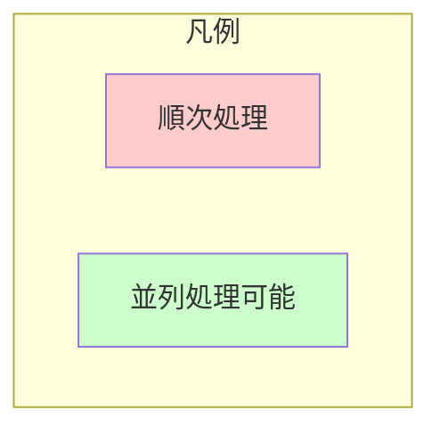

各フェーズ内で並列処理可能なタスクを識別し、開発効率を最大化します。

| フェーズ | 並列グループ | タスク | コンフリクトリスク |
|---------|-------------|--------|------------------|
| Phase 1 | Group A | 1.3, 1.4 | 低（異なるファイル） |
| Phase 2 | Group B | 2.5, 2.6 | なし（異なるディレクトリ） |
| Phase 2 | Group C | 2.1, 2.2 | 低（独立モジュール） |
| Phase 3 | Group D | 3.1, 3.2, 3.4 | なし（完全独立） |
| Phase 3 | Group E | 3.3, 3.5 | 低（UI関連だが異なるファイル） |
| Phase 4 | Group F | 4.1, 4.2 | なし（独立モジュール） |
| Phase 5 | Group G | 5.1, 5.2, 5.3, 5.4 | なし（独立ファイル） |

---

## Phase 1: 基盤構築

**目標**: プロジェクト初期化と CLI フレームワークの構築

### 実行順序と並列処理

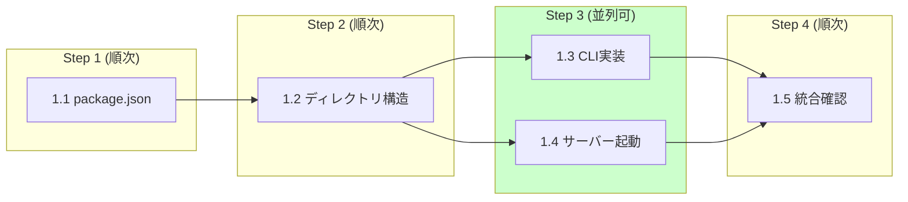

| ステップ | タスク | 並列 | ブランチ |
|---------|--------|------|---------|
| 1 | 1.1 | - | `feature/p1-package-setup` |
| 2 | 1.2 | - | 同上（継続） |
| 3 | 1.3, 1.4 | **可能** | `feature/p1-cli`, `feature/p1-server` |
| 4 | 1.5 | - | `develop` でマージ後統合 |

### タスク一覧

| # | タスク | 予想工数 | 担当ファイル | 状態 |
|---|--------|---------|-------------|------|
| 1.1 | package.json と ESM 設定 | 2h | `package.json` | pending |
| 1.2 | ディレクトリ構造作成 | 1h | `src/`, `bin/`, `templates/` | pending |
| 1.3 | Commander.js による CLI 実装 | 3h | `src/cli.js`, `bin/mdv.js` | pending |
| 1.4 | 基本サーバー起動機能 | 2h | `src/server.js` | pending |
| 1.5 | ポート指定と起動確認 | 1h | `src/cli.js`, `src/server.js` | pending |

### 成果物

- `package.json`: ESM対応、必要な依存関係記載
- `src/` ディレクトリ構造
- `src/cli.js`: コマンドラインインターフェース
- `src/server.js`: 基本的な HTTP サーバー実装
- `bin/mdv.js`: 実行可能ファイル

### 確認項目

- [ ] `npm start` でサーバーが起動すること
- [ ] `mdv --help` でヘルプが表示されること
- [ ] 指定ポートでサーバーが起動すること

---

## Phase 2: コア機能

**目標**: Markdown ファイルの描画と基本的なナビゲーション機能の実装

### 実行順序と並列処理

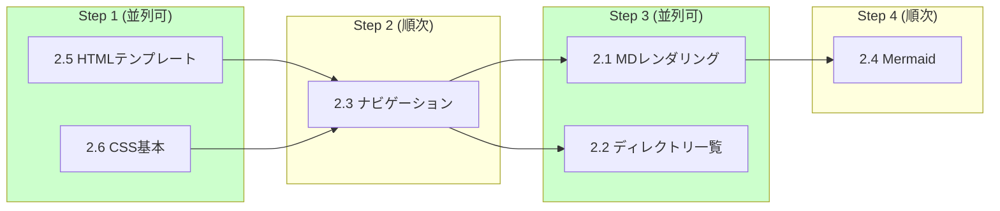

| ステップ | タスク | 並列 | ブランチ |
|---------|--------|------|---------|
| 1 | 2.5, 2.6 | **可能** | `feature/p2-templates`, `feature/p2-styles` |
| 2 | 2.3 | - | `feature/p2-navigation` |
| 3 | 2.1, 2.2 | **可能** | `feature/p2-renderer`, `feature/p2-directory` |
| 4 | 2.4 | - | `feature/p2-mermaid` |

### タスク一覧

| # | タスク | 予想工数 | 担当ファイル | 状態 |
|---|--------|---------|-------------|------|
| 2.1 | Markdown レンダリング | 4h | `src/routes/markdown.js` | pending |
| 2.2 | ディレクトリ一覧表示 | 3h | `src/routes/directory.js` | pending |
| 2.3 | ファイルナビゲーション | 2h | `src/utils/navigation.js` | pending |
| 2.4 | Mermaid 図サポート | 3h | `public/js/app.js` | pending |
| 2.5 | HTML テンプレート | 3h | `templates/page.html` | pending |
| 2.6 | CSS スタイリング基本 | 2h | `public/styles/base.css` | pending |

### 成果物

- `src/routes/markdown.js`: Markdown レンダリングルート
- `src/routes/directory.js`: ディレクトリ一覧ルート
- `src/utils/navigation.js`: ナビゲーションユーティリティ
- `public/js/app.js`: クライアントサイドJS（Mermaid処理含む）
- `templates/page.html`: メインテンプレート
- `public/styles/base.css`: 基本スタイルシート

### 確認項目

- [ ] Markdown ファイルが正しく HTML にレンダリングされること
- [ ] コード行番号が表示されること
- [ ] ディレクトリ一覧が表示されること
- [ ] Mermaid 図が正しく表示されること
- [ ] ファイル間のナビゲーションが機能すること

---

## Phase 3: 追加機能

**目標**: ユーザー体験の向上と実用性の拡張

### 実行順序と並列処理

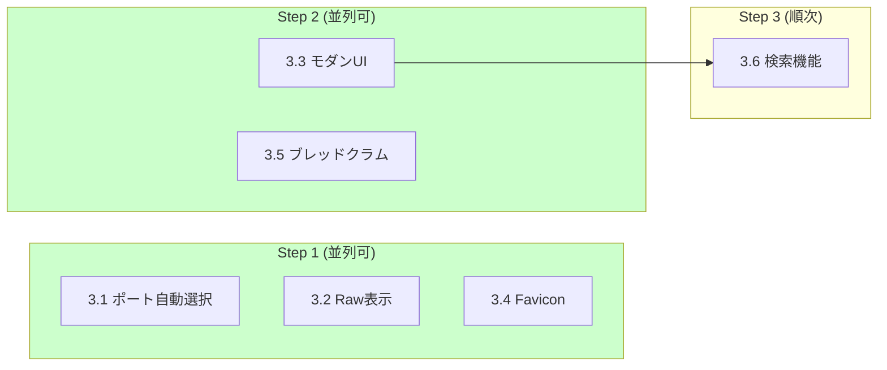

| ステップ | タスク | 並列 | ブランチ |
|---------|--------|------|---------|
| 1 | 3.1, 3.2, 3.4 | **可能** | `feature/p3-port-finder`, `feature/p3-raw-viewer`, `feature/p3-favicon` |
| 2 | 3.3, 3.5 | **可能** | `feature/p3-modern-ui`, `feature/p3-breadcrumb` |
| 3 | 3.6 | - | `feature/p3-search` |

### タスク一覧

| # | タスク | 予想工数 | 担当ファイル | 状態 |
|---|--------|---------|-------------|------|
| 3.1 | 複数インスタンス対応 | 2h | `src/utils/port.js` | pending |
| 3.2 | Raw コード表示 | 1h | `src/routes/raw.js` | pending |
| 3.3 | モダン UI スタイリング | 4h | `public/styles/modern.css` | pending |
| 3.4 | Favicon 追加 | 1h | `public/favicon.ico` | pending |
| 3.5 | ナビゲーション強化 | 2h | `public/js/navigation.js` | pending |
| 3.6 | 検索機能 (opt) | 3h | `src/routes/api.js`, `public/js/search.js` | pending |

### 成果物

- `src/utils/port.js`: ポート自動選択ロジック
- `public/styles/modern.css`: モダンスタイルシート
- `public/favicon.ico`, `public/favicon.svg`: ファビコン
- `src/routes/raw.js`: Raw 表示ルート
- `public/js/navigation.js`: クライアント側ナビゲーション
- `src/routes/api.js`: 検索API

### 確認項目

- [ ] ポート自動選択が機能すること
- [ ] モダンな UI が表示されること
- [ ] Raw コード表示が機能すること
- [ ] ブレッドクラムナビゲーションが表示されること

---

## Phase 4: 品質保証

**目標**: セキュリティ、信頼性、保守性の確保

### 実行順序と並列処理

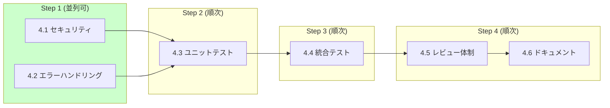

| ステップ | タスク | 並列 | ブランチ |
|---------|--------|------|---------|
| 1 | 4.1, 4.2 | **可能** | `feature/p4-security`, `feature/p4-error-handling` |
| 2 | 4.3 | - | `feature/p4-unit-tests` |
| 3 | 4.4 | - | `feature/p4-integration-tests` |
| 4 | 4.5, 4.6 | 順次 | `feature/p4-docs` |

### タスク一覧

| # | タスク | 予想工数 | 担当ファイル | 状態 |
|---|--------|---------|-------------|------|
| 4.1 | セキュリティ対策 | 3h | `src/utils/path.js`, `src/middleware/security.js` | pending |
| 4.2 | エラーハンドリング | 2h | `src/middleware/error.js`, `src/utils/logger.js` | pending |
| 4.3 | ユニットテスト | 5h | `tests/unit/**` | pending |
| 4.4 | 統合テスト | 4h | `tests/integration/**` | pending |
| 4.5 | レビュー体制構築 | 1h | `.github/`, `CONTRIBUTING.md` | pending |
| 4.6 | ドキュメンテーション | 3h | `docs/**` | pending |

### 成果物

- `src/utils/path.js`: パス検証ユーティリティ
- `src/middleware/security.js`: セキュリティミドルウェア
- `src/middleware/error.js`: エラーハンドリングミドルウェア
- `src/utils/logger.js`: 統一ロガー
- `tests/unit/`: ユニットテストディレクトリ
- `tests/integration/`: 統合テストディレクトリ
- テスト実行結果レポート

### 確認項目

- [ ] すべてのセキュリティテストが通過すること
- [ ] ユニットテストカバレッジが 80% 以上であること
- [ ] 統合テストすべてが通過すること
- [ ] エラーメッセージが一貫性を持つこと

---

## Phase 5: 公開準備

**目標**: npm パッケージとしての公開準備完了

### 実行順序と並列処理

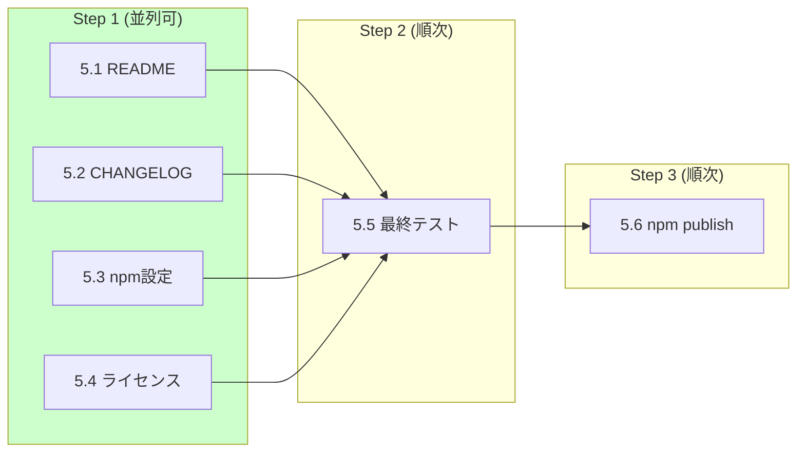

| ステップ | タスク | 並列 | ブランチ |
|---------|--------|------|---------|
| 1 | 5.1, 5.2, 5.3, 5.4 | **可能** | `feature/p5-readme`, `feature/p5-changelog`, `feature/p5-npm-config`, `feature/p5-license` |
| 2 | 5.5 | - | `develop` でマージ後 |
| 3 | 5.6 | - | `main` へマージ後 |

### タスク一覧

| # | タスク | 予想工数 | 担当ファイル | 状態 |
|---|--------|---------|-------------|------|
| 5.1 | README 作成 | 3h | `README.md` | pending |
| 5.2 | CHANGELOG 作成 | 2h | `CHANGELOG.md` | pending |
| 5.3 | npm パッケージ設定 | 1h | `package.json` | pending |
| 5.4 | ライセンス設定 | 1h | `LICENSE` | pending |
| 5.5 | 最終テスト | 2h | - | pending |
| 5.6 | npm publish | 1h | - | pending |

### 成果物

- `README.md`: プロジェクト概要とインストール手順
- `CHANGELOG.md`: バージョン履歴
- `LICENSE`: ライセンスファイル
- `package.json`: 最終版設定

### 確認項目

- [ ] README が完全で分かりやすいこと
- [ ] CHANGELOG が正確であること
- [ ] npm パッケージ情報が正確であること
- [ ] `npm install -g markserv` でインストール可能であること

---

## 開発ルール

### ブランチ戦略（詳細）

#### ブランチ階層構造

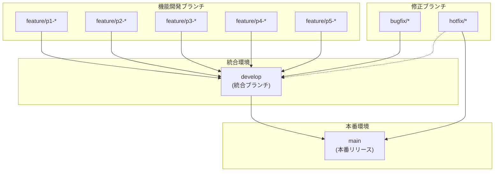

#### ブランチ命名規則（詳細）

| 種類 | パターン | 例 |
|------|----------|-----|
| 機能開発 | `feature/p{N}-{task-name}` | `feature/p1-cli-setup` |
| バグ修正 | `bugfix/{issue-description}` | `bugfix/path-traversal` |
| 緊急修正 | `hotfix/{critical-issue}` | `hotfix/server-crash` |
| リリース | `release/v{version}` | `release/v2.0.0` |

#### 全ブランチ一覧（計画）

```
main
├── develop
│   ├── feature/p1-package-setup      # 1.1, 1.2
│   ├── feature/p1-cli                # 1.3
│   ├── feature/p1-server             # 1.4, 1.5
│   │
│   ├── feature/p2-templates          # 2.5
│   ├── feature/p2-styles             # 2.6
│   ├── feature/p2-renderer           # 2.1
│   ├── feature/p2-directory          # 2.2
│   ├── feature/p2-navigation         # 2.3
│   ├── feature/p2-mermaid            # 2.4
│   │
│   ├── feature/p3-port-finder        # 3.1
│   ├── feature/p3-raw-viewer         # 3.2
│   ├── feature/p3-modern-ui          # 3.3
│   ├── feature/p3-favicon            # 3.4
│   ├── feature/p3-breadcrumb         # 3.5
│   ├── feature/p3-search             # 3.6
│   │
│   ├── feature/p4-security           # 4.1
│   ├── feature/p4-error-handling     # 4.2
│   ├── feature/p4-unit-tests         # 4.3
│   ├── feature/p4-integration-tests  # 4.4
│   ├── feature/p4-docs               # 4.5, 4.6
│   │
│   ├── feature/p5-readme             # 5.1
│   ├── feature/p5-changelog          # 5.2
│   ├── feature/p5-npm-config         # 5.3
│   └── feature/p5-license            # 5.4
│
└── release/v2.0.0                    # 5.5, 5.6
```

---

## コンフリクト防止戦略

### ディレクトリ・ファイル所有権マッピング

並列処理時のコンフリクトを防ぐため、各ブランチが編集可能なファイル/ディレクトリを明確に定義します。

#### Phase 1 所有権マップ

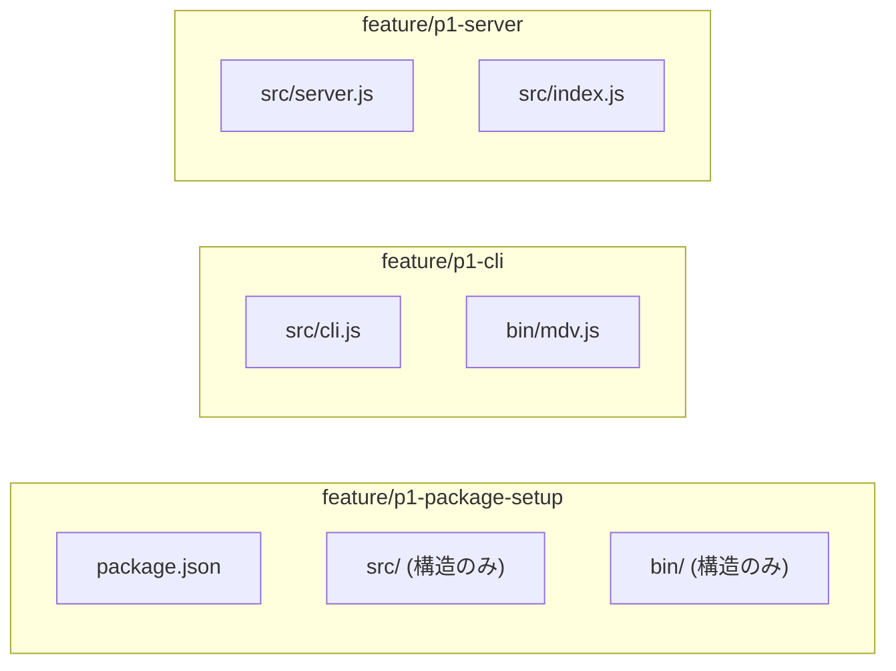

| ブランチ | 所有ファイル | 参照のみ |
|---------|-------------|---------|
| `feature/p1-package-setup` | `package.json`, `src/` (構造), `bin/` (構造) | - |
| `feature/p1-cli` | `src/cli.js`, `bin/mdv.js` | `package.json` |
| `feature/p1-server` | `src/server.js`, `src/index.js` | `package.json` |

#### Phase 2 所有権マップ

| ブランチ | 所有ファイル | 参照のみ |
|---------|-------------|---------|
| `feature/p2-templates` | `templates/**` | - |
| `feature/p2-styles` | `public/styles/base.css` | - |
| `feature/p2-renderer` | `src/routes/markdown.js` | `templates/`, `public/styles/` |
| `feature/p2-directory` | `src/routes/directory.js` | `templates/` |
| `feature/p2-navigation` | `src/utils/navigation.js` | `src/routes/markdown.js` |
| `feature/p2-mermaid` | `public/js/app.js` | `templates/` |

#### Phase 3 所有権マップ

| ブランチ | 所有ファイル | 参照のみ |
|---------|-------------|---------|
| `feature/p3-port-finder` | `src/utils/port.js` | `src/server.js` |
| `feature/p3-raw-viewer` | `src/routes/raw.js` | `src/routes/markdown.js` |
| `feature/p3-modern-ui` | `public/styles/modern.css` | `templates/` |
| `feature/p3-favicon` | `public/favicon.ico`, `public/favicon.svg` | - |
| `feature/p3-breadcrumb` | `public/js/navigation.js` | `templates/` |
| `feature/p3-search` | `src/routes/api.js`, `public/js/search.js` | 全体 |

#### Phase 4 所有権マップ

| ブランチ | 所有ファイル | 参照のみ |
|---------|-------------|---------|
| `feature/p4-security` | `src/utils/path.js`, `src/middleware/security.js` | `src/**` |
| `feature/p4-error-handling` | `src/middleware/error.js`, `src/utils/logger.js` | `src/**` |
| `feature/p4-unit-tests` | `tests/unit/**` | `src/**` |
| `feature/p4-integration-tests` | `tests/integration/**` | `src/**`, `tests/unit/**` |
| `feature/p4-docs` | `docs/**`, `.github/**`, `CONTRIBUTING.md` | - |

#### Phase 5 所有権マップ

| ブランチ | 所有ファイル | 参照のみ |
|---------|-------------|---------|
| `feature/p5-readme` | `README.md` | 全体 |
| `feature/p5-changelog` | `CHANGELOG.md` | git log |
| `feature/p5-npm-config` | `package.json` (メタデータのみ) | - |
| `feature/p5-license` | `LICENSE` | - |

### コンフリクト回避ルール

#### 1. 共有ファイル編集ルール

**`package.json` の編集**

```json
// 各ブランチが編集可能なセクション
{
  // p1-package-setup のみ
  "name": "...",
  "version": "...",
  "type": "module",
  "main": "...",
  "bin": {},
  "engines": {},

  // p1-package-setup + 各フェーズで追加
  "dependencies": {},
  "devDependencies": {},

  // p5-npm-config のみ
  "description": "...",
  "keywords": [],
  "author": "...",
  "repository": {},
  "bugs": {},
  "homepage": "..."
}
```

#### 2. マージ順序ルール

同一ファイルを編集する可能性があるブランチのマージ順序を定義：

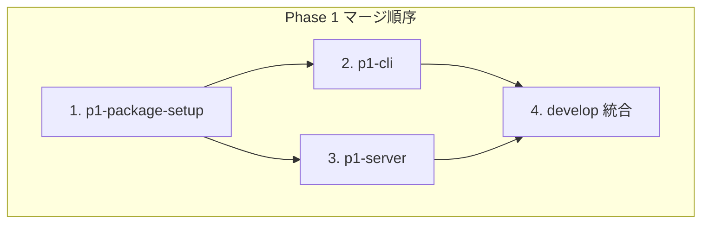

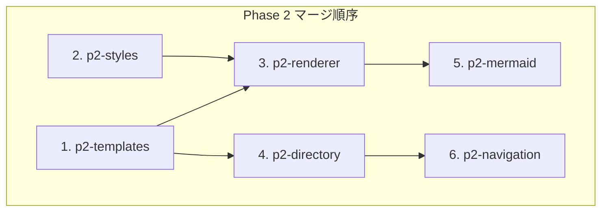

#### 3. レビュー前チェックリスト

並列開発ブランチをマージする前に確認：

```bash
# 1. develop の最新を取得
git fetch origin develop

# 2. コンフリクトの事前確認
git merge-tree $(git merge-base HEAD origin/develop) HEAD origin/develop

# 3. 所有権外のファイル変更がないか確認
git diff origin/develop --name-only | grep -v "^<所有ファイルパターン>"

# 4. リベースして最新化
git rebase origin/develop
```

#### 4. 自動コンフリクト検出 (CI)

`.github/workflows/conflict-check.yml` で自動チェック：

```yaml
# 推奨設定（Phase 4 で実装）
name: Conflict Check
on: [pull_request]

jobs:
  ownership-check:
    runs-on: ubuntu-latest
    steps:
      - name: Check file ownership
        run: |
          # 変更されたファイルが所有権マップに準拠しているか確認
          # 違反があれば警告を出力
```

---

### 並列開発ワークフロー

#### 開始時

```bash
# 1. develop から最新を取得
git checkout develop
git pull origin develop

# 2. 新しいブランチを作成
git checkout -b feature/p2-renderer

# 3. 担当ファイルのみ編集
# src/renderer.js のみ編集可能
```

#### 作業中

```bash
# 定期的に develop をマージ（1日1回推奨）
git fetch origin develop
git merge origin/develop

# コンフリクトがあれば即座に解決
```

#### 完了時

```bash
# 1. 最終リベース
git fetch origin develop
git rebase origin/develop

# 2. 所有権外の変更がないことを確認
git diff origin/develop --name-only

# 3. PR 作成
gh pr create --base develop --title "feat(renderer): implement markdown rendering"
```

---

## タスク実行順序サマリー

### 全体実行フロー

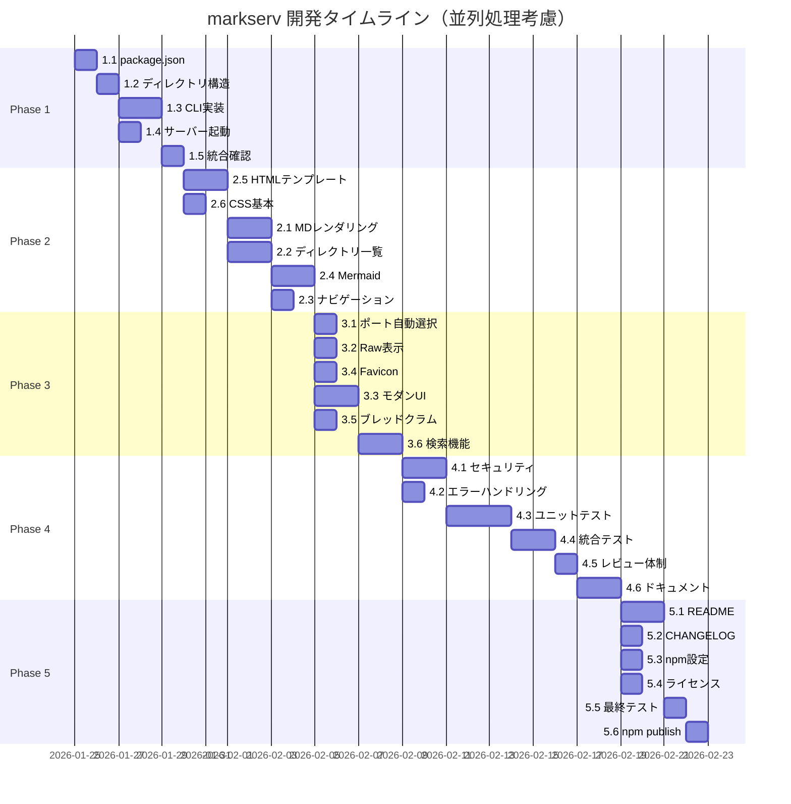

### 並列実行可能タスク一覧

| フェーズ | 並列グループ | タスク | 最大並列数 | 効率化 |
|---------|-------------|--------|-----------|--------|
| Phase 1 | A | 1.3 + 1.4 | 2 | 5h → 3h |
| Phase 2 | B | 2.5 + 2.6 | 2 | 5h → 3h |
| Phase 2 | C | 2.1 + 2.2 | 2 | 7h → 4h |
| Phase 2 | D | 2.3 + 2.4 | 2 | 5h → 3h |
| Phase 3 | E | 3.1 + 3.2 + 3.4 | 3 | 4h → 2h |
| Phase 3 | F | 3.3 + 3.5 | 2 | 6h → 4h |
| Phase 4 | G | 4.1 + 4.2 | 2 | 5h → 3h |
| Phase 5 | H | 5.1 + 5.2 + 5.3 + 5.4 | 4 | 7h → 3h |

**合計工数**: 67h（順次） → **約 45h**（並列最適化時）

---

### コミットメッセージ

**Conventional Commits** に準拠します。

```
<type>(<scope>): <subject>

<body>

<footer>
```

#### Type

- `feat`: 新機能
- `fix`: バグ修正
- `refactor`: コード整理（機能変更なし）
- `test`: テスト追加/修正
- `docs`: ドキュメント
- `chore`: ビルド、パッケージ管理など
- `perf`: パフォーマンス改善

#### 例

```
feat(renderer): add Mermaid diagram support

- Implemented mermaid-js integration
- Added syntax highlighting for diagram blocks
- Support for all Mermaid diagram types

Closes #123
```

### PR レビュー基準

- [ ] コードが要件を満たしているか
- [ ] テストが全て通過しているか
- [ ] セキュリティに問題がないか
- [ ] ドキュメントが更新されているか
- [ ] コードスタイルが統一されているか
- [ ] パフォーマンスに悪影響がないか

---

## テスト戦略

### ユニットテスト

**フレームワーク**: Jest
**実行コマンド**: `npm test:unit`

対象モジュール:
- `src/renderer.js` - Markdown レンダリング
- `src/fileHandler.js` - ファイル操作
- `src/security.js` - セキュリティ関数
- `src/portFinder.js` - ポート検索

**目標カバレッジ**: 80% 以上

### 統合テスト

**フレームワーク**: Jest + Supertest
**実行コマンド**: `npm test:integration`

対象シナリオ:
- サーバー起動と停止
- ファイルの取得と表示
- ディレクトリナビゲーション
- エラーハンドリング
- セキュリティ検証

### E2E テスト

**ツール**: Playwright（オプション）
**実行コマンド**: `npm test:e2e`

対象操作:
- ブラウザからのファイル閲覧
- 複数ファイル間のナビゲーション
- 検索機能の動作

### テスト実行フロー

```bash
# ローカル開発時
npm test                # すべてのテスト実行

# PR 前に必須
npm test:unit          # ユニットテスト
npm test:integration   # 統合テスト
npm run lint           # リント
npm run format:check   # コードフォーマット確認

# CI/CD パイプラインで自動実行
```

---

## 更新履歴

| バージョン | 日付 | 変更内容 | 作成者 |
|-----------|------|---------|--------|
| 1.0.0 | 2026-01-24 | 初版作成 - 5フェーズの実装計画を定義 | System |
| 1.1.0 | 2026-01-24 | 並列処理戦略、詳細ブランチ戦略、コンフリクト防止策を追加 | Claude Code |
| 1.2.0 | 2026-01-24 | 04_tasks.mdとの整合性確保（ファイル名・依存関係・所有権マップ修正）、bin/mdv.js拡張子統一 | Claude Code |

---

## 参考資料

- [Conventional Commits](https://www.conventionalcommits.org/)
- [Jest ドキュメント](https://jestjs.io/)
- [Marked.js](https://marked.js.org/)
- [Highlight.js](https://highlightjs.org/)
- [Mermaid.js](https://mermaid.js.org/)
