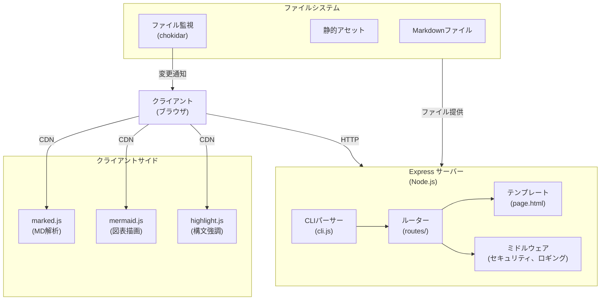
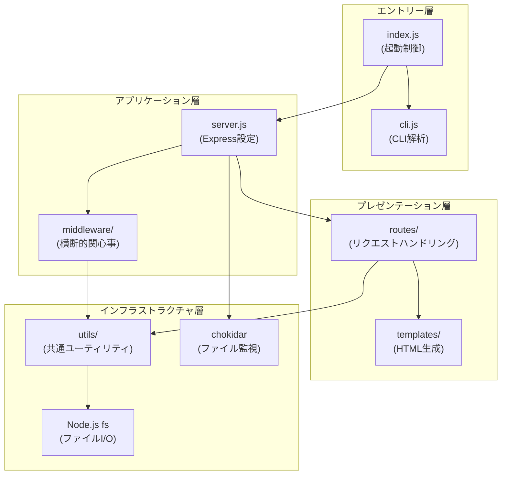

# 1. アーキテクチャ概要

## 1.1 システムアーキテクチャ

markdown-viewer は、シンプルかつスケーラブルなExpressベースのHTTPサーバーとして設計される。



## 1.2 設計原則

- **シンプルさの優先**: ESM形式の単一言語実装で保守性を確保
- **開発体験の最優先**: ファイル変更の即座なリフレッシュで迅速な開発サイクル
- **セキュリティ第一**: パストラバーサル防止など基本的なセキュリティ対策を組み込み
- **クライアント処理の優先**: レンダリングやシンタックスハイライトはクライアント側で実行

## 1.3 レイヤー設計

markdown-viewer は3層アーキテクチャを採用し、各レイヤーの責務を明確に分離する。



### 1.3.1 レイヤー責務

| レイヤー | 責務 | 含まれるモジュール |
|---------|------|-------------------|
| **エントリー層** | プロセス起動、CLI解析、設定読込 | `index.js`, `cli.js` |
| **プレゼンテーション層** | HTTPリクエスト処理、レスポンス生成、HTML出力 | `routes/*`, `templates/*` |
| **アプリケーション層** | Express設定、ルーティング登録、ミドルウェア適用 | `server.js`, `middleware/*` |
| **インフラストラクチャ層** | ファイルI/O、パス検証、ロギング、外部ライブラリ連携 | `utils/*`, `chokidar` |

### 1.3.2 依存関係ルール

レイヤー間の依存は **上位から下位への一方向のみ** 許可する。

```
エントリー層 → アプリケーション層 → プレゼンテーション層 → インフラストラクチャ層
                    ↓                        ↓
              インフラストラクチャ層    インフラストラクチャ層
```

**許可される依存**:
- エントリー層 → アプリケーション層
- アプリケーション層 → プレゼンテーション層
- アプリケーション層 → インフラストラクチャ層
- プレゼンテーション層 → インフラストラクチャ層

**禁止される依存**:
- 下位層から上位層への依存（例: `utils/` → `routes/`）
- 同一レイヤー内の循環依存

### 1.3.3 コンポーネント配置

```
src/
├── index.js              # [エントリー層] プロセス起動
├── cli.js                # [エントリー層] CLI解析
├── server.js             # [アプリケーション層] Express設定
├── routes/               # [プレゼンテーション層]
│   ├── markdown.js       #   Markdownレンダリング
│   ├── static.js         #   静的ファイル配信
│   └── raw.js            #   rawコード表示
├── middleware/           # [アプリケーション層]
│   ├── security.js       #   セキュリティヘッダー
│   └── cors.js           #   CORS設定
├── utils/                # [インフラストラクチャ層]
│   ├── path.js           #   パス検証・正規化
│   └── logger.js         #   統一ロガー
└── templates/            # [プレゼンテーション層]
    └── page.html         #   HTMLテンプレート
```

### 1.3.4 レイヤー間インターフェース

各レイヤー間は明確なインターフェースを通じて通信する。

| 呼出元 | 呼出先 | インターフェース |
|--------|--------|-----------------|
| index.js | cli.js | `parseCLI(argv): Options` |
| index.js | server.js | `createServer(options): Express` |
| server.js | routes/* | `router: express.Router` |
| server.js | middleware/* | `middleware: RequestHandler` |
| routes/* | utils/path.js | `validatePath(reqPath, rootDir): string` |
| routes/* | utils/logger.js | `logger.info/warn/error(msg)` |
