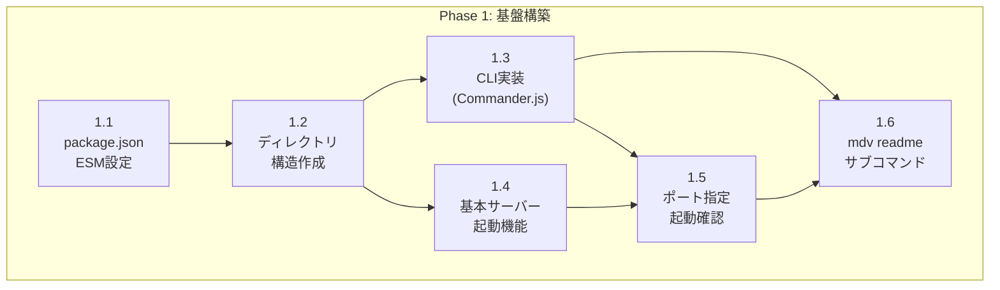

# Phase 1: 基盤構築

## タスク一覧

| ID | タスク | 予想工数 |
|----|--------|---------|
| 1.1 | package.json と ESM 設定 | 2h |
| 1.2 | ディレクトリ構造作成 | 1h |
| 1.3 | Commander.js による CLI 実装 | 3h |
| 1.4 | 基本サーバー起動機能 | 2h |
| 1.5 | ポート指定と起動確認 | 1h |
| 1.6 | `mdv readme` サブコマンド実装 | 2h |

## 依存関係図



---

## タスク 1.1: package.json と ESM 設定

### 概要
既存の `package.json` を ESM (ECMAScript Modules) 対応に改修し、必要な依存関係を整理する。

### 参照ファイル（既存コードの確認）

| ファイル | 確認内容 | 備考 |
|---------|---------|------|
| `package.json` | 現在の依存関係、scripts、bin設定 | 全体を確認 |
| `lib/cli.js:1-10` | 現在の import 文の形式 | CommonJS → ESM 変換の参考 |
| `lib/server.js:1-50` | 現在の依存関係読み込み | ESM 形式への変換対象 |

### 変更対象ファイル

| ファイル | 変更内容 |
|---------|---------|
| `package.json` | `"type": "module"` 追加、ESM対応依存関係への更新 |

### 設計仕様参照
- [03_design_spec.md § 2.1 実行環境](../03_design_spec/02_tech_stack.md#21-実行環境)

### 実装詳細

**1. package.json の必須変更**:

```json
{
  "name": "markdown-viewer",
  "version": "1.0.0",
  "type": "module",
  "engines": {
    "node": ">=18.0.0"
  },
  "main": "src/index.ts",
  "bin": {
    "mdv": "bin/mdv.js"
  }
}
```

**2. 依存関係の整理**:

| 種別 | パッケージ | 用途 |
|------|-----------|------|
| 追加 | `express@^5.0.0` | HTTPサーバーフレームワーク |
| 追加 | `commander@^11.0.0` | CLIパーサー |
| 追加 | `chokidar@^3.5.0` | ファイル監視 |
| 削除 | `connect` | Express に置換 |
| 削除 | `meow` | Commander.js に置換 |
| 削除 | `bluebird` | Native Promise を使用 |

### 確認項目

- [ ] `"type": "module"` が設定されている
- [ ] `engines.node` が `">=18.0.0"` に設定されている
- [ ] 不要な依存関係が削除されている

---

## タスク 1.2: ディレクトリ構造作成

### 概要
設計仕様に基づいた新しいディレクトリ構造を作成する。

### 参照ファイル（既存コードの確認）

| ファイル | 確認内容 | 備考 |
|---------|---------|------|
| `lib/` ディレクトリ全体 | 現在のファイル構成 | 移行元として確認 |
| `lib/templates/` | テンプレートファイル | 移行対象 |
| `lib/icons/` | アイコンファイル | 移行対象 |

### 変更対象ファイル

| 操作 | パス | 説明 |
|------|------|------|
| 作成 | `src/` | ソースコードルート |
| 作成 | `src/index.js` | エントリーポイント |
| 作成 | `src/cli.js` | CLIパーサー |
| 作成 | `src/server.js` | Expressサーバー設定 |
| 作成 | `src/routes/` | ルートハンドラー |
| 作成 | `src/utils/` | ユーティリティ関数 |
| 作成 | `src/utils/template.js` | テンプレートレンダリング |
| 作成 | `src/utils/html.js` | HTMLエスケープ等 |
| 作成 | `src/middleware/` | Expressミドルウェア |
| 作成 | `bin/mdv.js` | 実行可能ファイル |
| 移行 | `templates/` ← `lib/templates/` | テンプレート移行 |
| 作成 | `public/styles/` | スタイルシート |
| 作成 | `public/js/` | クライアントサイドJS |

### 設計仕様参照
- [03_design_spec.md § 3.1 ディレクトリ構造](../03_design_spec/03_components.md#31-ディレクトリ構造)

### 実装詳細

**新ディレクトリ構造**:

```
markdown-viewer/
├── bin/
│   └── mdv.js                # 実行可能ファイル
├── src/
│   ├── index.ts              # エントリーポイント
│   ├── cli.ts                # CLIパーサー
│   ├── server.ts             # Expressサーバー設定
│   ├── routes/
│   │   ├── markdown.ts       # Markdownレンダリング
│   │   ├── directory.ts      # ディレクトリ一覧
│   │   ├── static.ts         # 静的ファイル配信
│   │   └── raw.ts            # rawコード表示
│   ├── utils/
│   │   ├── path.ts           # パス検証・正規化
│   │   └── logger.ts         # 統一ロガー
│   └── middleware/
│       ├── security.ts       # セキュリティヘッダー
│       └── error.ts          # エラーハンドリング
├── templates/
│   └── page.html             # メインテンプレート
├── public/
│   ├── styles/
│   │   └── base.css          # 基本スタイル
│   └── js/
│       └── app.js            # クライアントサイドJS
└── tests/
    ├── unit/
    └── integration/
```

### 確認項目

- [ ] すべてのディレクトリが作成されている
- [ ] `bin/mdv.js` に実行権限が付与されている (`chmod +x`)
- [ ] 既存テンプレートが `templates/` に移行されている

---

## タスク 1.3: Commander.js による CLI 実装

### 概要
Commander.js を使用して、コマンドライン引数を解析する CLI モジュールを実装する。

### 参照ファイル（既存コードの確認）

| ファイル | 確認内容 | 位置 |
|---------|---------|------|
| `lib/cli.js` | 現在のCLI実装全体 | 全ファイル |
| `lib/cli-defs.js` | CLIオプション定義 | 全ファイル |
| `lib/cli-help.txt` | ヘルプテキスト | 全ファイル |
| `lib/splash.js` | スプラッシュスクリーン | 全ファイル |

### 変更対象ファイル

| ファイル | 変更内容 |
|---------|---------|
| `src/cli.ts` | 新規作成：Commander.js ベースの CLI |
| `bin/mdv.js` | 新規作成：実行可能エントリーポイント |

### 設計仕様参照
- [03_design_spec.md § 3.2.2 cli.js](../03_design_spec/03_components.md#322-cliじscliパーサー)

### 実装詳細

**1. bin/mdv.js（実行可能ファイル）**:

```javascript
#!/usr/bin/env node

import { run } from '../src/cli.js';

run(process.argv);
```

**2. src/cli.js（CLIパーサー）**:

```javascript
import { Command } from 'commander';
import { createServer } from './server.js';

const program = new Command();

export function parseCLI(argv) {
  program
    .name('mdv')
    .description('Serve Markdown files as HTML')
    .version('2.0.0')
    .option('-p, --port <number>', 'Server port', '3000')
    .option('-h, --host <string>', 'Bind address', 'localhost')
    .option('-d, --dir <path>', 'Document root directory', '.')
    .option('--no-watch', 'Disable file watching')
    .option('-q, --quiet', 'Suppress log output')
    .option('--debug', 'Enable debug logging')
    .parse(argv);

  return program.opts();
}

export function run(argv) {
  const options = parseCLI(argv);
  const server = createServer(options);
  server.listen(options.port, options.host, () => {
    console.log(`mdv running at http://${options.host}:${options.port}`);
  });
}
```

**3. サポートするオプション**:

| オプション | 短縮形 | デフォルト | 説明 |
|-----------|--------|-----------|------|
| `--port` | `-p` | `3000` | サーバーポート |
| `--host` | `-h` | `localhost` | バインドアドレス |
| `--dir` | `-d` | `.` | ドキュメントルート |
| `--no-watch` | - | `false` | ファイル監視無効化 |
| `--quiet` | `-q` | `false` | ログ抑制 |
| `--debug` | - | `false` | デバッグログ有効化 |

### 確認項目

- [ ] `mdv --help` でヘルプが表示される
- [ ] `mdv --version` でバージョンが表示される
- [ ] 各オプションが正しくパースされる

---

## タスク 1.4: 基本サーバー起動機能

### 概要
Express.js を使用して基本的な HTTP サーバーを実装する。

### 参照ファイル（既存コードの確認）

| ファイル | 確認内容 | 位置 |
|---------|---------|------|
| `lib/server.js` | 現在のサーバー実装 | 全ファイル |
| `lib/server.js:startConnectApp` | Connect アプリ初期化 | 関数定義部分 |
| `lib/server.js:startHTTPServer` | HTTP サーバー起動 | 関数定義部分 |
| `lib/server.js:init` | 初期化シーケンス | 関数定義部分 |

### 変更対象ファイル

| ファイル | 変更内容 |
|---------|---------|
| `src/server.js` | 新規作成：Express サーバー設定 |
| `src/index.js` | 新規作成：エントリーポイント |

### 設計仕様参照
- [03_design_spec.md § 3.2.3 server.js](../03_design_spec/03_components.md#323-serverjsexpressサーバー設定)

### 実装詳細

**1. src/server.js（Express サーバー設定）**:

```javascript
import express from 'express';
import path from 'path';

export function createServer(options) {
  const app = express();

  // ドキュメントルートの設定
  const docRoot = path.resolve(options.dir);

  // 基本ルーティング（Phase 2 で拡張）
  app.get('/', (req, res) => {
    res.send('mdv is running');
  });

  // ヘルスチェック
  app.get('/health', (req, res) => {
    res.json({ status: 'ok', timestamp: new Date().toISOString() });
  });

  return app;
}
```

**2. src/index.js（エントリーポイント）**:

```javascript
import { createServer } from './server.js';
import { parseCLI } from './cli.js';

const options = parseCLI(process.argv.slice(2));
const server = createServer(options);

server.listen(options.port, options.host, () => {
  console.log(`mdv running at http://${options.host}:${options.port}`);
});

export { createServer, parseCLI };
```

### 確認項目

- [ ] `node src/index.js` でサーバーが起動する
- [ ] `http://localhost:3000/` にアクセスできる
- [ ] `/health` エンドポイントが JSON を返す

---

## タスク 1.5: ポート指定と起動確認

### 概要
CLI から指定したポートでサーバーを起動し、CLI と サーバーの統合動作を確認する。

### 参照ファイル（既存コードの確認）

| ファイル | 確認内容 | 位置 |
|---------|---------|------|
| `lib/server.js:startConnectApp` | ポート設定処理 | `port` プロパティ |
| `lib/cli.js:cliOpts` | CLI オプション処理 | 変数定義部分 |

### 変更対象ファイル

| ファイル | 変更内容 |
|---------|---------|
| `src/cli.js` | ポート検証ロジック追加 |
| `src/server.js` | ポート設定統合 |

### 設計仕様参照
- [03_design_spec.md § 2.2 HTTP サーバー](../03_design_spec/02_tech_stack.md#22-http-サーバー)

### 実装詳細

**1. ポート検証ロジック（src/cli.js に追加）**:

```javascript
function validatePort(value) {
  const port = parseInt(value, 10);
  if (isNaN(port) || port < 1 || port > 65535) {
    throw new Error(`Invalid port number: ${value}`);
  }
  return port;
}

program
  .option('-p, --port <number>', 'Server port', validatePort, 3000)
```

**2. 統合テストコマンド**:

```bash
# デフォルトポートで起動
node bin/mdv.js

# カスタムポートで起動
node bin/mdv.js --port 8080

# ヘルプ表示
node bin/mdv.js --help
```

### 確認項目

- [ ] `mdv` コマンドでデフォルトポート 3000 で起動する
- [ ] `mdv --port 8080` でポート 8080 で起動する
- [ ] 不正なポート番号でエラーメッセージが表示される
- [ ] `mdv --help` でヘルプが表示される

---

## タスク 1.6: `mdv readme` サブコマンド実装

### 概要
`mdv readme` コマンドでカレントディレクトリまたは親ディレクトリから README.md を自動検索し、ブラウザで表示する機能を実装する。（DEC-004）

### 参照ファイル（既存コードの確認）

| ファイル | 確認内容 | 位置 |
|---------|---------|------|
| `src/cli.ts` | Phase 1.3 で作成した CLI 実装 | 全ファイル |
| `src/server.ts` | Phase 1.4 で作成したサーバー | 全ファイル |

### 変更対象ファイル

| ファイル | 変更内容 |
|---------|---------|
| `src/cli.ts` | `readme` サブコマンド追加 |
| `src/utils/readme.ts` | 新規作成：README.md 検索ユーティリティ |

### 設計仕様参照
- [03_design_spec.md § 3.2.2 cli.ts](../03_design_spec/03_components.md#322-clitsclパーサー)

### 実装詳細

**1. src/utils/readme.ts（README検索）**:

```typescript
import fs from 'fs';
import path from 'path';

/**
 * 上位ディレクトリを遡って README.md を検索
 * @param startDir - 検索開始ディレクトリ
 * @returns README.md の絶対パス、見つからない場合は null
 */
export function findReadme(startDir: string): string | null {
  let currentDir = path.resolve(startDir);
  const root = path.parse(currentDir).root;

  while (currentDir !== root) {
    const readmePath = path.join(currentDir, 'README.md');
    if (fs.existsSync(readmePath)) {
      return readmePath;
    }
    // 大文字小文字の違いも考慮
    const readmePathLower = path.join(currentDir, 'readme.md');
    if (fs.existsSync(readmePathLower)) {
      return readmePathLower;
    }
    currentDir = path.dirname(currentDir);
  }
  return null;
}
```

**2. src/cli.ts への追加**:

```typescript
import { Command } from 'commander';
import { findReadme } from './utils/readme.js';

const program = new Command();

program
  .name('mdv')
  .description('Serve Markdown files as HTML')
  .version('2.0.0');

// readme サブコマンド
program
  .command('readme')
  .description('Find and display the nearest README.md')
  .action(() => {
    const readmePath = findReadme(process.cwd());
    if (readmePath) {
      const dirPath = path.dirname(readmePath);
      // サーバーを起動し、README.md を表示
      const server = createServer({ dir: dirPath });
      server.listen(3000, 'localhost', () => {
        const relativePath = path.basename(readmePath);
        console.log(`Opening ${readmePath}`);
        // ブラウザを開く処理
        import('open').then(open => open.default(`http://localhost:3000/${relativePath}`));
      });
    } else {
      console.error('README.md not found');
      process.exit(1);
    }
  });
```

### 確認項目

- [ ] `mdv readme` でカレントディレクトリの README.md が表示される
- [ ] カレントディレクトリにない場合、親ディレクトリを検索する
- [ ] README.md が見つからない場合はエラーメッセージを表示
- [ ] 大文字小文字の違い（README.md / readme.md）を考慮

---

## Phase 1 成果物

| ファイル | 説明 |
|---------|------|
| `package.json` | ESM対応、依存関係更新済み |
| `src/index.ts` | エントリーポイント |
| `src/cli.ts` | Commander.js ベース CLI（readme サブコマンド含む）|
| `src/server.ts` | Express サーバー設定 |
| `src/utils/readme.ts` | README.md 検索ユーティリティ |
| `bin/mdv.js` | 実行可能ファイル |
| `src/routes/` | ルートディレクトリ（空） |
| `src/utils/` | ユーティリティディレクトリ |
| `src/middleware/` | ミドルウェアディレクトリ（空） |
