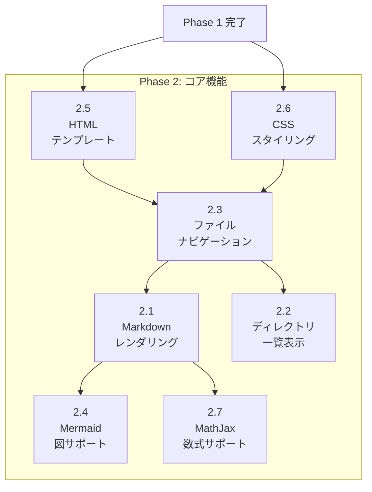

# Phase 2: コア機能

## タスク一覧

| ID | タスク | 予想工数 |
|----|--------|---------|
| 2.1 | Markdown レンダリング (marked + highlight.js) | 4h |
| 2.2 | ディレクトリ一覧表示機能 | 3h |
| 2.3 | ファイルナビゲーション機能 | 2h |
| 2.4 | Mermaid 図サポート | 3h |
| 2.5 | HTML テンプレート作成 | 3h |
| 2.6 | CSS スタイリング基本 | 2h |
| 2.7 | MathJax 数式サポート | 2h |

## 依存関係図



---

## タスク 2.5: HTML テンプレート作成

### 概要
Markdown レンダリング結果を埋め込む HTML テンプレートを作成する。

### 参照ファイル（既存コードの確認）

| ファイル | 確認内容 | 位置 |
|---------|---------|------|
| `lib/templates/markdown.html` | 現在の Markdown テンプレート | 全ファイル (25行) |
| `lib/templates/directory.html` | 現在のディレクトリテンプレート | 全ファイル (20行) |
| `lib/templates/error.html` | エラーページテンプレート | 全ファイル |
| `lib/server.js:baseTemplate` | テンプレート読み込み処理 | 関数定義部分 |

### 変更対象ファイル

| ファイル | 変更内容 |
|---------|---------|
| `templates/page.html` | 新規作成：統合テンプレート |

### 設計仕様参照
- [03_design_spec.md § 3.2.10 templates/page.html](../03_design_spec/03_components.md#3210-templatespagehtml（htmlテンプレート）)

### 実装詳細

**templates/page.html**:

```html
<!DOCTYPE html>
<html lang="ja">
<head>
  <meta charset="UTF-8">
  <meta name="viewport" content="width=device-width, initial-scale=1.0">
  <title>{{title}}</title>
  <link rel="stylesheet" href="/static/styles/base.css">
  <link rel="stylesheet"
    href="https://cdn.jsdelivr.net/npm/highlight.js@11/styles/github.min.css">
</head>
<body>
  <nav id="breadcrumbs">{{breadcrumbs}}</nav>
  <main id="content">
    {{content}}
  </main>
  <footer>
    <hr>
    Served by <a href="https://www.npmjs.com/package/markdown-viewer">markdown-viewer</a>
  </footer>

  <!-- クライアント側ライブラリ -->
  <script src="https://cdn.jsdelivr.net/npm/marked/marked.min.js"></script>
  <script src="https://cdn.jsdelivr.net/npm/highlight.js@11/dist/highlight.min.js"></script>
  <script type="module">
    import mermaid from 'https://cdn.jsdelivr.net/npm/mermaid@11/dist/mermaid.esm.min.mjs';
    mermaid.initialize({ startOnLoad: true });
  </script>
  <script src="/static/js/app.js"></script>
</body>
</html>
```

### 確認項目

- [ ] テンプレート変数 `{{title}}`, `{{content}}`, `{{breadcrumbs}}` が定義されている
- [ ] CDN からのスクリプト読み込みが正しい
- [ ] CSP 設定と整合性がある

---

## タスク 2.6: CSS スタイリング基本

### 概要
GitHub スタイルの Markdown 表示用基本 CSS を作成する。

### 参照ファイル（既存コードの確認）

| ファイル | 確認内容 | 位置 |
|---------|---------|------|
| `lib/templates/markserv.css` | 現在の CSS スタイル | 全ファイル |
| `lib/templates/github.less` | GitHub スタイル LESS | 全ファイル |
| `lib/templates/highlight-js-github-gist.css` | シンタックスハイライト CSS | 全ファイル |

### 変更対象ファイル

| ファイル | 変更内容 |
|---------|---------|
| `public/styles/base.css` | 新規作成：基本スタイルシート |

### 設計仕様参照
- [03_design_spec.md § 2.3 Markdown 処理](../03_design_spec/02_tech_stack.md#23-markdown-処理)

### 実装詳細

**public/styles/base.css**（主要セクション）:

```css
/* リセットと基本設定 */
*, *::before, *::after {
  box-sizing: border-box;
}

body {
  font-family: -apple-system, BlinkMacSystemFont, "Segoe UI", Helvetica, Arial, sans-serif;
  font-size: 16px;
  line-height: 1.6;
  color: #24292e;
  background-color: #ffffff;
  max-width: 980px;
  margin: 0 auto;
  padding: 45px;
}

/* Markdown コンテンツ */
#content {
  /* GitHub スタイル準拠 */
}

/* コードブロック */
pre {
  background-color: #f6f8fa;
  border-radius: 6px;
  padding: 16px;
  overflow: auto;
}

code {
  font-family: "SFMono-Regular", Consolas, "Liberation Mono", Menlo, monospace;
  font-size: 85%;
}

/* ディレクトリ一覧 */
.directory-listing {
  list-style: none;
  padding: 0;
}

.directory-listing li {
  padding: 8px 0;
  border-bottom: 1px solid #e1e4e8;
}

/* ブレッドクラム */
#breadcrumbs {
  font-size: 14px;
  margin-bottom: 20px;
}

#breadcrumbs a {
  color: #0366d6;
  text-decoration: none;
}
```

### 確認項目

- [ ] 基本的なタイポグラフィが設定されている
- [ ] コードブロックのスタイルが適用されている
- [ ] レスポンシブ対応（max-width 設定）

---

## タスク 2.1: Markdown レンダリング

### 概要
Markdown ファイルを読み込み、HTML テンプレートに埋め込んでレスポンスする。

### 参照ファイル（既存コードの確認）

| ファイル | 確認内容 | 位置 |
|---------|---------|------|
| `lib/server.js:markdownToHTML` | 現在の Markdown 変換処理 | 関数定義部分 |
| `lib/server.js:md` | markdown-it 設定 | 変数定義部分 |
| `lib/server.js:createRequestHandler` | リクエストハンドラ | 関数定義部分 |
| `lib/server.js:getFile` | ファイル取得処理 | 関数定義部分 |

### 変更対象ファイル

| ファイル | 変更内容 |
|---------|---------|
| `src/routes/markdown.js` | 新規作成：Markdown ルートハンドラ |
| `src/server.js` | ルート登録追加 |

### 設計仕様参照
- [03_design_spec.md § 3.2.4 routes/markdown.js](../03_design_spec/03_components.md#324-routesmarkdownjsmarkdownレンダリング)
- [03_design_spec.md § 5.2.2 GET /*.md](../03_design_spec/05_api.md#522-get-md---markdownレンダリング)

### 実装詳細

**src/routes/markdown.js**:

```javascript
import { Router } from 'express';
import fs from 'fs/promises';
import path from 'path';
import { validatePath } from '../utils/path.js';
import { renderTemplate } from '../utils/template.js';
import { escapeHtml } from '../utils/html.js';
import { generateBreadcrumbs } from '../utils/navigation.js';

const router = Router();

router.get('/*.md', async (req, res, next) => {
  try {
    const requestPath = req.path;
    const docRoot = req.app.get('docRoot');

    // パス検証（パストラバーサル防止）
    const filePath = validatePath(requestPath, docRoot);

    // ファイル読み込み
    const content = await fs.readFile(filePath, 'utf-8');

    // テンプレートにMarkdownを埋め込み（クライアント側でレンダリング）
    const html = renderTemplate('page', {
      title: path.basename(filePath),
      content: `<div id="markdown-source" style="display:none">${escapeHtml(content)}</div>
                <div id="markdown-rendered"></div>`,
      breadcrumbs: generateBreadcrumbs(requestPath)
    });

    res.type('html').send(html);
  } catch (error) {
    if (error.code === 'ENOENT') {
      res.status(404).send('File not found');
    } else if (error.message === 'Path traversal detected') {
      res.status(403).send('Access denied');
    } else {
      next(error);
    }
  }
});

export default router;
```

**src/server.js への追加**:

```javascript
import markdownRouter from './routes/markdown.js';

// ルート登録
app.use(markdownRouter);
```

### 確認項目

- [ ] `.md` ファイルにアクセスすると HTML が返される
- [ ] ファイルが存在しない場合 404 エラー
- [ ] パストラバーサル試行で 403 エラー

---

## タスク 2.2: ディレクトリ一覧表示機能

### 概要
ディレクトリにアクセスした際にファイル一覧を表示する。

### 参照ファイル（既存コードの確認）

| ファイル | 確認内容 | 位置 |
|---------|---------|------|
| `lib/server.js:dirToHtml` | ディレクトリ→HTML 変換 | 関数定義部分 |
| `lib/server.js:lookUpIconClass` | アイコンクラス取得 | 関数定義部分 |
| `lib/icons/material-icons.json` | アイコン定義 | 全ファイル |
| `lib/templates/directory.html:15` | ディレクトリ一覧構造 | `{{{content}}}` 部分 |

### 変更対象ファイル

| ファイル | 変更内容 |
|---------|---------|
| `src/routes/directory.js` | 新規作成：ディレクトリ一覧ルート |
| `src/utils/icons.js` | 新規作成：アイコンユーティリティ |
| `src/server.js` | ルート登録追加 |

### 設計仕様参照
- [03_design_spec.md § 5.2.1 GET /](../03_design_spec/05_api.md#521-get----ルートディレクトリ一覧)

### 実装詳細

**src/routes/directory.js**:

```javascript
import { Router } from 'express';
import fs from 'fs/promises';
import path from 'path';
import { validatePath } from '../utils/path.js';
import { getIconClass } from '../utils/icons.js';
import { renderTemplate } from '../utils/template.js';
import { generateBreadcrumbs } from '../utils/navigation.js';

const router = Router();

router.get('*', async (req, res, next) => {
  try {
    const requestPath = req.path;
    const docRoot = req.app.get('docRoot');
    const dirPath = validatePath(requestPath, docRoot);

    const stat = await fs.stat(dirPath);
    if (!stat.isDirectory()) {
      return next(); // ディレクトリでなければ次のハンドラへ
    }

    const entries = await fs.readdir(dirPath, { withFileTypes: true });

    // エントリーをソート（ディレクトリ優先、アルファベット順）
    const sorted = entries.sort((a, b) => {
      if (a.isDirectory() && !b.isDirectory()) return -1;
      if (!a.isDirectory() && b.isDirectory()) return 1;
      return a.name.localeCompare(b.name);
    });

    // HTML リスト生成
    const listHtml = sorted.map(entry => {
      const isDir = entry.isDirectory();
      const href = path.join(requestPath, entry.name) + (isDir ? '/' : '');
      const iconClass = getIconClass(entry.name, isDir);
      return `<li class="${iconClass}"><a href="${href}">${entry.name}${isDir ? '/' : ''}</a></li>`;
    }).join('\n');

    const html = renderTemplate('page', {
      title: `Index of ${requestPath}`,
      content: `<ul class="directory-listing">${listHtml}</ul>`,
      breadcrumbs: generateBreadcrumbs(requestPath)
    });

    res.type('html').send(html);
  } catch (error) {
    next(error);
  }
});

export default router;
```

### 確認項目

- [ ] ディレクトリにアクセスするとファイル一覧が表示される
- [ ] ディレクトリが先に、ファイルが後に表示される
- [ ] 各エントリーがリンクになっている

---

## タスク 2.3: ファイルナビゲーション機能

### 概要
ブレッドクラムナビゲーションとディレクトリ間の移動機能を実装する。

### 参照ファイル（既存コードの確認）

| ファイル | 確認内容 | 位置 |
|---------|---------|------|
| `lib/server.js:createBreadcrumbs` | ブレッドクラム生成 | 関数定義部分 |
| `lib/templates/directory.html:15` | ブレッドクラム表示 | `{{#each breadcrumbs}}` 部分 |

### 変更対象ファイル

| ファイル | 変更内容 |
|---------|---------|
| `src/utils/navigation.js` | 新規作成：ナビゲーションユーティリティ |
| `public/js/app.js` | クライアント側ナビゲーション追加 |

### 設計仕様参照
- [03_design_spec.md § 3.3 データフロー](../03_design_spec/03_components.md#33-データフロー)

### 実装詳細

**src/utils/navigation.js**:

```javascript
/**
 * パスからブレッドクラムを生成
 * @param {string} requestPath - リクエストパス
 * @returns {string} - ブレッドクラム HTML
 */
export function generateBreadcrumbs(requestPath) {
  const parts = requestPath.split('/').filter(Boolean);
  const breadcrumbs = [{ href: '/', text: 'Home' }];

  let currentPath = '';
  for (const part of parts) {
    currentPath += `/${part}`;
    breadcrumbs.push({ href: currentPath, text: part });
  }

  return breadcrumbs
    .map((crumb, index) => {
      const isLast = index === breadcrumbs.length - 1;
      if (isLast) {
        return `<span>${crumb.text}</span>`;
      }
      return `<a href="${crumb.href}">${crumb.text}</a>`;
    })
    .join(' / ');
}
```

### 確認項目

- [ ] ブレッドクラムが正しく表示される
- [ ] 各パスセグメントがリンクになっている
- [ ] 現在のページはリンクではなくテキスト

---

## タスク 2.4: Mermaid 図サポート

### 概要
Markdown 内の Mermaid 記法を図として表示する機能を実装する。

### 参照ファイル（既存コードの確認）

| ファイル | 確認内容 | 位置 |
|---------|---------|------|
| `lib/templates/markdown.html:20-23` | 現在の Mermaid 読み込み | script タグ |
| `lib/server.js:fence` | フェンスブロック処理 | 関数定義部分 |

### 変更対象ファイル

| ファイル | 変更内容 |
|---------|---------|
| `public/js/app.js` | Mermaid 初期化追加 |
| `templates/page.html` | Mermaid スクリプト確認 |

### 設計仕様参照
- [03_design_spec.md § 2.3 Markdown 処理](../03_design_spec/02_tech_stack.md#23-markdown-処理)

### 実装詳細

**public/js/app.js に追加**:

```javascript
// Mermaid ダイアグラムの処理
document.addEventListener('DOMContentLoaded', () => {
  // marked.js で Markdown をレンダリング
  const source = document.getElementById('markdown-source');
  const rendered = document.getElementById('markdown-rendered');

  if (source && rendered) {
    const markdown = source.textContent;

    // Mermaid コードブロックを一時的にプレースホルダに置換
    const mermaidBlocks = [];
    const processedMarkdown = markdown.replace(
      /```mermaid\n([\s\S]*?)```/g,
      (match, code) => {
        const id = `mermaid-${mermaidBlocks.length}`;
        mermaidBlocks.push({ id, code });
        return `<div class="mermaid" id="${id}">${code}</div>`;
      }
    );

    // Markdown をレンダリング
    rendered.innerHTML = marked.parse(processedMarkdown);

    // シンタックスハイライト
    document.querySelectorAll('pre code').forEach((block) => {
      hljs.highlightElement(block);
    });
  }
});
```

### 確認項目

- [ ] Mermaid 記法が図としてレンダリングされる
- [ ] 複数の Mermaid ブロックが正しく表示される
- [ ] Mermaid エラー時にエラーメッセージが表示される

---

## タスク 2.7: MathJax 数式サポート

### 概要
Markdown 内の LaTeX 記法（`$E=mc^2$`、`$$...$$`）を MathJax でレンダリングする機能を実装する。（DEC-001）

### 参照ファイル（既存コードの確認）

| ファイル | 確認内容 | 位置 |
|---------|---------|------|
| `templates/page.html` | Phase 2.5 で作成したテンプレート | script タグ |
| `public/js/app.js` | Phase 2.4 で作成したクライアントJS | 全ファイル |

### 変更対象ファイル

| ファイル | 変更内容 |
|---------|---------|
| `templates/page.html` | MathJax CDN スクリプト追加 |
| `public/js/app.js` | MathJax 初期化・再レンダリング処理追加 |

### 設計仕様参照
- [03_design_spec.md § 2.3 Markdown 処理](../03_design_spec/02_tech_stack.md#23-markdown-処理)
- [03_design_spec.md § 3.2.10 templates/page.html](../03_design_spec/03_components.md#3210-templatespagehtml（htmlテンプレート）)

### 実装詳細

**1. templates/page.html への追加**:

```html
<head>
  <!-- 既存の内容 -->

  <!-- MathJax 設定 -->
  <script>
    MathJax = {
      tex: {
        inlineMath: [['$', '$'], ['\\(', '\\)']],
        displayMath: [['$$', '$$'], ['\\[', '\\]']],
        processEscapes: true
      },
      svg: { fontCache: 'global' },
      startup: {
        ready: () => {
          MathJax.startup.defaultReady();
          // Markdown レンダリング後に MathJax を再実行するためのフック
          window.renderMathJax = () => {
            MathJax.typesetPromise();
          };
        }
      }
    };
  </script>
  <script src="https://cdn.jsdelivr.net/npm/mathjax@3/es5/tex-svg.js" async></script>
</head>
```

**2. public/js/app.js への追加**:

```javascript
// Markdown レンダリング後に MathJax を実行
document.addEventListener('DOMContentLoaded', () => {
  const source = document.getElementById('markdown-source');
  const rendered = document.getElementById('markdown-rendered');

  if (source && rendered) {
    // ... 既存の Markdown レンダリング処理 ...

    // MathJax で数式をレンダリング
    if (window.MathJax && window.MathJax.typesetPromise) {
      window.MathJax.typesetPromise([rendered]).catch((err) => {
        console.error('MathJax error:', err);
      });
    }
  }
});
```

**3. サポートする記法**:

| 記法 | 説明 | 例 |
|------|------|-----|
| `$...$` | インライン数式 | `$E=mc^2$` → $E=mc^2$ |
| `$$...$$` | ブロック数式 | `$$\sum_{i=1}^n i$$` |
| `\(...\)` | インライン数式（代替） | `\(x^2\)` |
| `\[...\]` | ブロック数式（代替） | `\[x^2 + y^2 = r^2\]` |

### 確認項目

- [ ] インライン数式 `$E=mc^2$` が正しくレンダリングされる
- [ ] ブロック数式 `$$...$$` が中央揃えで表示される
- [ ] Mermaid 図と数式が同じページで共存できる
- [ ] MathJax エラー時にコンソールにエラーが出力される

---

## Phase 2 成果物

| ファイル | 説明 |
|---------|------|
| `src/routes/markdown.ts` | Markdown レンダリングルート |
| `src/routes/directory.ts` | ディレクトリ一覧ルート |
| `src/utils/navigation.ts` | ナビゲーションユーティリティ |
| `src/utils/icons.ts` | アイコンユーティリティ |
| `templates/page.html` | メインテンプレート（MathJax 対応）|
| `public/styles/base.css` | 基本スタイルシート |
| `public/js/app.js` | クライアントサイド JS（MathJax 対応）|
