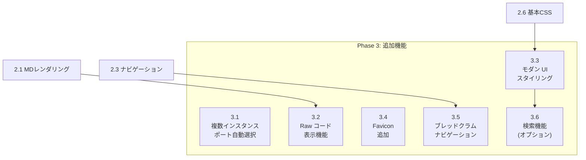

# Phase 3: 追加機能

## タスク一覧

| ID | タスク | 予想工数 |
|----|--------|---------|
| 3.1 | 複数インスタンス対応（ポート自動選択） | 2h |
| 3.2 | Raw コード表示機能 | 1h |
| 3.3 | モダン UI スタイリング | 4h |
| 3.4 | Favicon 追加 | 1h |
| 3.5 | ナビゲーション強化（キーボード対応） | 2h |
| 3.6 | 検索機能 (オプション) | 3h |

## 依存関係図



---

## タスク 3.1: 複数インスタンス対応（ポート自動選択）

### 概要
指定ポートが使用中の場合、自動的に空きポートを検索して起動する。

### 参照ファイル（既存コードの確認）

| ファイル | 確認内容 | 位置 |
|---------|---------|------|
| `lib/server.js:startConnectApp` | 現在のポート設定 | `port` プロパティ |
| `tests/test.js` | テストでの get-port 使用 | import 文 |
| `package.json:106` | devDependencies の get-port | |

### 変更対象ファイル

| ファイル | 変更内容 |
|---------|---------|
| `src/utils/port.js` | 新規作成：ポート検索ユーティリティ |
| `src/server.js` | ポート自動選択統合 |
| `package.json` | get-port を dependencies に移動 |

### 実装詳細

**src/utils/port.js**:

```javascript
import net from 'net';

/**
 * 空きポートを検索
 * @param {number} preferredPort - 優先ポート
 * @param {number} maxAttempts - 最大試行回数
 * @returns {Promise<number>} - 利用可能なポート
 */
export async function findAvailablePort(preferredPort = 3000, maxAttempts = 10) {
  for (let i = 0; i < maxAttempts; i++) {
    const port = preferredPort + i;
    const isAvailable = await checkPortAvailable(port);
    if (isAvailable) {
      return port;
    }
  }
  throw new Error(`No available port found starting from ${preferredPort}`);
}

function checkPortAvailable(port) {
  return new Promise((resolve) => {
    const server = net.createServer();
    server.once('error', () => resolve(false));
    server.once('listening', () => {
      server.close();
      resolve(true);
    });
    server.listen(port);
  });
}
```

### 確認項目

- [ ] ポート 3000 が使用中でも起動できる
- [ ] 実際に使用されたポートがコンソールに表示される

---

## タスク 3.2: Raw コード表示機能

### 概要
非 Markdown ファイル（.js, .py 等）をシンタックスハイライト付きで表示する。

### 参照ファイル（既存コードの確認）

| ファイル | 確認内容 | 位置 |
|---------|---------|------|
| `lib/server.js:fileTypes` | ファイルタイプ定義 | プロパティ定義部分 |
| `lib/server.js:getFile` | ファイル取得処理 | 関数定義部分 |

### 変更対象ファイル

| ファイル | 変更内容 |
|---------|---------|
| `src/routes/raw.js` | 新規作成：Raw 表示ルート |
| `src/server.js` | ルート登録追加 |

### 設計仕様参照
- [03_design_spec.md § 3.2.6 routes/raw.js](../03_design_spec/03_components.md#326-routesrawjsrawコード表示)
- [03_design_spec.md § 5.2.3 GET /*](../03_design_spec/05_api.md#523-get----非mdファイルのraw表示)

### 実装詳細

**src/routes/raw.js**:

```javascript
import { Router } from 'express';
import fs from 'fs/promises';
import path from 'path';
import { validatePath } from '../utils/path.js';
import { renderTemplate } from '../utils/template.js';
import { getLanguageFromExtension } from '../utils/language.js';
import { escapeHtml } from '../utils/html.js';
import { generateBreadcrumbs } from '../utils/navigation.js';

const router = Router();

// 対応拡張子
const SUPPORTED_EXTENSIONS = [
  '.js', '.ts', '.jsx', '.tsx', '.json',
  '.html', '.css', '.scss', '.less',
  '.py', '.rb', '.go', '.rs', '.java', '.c', '.cpp', '.h',
  '.sh', '.bash', '.zsh', '.yml', '.yaml', '.toml',
  '.txt', '.xml', '.sql'
];

router.get('*', async (req, res, next) => {
  try {
    const requestPath = req.path;
    const ext = path.extname(requestPath).toLowerCase();

    if (!SUPPORTED_EXTENSIONS.includes(ext)) {
      return next();
    }

    const docRoot = req.app.get('docRoot');
    const filePath = validatePath(requestPath, docRoot);

    const content = await fs.readFile(filePath, 'utf-8');
    const language = getLanguageFromExtension(ext);

    const html = renderTemplate('page', {
      title: path.basename(filePath),
      content: `<pre><code class="language-${language}">${escapeHtml(content)}</code></pre>`,
      breadcrumbs: generateBreadcrumbs(requestPath)
    });

    res.type('html').send(html);
  } catch (error) {
    next(error);
  }
});

export default router;
```

### 確認項目

- [ ] `.js` ファイルがシンタックスハイライト付きで表示される
- [ ] 対応していない拡張子は次のハンドラに渡される

---

## タスク 3.3: モダン UI スタイリング

### 概要
視覚的に洗練された UI スタイルを追加する。

### 参照ファイル（既存コードの確認）

| ファイル | 確認内容 | 位置 |
|---------|---------|------|
| `lib/templates/markserv.css` | 現在のスタイル | 全ファイル |
| `lib/templates/github.less` | GitHub スタイル | 全ファイル |

### 変更対象ファイル

| ファイル | 変更内容 |
|---------|---------|
| `public/styles/modern.css` | 新規作成：モダンスタイル |
| `templates/page.html` | スタイルシート参照追加 |

### 実装詳細

**public/styles/modern.css**（主要セクション）:

```css
/* ダークモード対応 */
@media (prefers-color-scheme: dark) {
  body {
    background-color: #0d1117;
    color: #c9d1d9;
  }
  pre {
    background-color: #161b22;
  }
  a {
    color: #58a6ff;
  }
}

/* アニメーション */
a {
  transition: color 0.2s ease;
}

/* ディレクトリアイコン改善 */
.directory-listing li::before {
  content: '';
  display: inline-block;
  width: 20px;
  height: 20px;
  margin-right: 8px;
  background-size: contain;
}

.directory-listing li.folder::before {
  background-image: url('/static/icons/folder.svg');
}
```

### 確認項目

- [ ] ダークモード時に適切な配色になる
- [ ] アニメーションが滑らかに動作する

---

## タスク 3.4: Favicon 追加

### 概要
ブラウザタブに表示される Favicon を設定する。

### 参照ファイル（既存コードの確認）

| ファイル | 確認内容 | 位置 |
|---------|---------|------|
| `media/markserv-favicon-96x96.png` | 既存 Favicon | |
| `lib/server.js:faviconPath` | Favicon パス設定 | 変数定義部分 |
| `lib/server.js:faviconData` | Favicon データ | 変数定義部分 |

### 変更対象ファイル

| ファイル | 変更内容 |
|---------|---------|
| `public/favicon.ico` | 新規作成/コピー |
| `public/favicon.svg` | 新規作成：SVG 版 |
| `templates/page.html` | link タグ追加 |

### 実装詳細

**templates/page.html に追加**:

```html
<head>
  <!-- 既存の内容 -->
  <link rel="icon" type="image/svg+xml" href="/static/favicon.svg">
  <link rel="alternate icon" href="/static/favicon.ico">
</head>
```

### 確認項目

- [ ] ブラウザタブに Favicon が表示される
- [ ] SVG と ICO 両方が正しく配置されている

---

## タスク 3.5: ナビゲーション強化（キーボード対応）

### 概要
タスク 2.3 のブレッドクラムをより使いやすく強化する。

### 参照ファイル（既存コードの確認）

| ファイル | 確認内容 | 位置 |
|---------|---------|------|
| `lib/server.js:createBreadcrumbs` | ブレッドクラム生成 | 関数定義部分 |
| `src/utils/navigation.js` | Phase 2 で作成 | |

### 変更対象ファイル

| ファイル | 変更内容 |
|---------|---------|
| `public/js/navigation.js` | 新規作成：クライアント側ナビゲーション |
| `public/styles/modern.css` | ブレッドクラムスタイル追加 |

### 実装詳細

**public/js/navigation.js**:

```javascript
// キーボードナビゲーション
document.addEventListener('keydown', (e) => {
  // Alt + ← で親ディレクトリへ
  if (e.altKey && e.key === 'ArrowLeft') {
    const breadcrumbs = document.querySelectorAll('#breadcrumbs a');
    if (breadcrumbs.length > 1) {
      breadcrumbs[breadcrumbs.length - 2].click();
    }
  }
});
```

### 確認項目

- [ ] ブレッドクラムのスタイルが改善されている
- [ ] キーボードナビゲーションが動作する

---

## タスク 3.6: 検索機能 (オプション)

### 概要
クライアント側でディレクトリ内のファイルを検索する機能を追加する。

### 参照ファイル（既存コードの確認）

| ファイル | 確認内容 | 位置 |
|---------|---------|------|
| なし | 新規機能 | |

### 変更対象ファイル

| ファイル | 変更内容 |
|---------|---------|
| `public/js/search.js` | 新規作成：検索 UI |
| `src/routes/api.js` | 新規作成：検索 API |
| `templates/page.html` | 検索ボックス追加 |

### 実装詳細

**src/routes/api.js**:

```javascript
import { Router } from 'express';
import fs from 'fs/promises';
import path from 'path';

const router = Router();

router.get('/api/search', async (req, res) => {
  const { q, dir } = req.query;
  const docRoot = req.app.get('docRoot');
  const searchDir = path.resolve(docRoot, dir || '.');

  // 再帰的にファイル一覧取得
  const files = await getAllFiles(searchDir);

  // クエリでフィルタ
  const results = files.filter(f =>
    path.basename(f).toLowerCase().includes(q.toLowerCase())
  );

  res.json({ results: results.slice(0, 50) });
});

export default router;
```

### 確認項目

- [ ] 検索ボックスが表示される
- [ ] ファイル名で検索できる
- [ ] 検索結果がリアルタイムで更新される

---

## Phase 3 成果物

| ファイル | 説明 |
|---------|------|
| `src/utils/port.js` | ポート自動選択ユーティリティ |
| `src/routes/raw.js` | Raw 表示ルート |
| `src/routes/api.js` | 検索 API |
| `public/styles/modern.css` | モダンスタイル |
| `public/favicon.ico` | Favicon |
| `public/favicon.svg` | SVG Favicon |
| `public/js/navigation.js` | ナビゲーション JS |
| `public/js/search.js` | 検索 JS |
