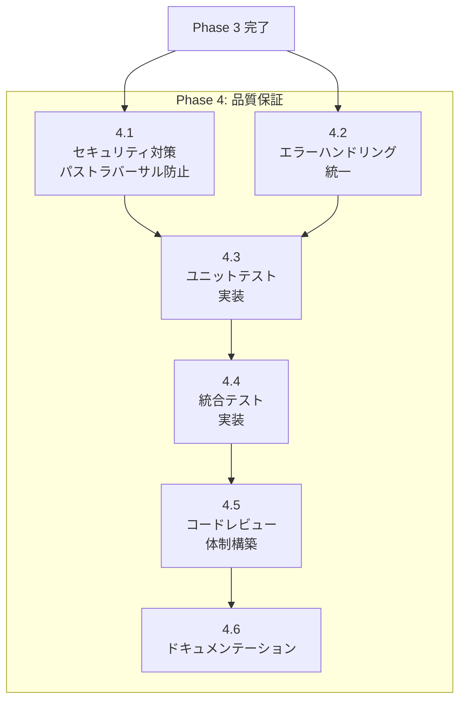

# Phase 4: 品質保証

## タスク一覧

| ID | タスク | 予想工数 |
|----|--------|---------|
| 4.1 | セキュリティ対策（パストラバーサル防止） | 3h |
| 4.2 | エラーハンドリング統一 | 2h |
| 4.3 | ユニットテスト実装 | 5h |
| 4.4 | 統合テスト実装 | 4h |
| 4.5 | コードレビュー体制構築 | 1h |
| 4.6 | ドキュメンテーション | 3h |

## 依存関係図



---

## タスク 4.1: セキュリティ対策（パストラバーサル防止）

### 概要
パストラバーサル攻撃を防止するセキュリティモジュールを実装する。

### 参照ファイル（既存コードの確認）

| ファイル | 確認内容 | 位置 |
|---------|---------|------|
| `lib/server.js:secureUrl` | 現在の URL 検証 | 関数定義部分 |
| `lib/server.js:getFile` | ファイルアクセス処理 | 関数定義部分 |

### 変更対象ファイル

| ファイル | 変更内容 |
|---------|---------|
| `src/utils/path.js` | 新規作成：パス検証ユーティリティ |
| `src/middleware/security.js` | 新規作成：セキュリティミドルウェア |

### 設計仕様参照
- [03_design_spec.md § 3.2.7 utils/path.js](../03_design_spec/03_components.md#327-utilspathjs（パス検証・正規化）)
- [03_design_spec.md § 4. セキュリティ設計](../03_design_spec/04_security.md)

### 実装詳細

**src/utils/path.js**:

```javascript
import path from 'path';
import fs from 'fs';

/**
 * パストラバーサル攻撃を防止するパス検証
 * @param {string} requestPath - リクエストパス
 * @param {string} rootDir - ドキュメントルート
 * @returns {string} - 検証済み絶対パス
 * @throws {Error} - パストラバーサル検出時
 */
export function validatePath(requestPath, rootDir) {
  // 1. URL デコード
  const decodedPath = decodeURIComponent(requestPath);

  // 2. パス正規化
  const normalizedPath = path.normalize(decodedPath);

  // 3. 絶対パスに変換
  const absolutePath = path.resolve(rootDir, '.' + normalizedPath);

  // 4. realpath でシンボリックリンク解決
  const realRootDir = fs.realpathSync(rootDir);
  let realPath;
  try {
    realPath = fs.realpathSync(absolutePath);
  } catch (e) {
    if (e.code === 'ENOENT') {
      // ファイルが存在しない場合は親ディレクトリで検証
      const parentDir = path.dirname(absolutePath);
      const realParent = fs.realpathSync(parentDir);
      if (!realParent.startsWith(realRootDir)) {
        throw new Error('Path traversal detected');
      }
      throw e; // 元のエラーを再スロー
    }
    throw e;
  }

  // 5. ドキュメントルート以下か確認
  if (!realPath.startsWith(realRootDir)) {
    throw new Error('Path traversal detected');
  }

  return realPath;
}
```

**src/middleware/security.ts**:

```typescript
import { Request, Response, NextFunction } from 'express';

/**
 * セキュリティヘッダーミドルウェア
 */
export function securityHeaders(req: Request, res: Response, next: NextFunction): void {
  res.setHeader('Content-Security-Policy', [
    "default-src 'self'",
    "script-src 'self' https://cdn.jsdelivr.net",
    "style-src 'self' 'unsafe-inline' https://cdn.jsdelivr.net",
    "font-src 'self' https://cdn.jsdelivr.net",  // MathJax フォント
    "img-src 'self' data:"
  ].join('; '));
  res.setHeader('X-Content-Type-Options', 'nosniff');
  res.setHeader('X-Frame-Options', 'DENY');
  res.setHeader('X-XSS-Protection', '1; mode=block');
  next();
}
```

### 確認項目

- [ ] `/../../../etc/passwd` へのアクセスが拒否される
- [ ] シンボリックリンクを使った攻撃が防止される
- [ ] CSP ヘッダーが正しく設定される

---

## タスク 4.2: エラーハンドリング統一

### 概要
統一的なエラーハンドリングとエラーページ表示を実装する。

### 参照ファイル（既存コードの確認）

| ファイル | 確認内容 | 位置 |
|---------|---------|------|
| `lib/server.js:errormsg` | 現在のエラーメッセージ | 変数定義部分 |
| `lib/server.js:warnmsg` | 警告メッセージ | 変数定義部分 |
| `lib/templates/error.html` | エラーテンプレート | 全ファイル |

### 変更対象ファイル

| ファイル | 変更内容 |
|---------|---------|
| `src/middleware/error.js` | 新規作成：エラーハンドリングミドルウェア |
| `src/utils/logger.js` | 新規作成：統一ロガー |
| `templates/error.html` | 新規作成：エラーページテンプレート |

### 設計仕様参照
- [03_design_spec.md § 3.2.8 utils/logger.js](../03_design_spec/03_components.md#328-utilsloggerjs（統一ロガー）)
- [03_design_spec.md § 8.2 エラーハンドリング](../03_design_spec/08_operation.md#82-エラーハンドリング)

### 実装詳細

**src/middleware/error.js**:

```javascript
import { renderTemplate } from '../utils/template.js';
import { logger } from '../utils/logger.js';

/**
 * 404 ハンドラ
 */
export function notFoundHandler(req, res, next) {
  res.status(404);
  const html = renderTemplate('error', {
    title: '404 - Not Found',
    message: `The requested file "${req.path}" was not found.`
  });
  res.type('html').send(html);
}

/**
 * グローバルエラーハンドラ
 */
export function errorHandler(err, req, res, next) {
  logger.error(`Error: ${err.message}`, { path: req.path, stack: err.stack });

  const statusCode = err.statusCode || 500;
  res.status(statusCode);

  const html = renderTemplate('error', {
    title: `${statusCode} - Error`,
    message: process.env.NODE_ENV === 'production'
      ? 'An internal error occurred.'
      : err.message
  });
  res.type('html').send(html);
}
```

**src/utils/logger.js**:

```javascript
const LOG_LEVELS = {
  DEBUG: 0,
  INFO: 1,
  WARN: 2,
  ERROR: 3
};

class Logger {
  constructor(level = 'INFO') {
    this.level = LOG_LEVELS[level] ?? LOG_LEVELS.INFO;
  }

  debug(message, meta = {}) {
    if (this.level <= LOG_LEVELS.DEBUG) {
      console.log(`[DEBUG] ${message}`, meta);
    }
  }

  info(message, meta = {}) {
    if (this.level <= LOG_LEVELS.INFO) {
      console.log(`[INFO] ${message}`, meta);
    }
  }

  warn(message, meta = {}) {
    if (this.level <= LOG_LEVELS.WARN) {
      console.warn(`[WARN] ${message}`, meta);
    }
  }

  error(message, meta = {}) {
    if (this.level <= LOG_LEVELS.ERROR) {
      console.error(`[ERROR] ${message}`, meta);
    }
  }
}

export const logger = new Logger(process.env.LOG_LEVEL);
```

### 確認項目

- [ ] 404 エラーが適切なページで表示される
- [ ] サーバーエラーがログに記録される
- [ ] 本番環境ではスタックトレースが表示されない

---

## タスク 4.3: ユニットテスト実装

### 概要
主要モジュールのユニットテストを Jest で実装する。

### 参照ファイル（既存コードの確認）

| ファイル | 確認内容 | 位置 |
|---------|---------|------|
| `tests/test.js` | 現在のテスト | 全ファイル |
| `package.json:7-9` | 現在のテストスクリプト | scripts セクション |

### 変更対象ファイル

| ファイル | 変更内容 |
|---------|---------|
| `tests/unit/path.test.js` | 新規作成 |
| `tests/unit/navigation.test.js` | 新規作成 |
| `tests/unit/port.test.js` | 新規作成 |
| `package.json` | Jest 設定追加 |
| `jest.config.js` | 新規作成：Jest 設定 |

### 実装詳細

**tests/unit/path.test.js**:

```javascript
import { validatePath } from '../../src/utils/path.js';
import path from 'path';
import os from 'os';
import fs from 'fs';

describe('validatePath', () => {
  const testRoot = path.join(os.tmpdir(), 'mdv-test');

  beforeAll(() => {
    fs.mkdirSync(testRoot, { recursive: true });
    fs.writeFileSync(path.join(testRoot, 'test.md'), '# Test');
  });

  afterAll(() => {
    fs.rmSync(testRoot, { recursive: true });
  });

  test('正常なパスを検証する', () => {
    const result = validatePath('/test.md', testRoot);
    expect(result).toBe(path.join(testRoot, 'test.md'));
  });

  test('パストラバーサルを検出する', () => {
    expect(() => {
      validatePath('/../../../etc/passwd', testRoot);
    }).toThrow('Path traversal detected');
  });

  test('存在しないファイルでEnoentエラー', () => {
    expect(() => {
      validatePath('/nonexistent.md', testRoot);
    }).toThrow();
  });
});
```

**package.json への追加**:

```json
{
  "scripts": {
    "test": "jest",
    "test:unit": "jest tests/unit",
    "test:integration": "jest tests/integration",
    "test:coverage": "jest --coverage"
  },
  "jest": {
    "testEnvironment": "node",
    "transform": {}
  }
}
```

### 確認項目

- [ ] `npm run test:unit` が成功する
- [ ] カバレッジが 80% 以上

---

## タスク 4.4: 統合テスト実装

### 概要
サーバー全体の統合テストを Supertest で実装する。

### 参照ファイル（既存コードの確認）

| ファイル | 確認内容 | 位置 |
|---------|---------|------|
| `tests/test.js` | 現在の統合テスト | 全ファイル |

### 変更対象ファイル

| ファイル | 変更内容 |
|---------|---------|
| `tests/integration/server.test.js` | 新規作成 |
| `tests/integration/markdown.test.js` | 新規作成 |
| `tests/integration/security.test.js` | 新規作成 |

### 実装詳細

**tests/integration/server.test.js**:

```javascript
import request from 'supertest';
import { createServer } from '../../src/server.js';

describe('Server Integration', () => {
  let app;

  beforeAll(() => {
    app = createServer({ dir: './tests/fixtures' });
  });

  test('GET / returns directory listing', async () => {
    const res = await request(app).get('/');
    expect(res.status).toBe(200);
    expect(res.type).toBe('text/html');
  });

  test('GET /health returns ok', async () => {
    const res = await request(app).get('/health');
    expect(res.status).toBe(200);
    expect(res.body.status).toBe('ok');
  });

  test('GET /nonexistent returns 404', async () => {
    const res = await request(app).get('/nonexistent.md');
    expect(res.status).toBe(404);
  });
});
```

**tests/integration/security.test.js**:

```javascript
import request from 'supertest';
import { createServer } from '../../src/server.js';

describe('Security Tests', () => {
  let app;

  beforeAll(() => {
    app = createServer({ dir: './tests/fixtures' });
  });

  test('パストラバーサルが拒否される', async () => {
    const res = await request(app).get('/../../../etc/passwd');
    expect(res.status).toBe(403);
  });

  test('CSP ヘッダーが設定される', async () => {
    const res = await request(app).get('/');
    expect(res.headers['content-security-policy']).toBeDefined();
  });

  test('X-Content-Type-Options が設定される', async () => {
    const res = await request(app).get('/');
    expect(res.headers['x-content-type-options']).toBe('nosniff');
  });
});
```

### 確認項目

- [ ] `npm run test:integration` が成功する
- [ ] セキュリティテストがすべて通過する

---

## タスク 4.5: コードレビュー体制構築

### 概要
GitHub でのコードレビュープロセスと CI/CD を設定する。

### 参照ファイル（既存コードの確認）

| ファイル | 確認内容 | 位置 |
|---------|---------|------|
| `.travis.yml` | 現在の CI 設定 | 全ファイル |
| `.github/FUNDING.yml` | GitHub 設定 | 全ファイル |

### 変更対象ファイル

| ファイル | 変更内容 |
|---------|---------|
| `.github/workflows/ci.yml` | 新規作成：GitHub Actions CI |
| `.github/PULL_REQUEST_TEMPLATE.md` | 新規作成 |
| `CONTRIBUTING.md` | 新規作成 |

### 実装詳細

**.github/workflows/ci.yml**:

```yaml
name: CI

on:
  push:
    branches: [main, develop]
  pull_request:
    branches: [main, develop]

jobs:
  test:
    runs-on: ubuntu-latest
    strategy:
      matrix:
        node-version: [18.x, 20.x]

    steps:
      - uses: actions/checkout@v4
      - name: Use Node.js ${{ matrix.node-version }}
        uses: actions/setup-node@v4
        with:
          node-version: ${{ matrix.node-version }}
          cache: 'npm'
      - run: npm ci
      - run: npm test
      - run: npm run lint
```

### 確認項目

- [ ] PR 時に CI が自動実行される
- [ ] テストが通らないと PR がマージできない

---

## タスク 4.6: ドキュメンテーション

### 概要
開発者向けドキュメントを整備する。

### 参照ファイル（既存コードの確認）

| ファイル | 確認内容 | 位置 |
|---------|---------|------|
| `README.md` | 現在の README | 全ファイル |

### 変更対象ファイル

| ファイル | 変更内容 |
|---------|---------|
| `docs/architecture.md` | 新規作成：アーキテクチャ説明 |
| `docs/api.md` | 新規作成：API リファレンス |
| `docs/development.md` | 新規作成：開発ガイド |

### 実装詳細

ドキュメント構成:

```
docs/
├── architecture.md    # システムアーキテクチャ
├── api.md             # API エンドポイント
├── development.md     # 開発環境セットアップ
└── security.md        # セキュリティ考慮事項
```

### 確認項目

- [ ] 各ドキュメントが完成している
- [ ] コード例が動作する

---

## Phase 4 成果物

| ファイル | 説明 |
|---------|------|
| `src/utils/path.js` | パス検証ユーティリティ |
| `src/utils/logger.js` | 統一ロガー |
| `src/middleware/security.js` | セキュリティミドルウェア |
| `src/middleware/error.js` | エラーハンドリング |
| `tests/unit/**` | ユニットテスト |
| `tests/integration/**` | 統合テスト |
| `.github/workflows/ci.yml` | CI 設定 |
| `docs/**` | ドキュメント |
