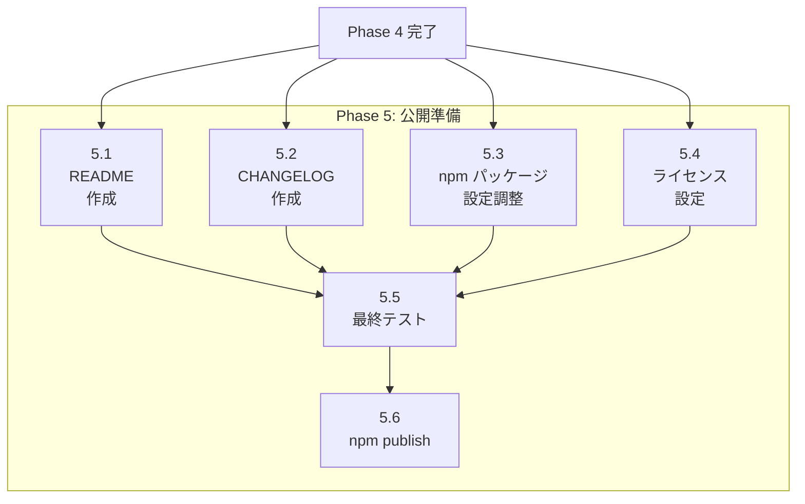

# Phase 5: 公開準備

## タスク一覧

| ID | タスク | 予想工数 |
|----|--------|---------|
| 5.1 | README 作成 | 3h |
| 5.2 | CHANGELOG 作成 | 2h |
| 5.3 | npm パッケージ設定調整 | 1h |
| 5.4 | ライセンス設定 | 1h |
| 5.5 | 最終テスト | 2h |
| 5.6 | npm publish | 1h |

## 依存関係図



---

## タスク 5.1: README 作成

### 概要
npm パッケージとしての README を作成する。

### 参照ファイル（既存コードの確認）

| ファイル | 確認内容 | 位置 |
|---------|---------|------|
| `README.md` | 現在の README | 全ファイル |

### 変更対象ファイル

| ファイル | 変更内容 |
|---------|---------|
| `README.md` | 全面改訂 |

### 実装詳細

README 構成:

```markdown
# markdown-viewer

> 🏁 Serve Markdown files as HTML with live reload

## Features
## Installation
## Usage
## CLI Options
## Configuration
## Contributing
## License
```

### 確認項目

- [ ] インストール手順が正確
- [ ] CLI オプションが網羅されている

---

## タスク 5.2: CHANGELOG 作成

### 概要
バージョン 2.0.0 の CHANGELOG を作成する。

### 参照ファイル（既存コードの確認）

| ファイル | 確認内容 | 位置 |
|---------|---------|------|
| `CHANGELOG.md` | 現在の CHANGELOG | 全ファイル |

### 変更対象ファイル

| ファイル | 変更内容 |
|---------|---------|
| `CHANGELOG.md` | v2.0.0 エントリー追加 |

### 実装詳細

```markdown
# Changelog

## [2.0.0] - 2026-XX-XX

### Added
- ESM support
- Express 5.x migration
- Mermaid diagram support
- Dark mode support
- Search functionality

### Changed
- CLI parser changed to Commander.js
- Directory structure reorganized

### Removed
- CommonJS support
- Connect framework
```

### 確認項目

- [ ] 全ての変更が記載されている
- [ ] フォーマットが [Keep a Changelog](https://keepachangelog.com/) に準拠

---

## タスク 5.3: npm パッケージ設定調整

### 概要
npm publish 用の package.json 設定を最終調整する。

### 参照ファイル（既存コードの確認）

| ファイル | 確認内容 | 位置 |
|---------|---------|------|
| `package.json` | 現在の設定 | 全ファイル |

### 変更対象ファイル

| ファイル | 変更内容 |
|---------|---------|
| `package.json` | メタデータ更新、files 設定 |
| `.npmignore` | 新規作成 |

### 実装詳細

**package.json の files 設定**:

```json
{
  "files": [
    "bin/",
    "src/",
    "templates/",
    "public/",
    "README.md",
    "LICENSE"
  ]
}
```

### 確認項目

- [ ] `npm pack` で正しいファイルが含まれる
- [ ] 不要なファイルが除外されている

---

## タスク 5.4: ライセンス設定

### 概要
ライセンスファイルを確認・更新する。

### 参照ファイル（既存コードの確認）

| ファイル | 確認内容 | 位置 |
|---------|---------|------|
| `LICENSE` | 現在のライセンス | 全ファイル |
| `package.json:66` | license フィールド | |

### 変更対象ファイル

| ファイル | 変更内容 |
|---------|---------|
| `LICENSE` | 年号更新 |

### 確認項目

- [ ] ライセンス年号が最新
- [ ] package.json と一致

---

## タスク 5.5: 最終テスト

### 概要
リリース前の最終確認テストを実施する。

### 変更対象ファイル

なし（テスト実行のみ）

### 実装詳細

**テストチェックリスト**:

```bash
# 1. 全テスト実行
npm test

# 2. カバレッジ確認
npm run test:coverage

# 3. Lint 確認
npm run lint

# 4. ローカルインストールテスト
npm pack
npm install -g markdown-viewer-1.0.0.tgz
mdv --help
mdv .

# 5. 各機能の手動確認
# - Markdown レンダリング
# - ディレクトリ一覧
# - Mermaid 図
# - ダークモード
```

### 確認項目

- [ ] 全テストが通過
- [ ] カバレッジ 80% 以上
- [ ] ローカルインストールが成功
- [ ] 主要機能が動作

---

## タスク 5.6: npm publish

### 概要
npm に パッケージを公開する。

### 変更対象ファイル

なし（npm publish 実行のみ）

### 実装詳細

```bash
# 1. npm ログイン確認
npm whoami

# 2. バージョン確認
npm version

# 3. Dry run
npm publish --dry-run

# 4. 公開
npm publish

# 5. 確認
npm info markdown-viewer
```

### 確認項目

- [ ] npm に公開されている
- [ ] `npm install -g markdown-viewer` でインストール可能

---

## Phase 5 成果物

| ファイル | 説明 |
|---------|------|
| `README.md` | 最終版 README |
| `CHANGELOG.md` | v2.0.0 CHANGELOG |
| `LICENSE` | ライセンスファイル |
| `package.json` | 最終版設定 |
| `.npmignore` | npm 除外設定 |
