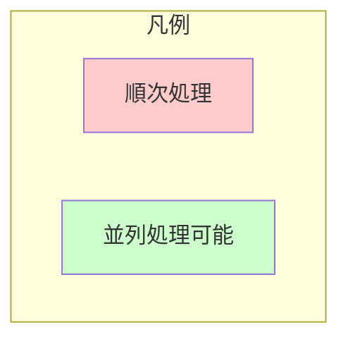
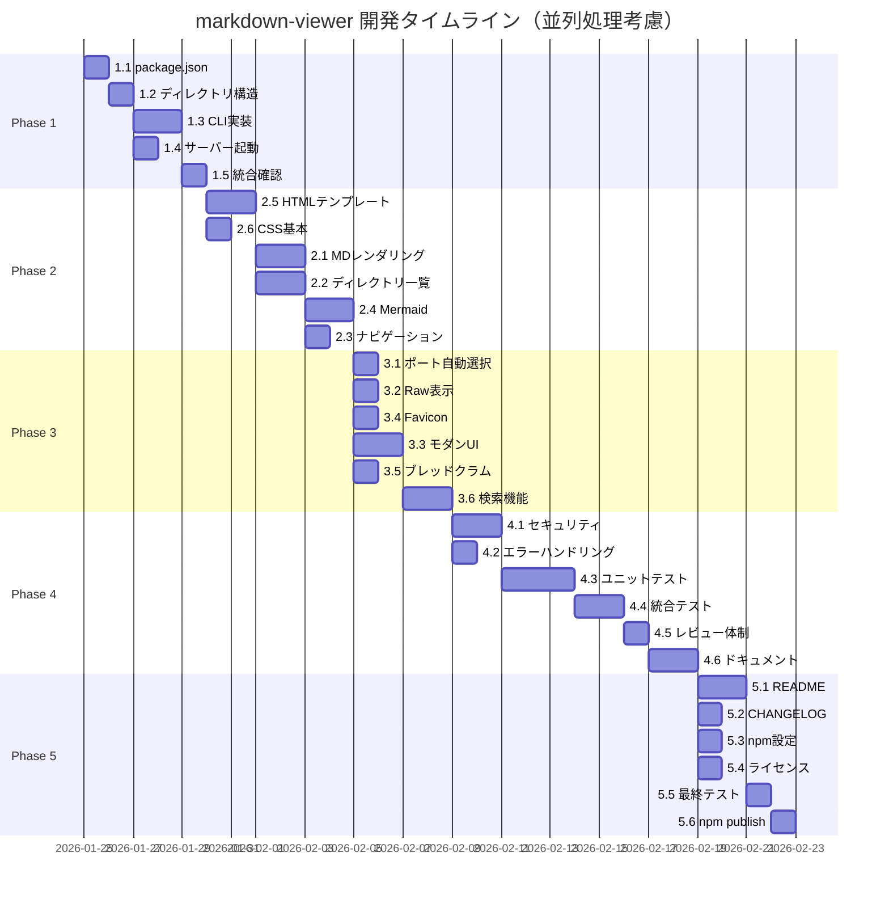

# 並列処理戦略概要

## 並列処理可能なタスクグループ

各フェーズ内で並列処理可能なタスクを識別し、開発効率を最大化します。

| フェーズ | 並列グループ | タスク | コンフリクトリスク |
|---------|-------------|--------|------------------|
| Phase 1 | Group A | 1.3, 1.4 | 低（異なるファイル） |
| Phase 2 | Group B | 2.5, 2.6 | なし（異なるディレクトリ） |
| Phase 2 | Group C | 2.1, 2.2 | 低（独立モジュール） |
| Phase 3 | Group D | 3.1, 3.2, 3.4 | なし（完全独立） |
| Phase 3 | Group E | 3.3, 3.5 | 低（UI関連だが異なるファイル） |
| Phase 4 | Group F | 4.1, 4.2 | なし（独立モジュール） |
| Phase 5 | Group G | 5.1, 5.2, 5.3, 5.4 | なし（独立ファイル） |

---

## タスク実行順序サマリー

### 全体実行フロー

### 並列実行可能タスク一覧

| フェーズ | 並列グループ | タスク | 最大並列数 | 効率化 |
|---------|-------------|--------|-----------|--------|
| Phase 1 | A | 1.3 + 1.4 | 2 | 5h → 3h |
| Phase 2 | B | 2.5 + 2.6 | 2 | 5h → 3h |
| Phase 2 | C | 2.1 + 2.2 | 2 | 7h → 4h |
| Phase 2 | D | 2.3 + 2.4 | 2 | 5h → 3h |
| Phase 3 | E | 3.1 + 3.2 + 3.4 | 3 | 4h → 2h |
| Phase 3 | F | 3.3 + 3.5 | 2 | 6h → 4h |
| Phase 4 | G | 4.1 + 4.2 | 2 | 5h → 3h |
| Phase 5 | H | 5.1 + 5.2 + 5.3 + 5.4 | 4 | 7h → 3h |

**合計工数**: 67h（順次） → **約 45h**（並列最適化時）
