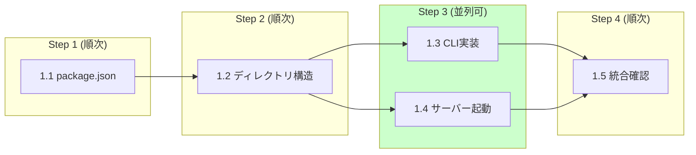

# Phase 1: 基盤構築

**目標**: プロジェクト初期化と CLI フレームワークの構築

## 実行順序と並列処理

| ステップ | タスク | 並列 | ブランチ |
|---------|--------|------|---------|
| 1 | 1.1 | - | `feature/p1-package-setup` |
| 2 | 1.2 | - | 同上（継続） |
| 3 | 1.3, 1.4 | **可能** | `feature/p1-cli`, `feature/p1-server` |
| 4 | 1.5 | - | `develop` でマージ後統合 |

## タスク一覧

| # | タスク | 予想工数 | 担当ファイル | 状態 |
|---|--------|---------|-------------|------|
| 1.1 | package.json と ESM 設定 | 2h | `package.json` | pending |
| 1.2 | ディレクトリ構造作成 | 1h | `src/`, `bin/`, `templates/` | pending |
| 1.3 | Commander.js による CLI 実装 | 3h | `src/cli.js`, `bin/mdv.js` | pending |
| 1.4 | 基本サーバー起動機能 | 2h | `src/server.js` | pending |
| 1.5 | ポート指定と起動確認 | 1h | `src/cli.js`, `src/server.js` | pending |

## 成果物

- `package.json`: ESM対応、必要な依存関係記載
- `src/` ディレクトリ構造
- `src/cli.js`: コマンドラインインターフェース
- `src/server.js`: 基本的な HTTP サーバー実装
- `bin/mdv.js`: 実行可能ファイル

## 確認項目

- [ ] `npm start` でサーバーが起動すること
- [ ] `mdv --help` でヘルプが表示されること
- [ ] 指定ポートでサーバーが起動すること
