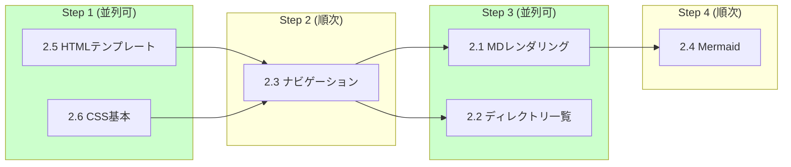

# Phase 2: コア機能

**目標**: Markdown ファイルの描画と基本的なナビゲーション機能の実装

## 実行順序と並列処理

| ステップ | タスク | 並列 | ブランチ |
|---------|--------|------|---------|
| 1 | 2.5, 2.6 | **可能** | `feature/p2-templates`, `feature/p2-styles` |
| 2 | 2.3 | - | `feature/p2-navigation` |
| 3 | 2.1, 2.2 | **可能** | `feature/p2-renderer`, `feature/p2-directory` |
| 4 | 2.4 | - | `feature/p2-mermaid` |

## タスク一覧

| # | タスク | 予想工数 | 担当ファイル | 状態 |
|---|--------|---------|-------------|------|
| 2.1 | Markdown レンダリング | 4h | `src/routes/markdown.js` | pending |
| 2.2 | ディレクトリ一覧表示 | 3h | `src/routes/directory.js` | pending |
| 2.3 | ファイルナビゲーション | 2h | `src/utils/navigation.js` | pending |
| 2.4 | Mermaid 図サポート | 3h | `public/js/app.js` | pending |
| 2.5 | HTML テンプレート | 3h | `templates/page.html` | pending |
| 2.6 | CSS スタイリング基本 | 2h | `public/styles/base.css` | pending |

## 成果物

- `src/routes/markdown.js`: Markdown レンダリングルート
- `src/routes/directory.js`: ディレクトリ一覧ルート
- `src/utils/navigation.js`: ナビゲーションユーティリティ
- `public/js/app.js`: クライアントサイドJS（Mermaid処理含む）
- `templates/page.html`: メインテンプレート
- `public/styles/base.css`: 基本スタイルシート

## 確認項目

- [ ] Markdown ファイルが正しく HTML にレンダリングされること
- [ ] コード行番号が表示されること
- [ ] ディレクトリ一覧が表示されること
- [ ] Mermaid 図が正しく表示されること
- [ ] ファイル間のナビゲーションが機能すること
