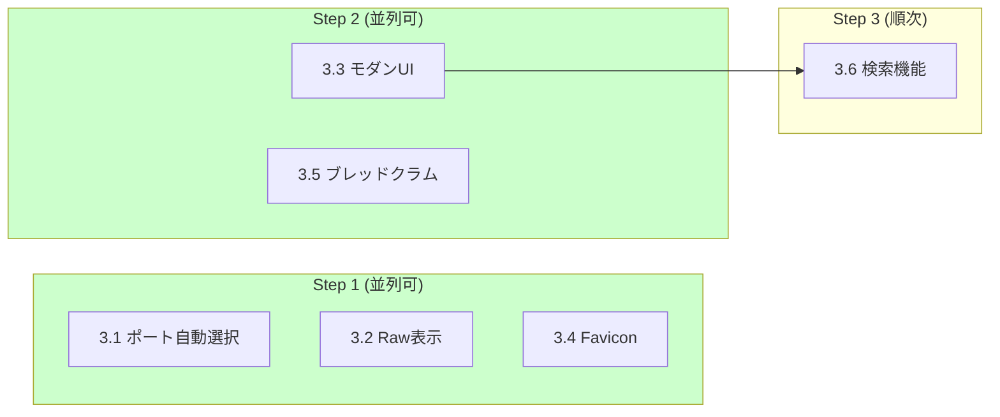

# Phase 3: 追加機能

**目標**: ユーザー体験の向上と実用性の拡張

## 実行順序と並列処理

| ステップ | タスク | 並列 | ブランチ |
|---------|--------|------|---------|
| 1 | 3.1, 3.2, 3.4 | **可能** | `feature/p3-port-finder`, `feature/p3-raw-viewer`, `feature/p3-favicon` |
| 2 | 3.3, 3.5 | **可能** | `feature/p3-modern-ui`, `feature/p3-breadcrumb` |
| 3 | 3.6 | - | `feature/p3-search` |

## タスク一覧

| # | タスク | 予想工数 | 担当ファイル | 状態 |
|---|--------|---------|-------------|------|
| 3.1 | 複数インスタンス対応 | 2h | `src/utils/port.js` | pending |
| 3.2 | Raw コード表示 | 1h | `src/routes/raw.js` | pending |
| 3.3 | モダン UI スタイリング | 4h | `public/styles/modern.css` | pending |
| 3.4 | Favicon 追加 | 1h | `public/favicon.ico` | pending |
| 3.5 | ナビゲーション強化 | 2h | `public/js/navigation.js` | pending |
| 3.6 | 検索機能 (opt) | 3h | `src/routes/api.js`, `public/js/search.js` | pending |

## 成果物

- `src/utils/port.js`: ポート自動選択ロジック
- `public/styles/modern.css`: モダンスタイルシート
- `public/favicon.ico`, `public/favicon.svg`: ファビコン
- `src/routes/raw.js`: Raw 表示ルート
- `public/js/navigation.js`: クライアント側ナビゲーション
- `src/routes/api.js`: 検索API

## 確認項目

- [ ] ポート自動選択が機能すること
- [ ] モダンな UI が表示されること
- [ ] Raw コード表示が機能すること
- [ ] ブレッドクラムナビゲーションが表示されること
