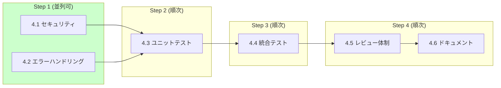

# Phase 4: 品質保証

**目標**: セキュリティ、信頼性、保守性の確保

## 実行順序と並列処理

| ステップ | タスク | 並列 | ブランチ |
|---------|--------|------|---------|
| 1 | 4.1, 4.2 | **可能** | `feature/p4-security`, `feature/p4-error-handling` |
| 2 | 4.3 | - | `feature/p4-unit-tests` |
| 3 | 4.4 | - | `feature/p4-integration-tests` |
| 4 | 4.5, 4.6 | 順次 | `feature/p4-docs` |

## タスク一覧

| # | タスク | 予想工数 | 担当ファイル | 状態 |
|---|--------|---------|-------------|------|
| 4.1 | セキュリティ対策 | 3h | `src/utils/path.js`, `src/middleware/security.js` | pending |
| 4.2 | エラーハンドリング | 2h | `src/middleware/error.js`, `src/utils/logger.js` | pending |
| 4.3 | ユニットテスト | 5h | `tests/unit/**` | pending |
| 4.4 | 統合テスト | 4h | `tests/integration/**` | pending |
| 4.5 | レビュー体制構築 | 1h | `.github/`, `CONTRIBUTING.md` | pending |
| 4.6 | ドキュメンテーション | 3h | `docs/**` | pending |

## 成果物

- `src/utils/path.js`: パス検証ユーティリティ
- `src/middleware/security.js`: セキュリティミドルウェア
- `src/middleware/error.js`: エラーハンドリングミドルウェア
- `src/utils/logger.js`: 統一ロガー
- `tests/unit/`: ユニットテストディレクトリ
- `tests/integration/`: 統合テストディレクトリ
- テスト実行結果レポート

## 確認項目

- [ ] すべてのセキュリティテストが通過すること
- [ ] ユニットテストカバレッジが 80% 以上であること
- [ ] 統合テストすべてが通過すること
- [ ] エラーメッセージが一貫性を持つこと
