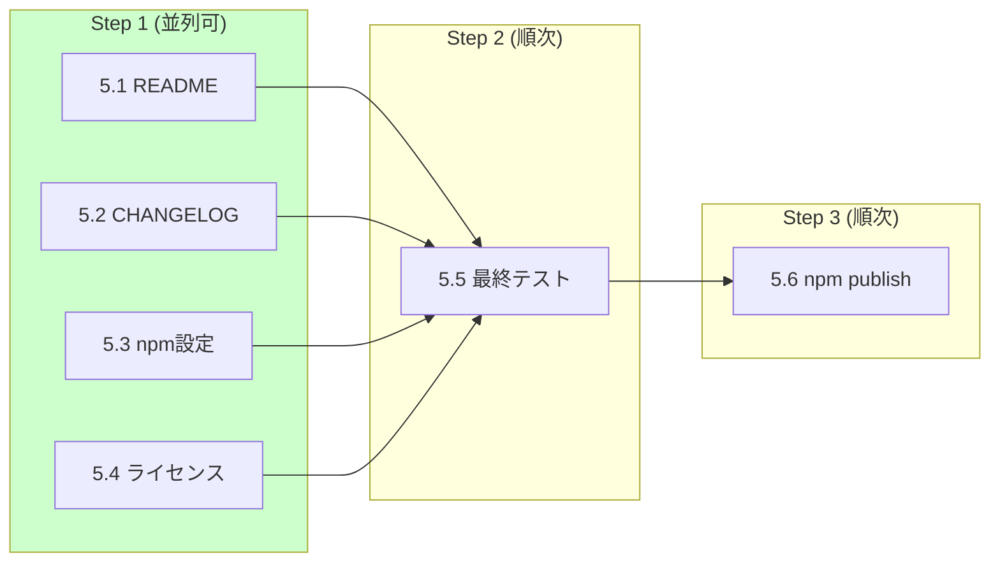

# Phase 5: 公開準備

**目標**: npm パッケージとしての公開準備完了

## 実行順序と並列処理

| ステップ | タスク | 並列 | ブランチ |
|---------|--------|------|---------|
| 1 | 5.1, 5.2, 5.3, 5.4 | **可能** | `feature/p5-readme`, `feature/p5-changelog`, `feature/p5-npm-config`, `feature/p5-license` |
| 2 | 5.5 | - | `develop` でマージ後 |
| 3 | 5.6 | - | `main` へマージ後 |

## タスク一覧

| # | タスク | 予想工数 | 担当ファイル | 状態 |
|---|--------|---------|-------------|------|
| 5.1 | README 作成 | 3h | `README.md` | pending |
| 5.2 | CHANGELOG 作成 | 2h | `CHANGELOG.md` | pending |
| 5.3 | npm パッケージ設定 | 1h | `package.json` | pending |
| 5.4 | ライセンス設定 | 1h | `LICENSE` | pending |
| 5.5 | 最終テスト | 2h | - | pending |
| 5.6 | npm publish | 1h | - | pending |

## 成果物

- `README.md`: プロジェクト概要とインストール手順
- `CHANGELOG.md`: バージョン履歴
- `LICENSE`: ライセンスファイル
- `package.json`: 最終版設定

## 確認項目

- [ ] README が完全で分かりやすいこと
- [ ] CHANGELOG が正確であること
- [ ] npm パッケージ情報が正確であること
- [ ] `npm install -g markdown-viewer` でインストール可能であること
