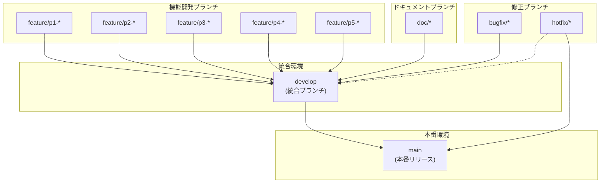

# 開発ルール：ブランチ戦略

## ブランチ階層構造



## ブランチ命名規則（詳細）

| 種類 | パターン | 例 | 派生元 |
|------|----------|-----|--------|
| 機能開発 | `feature/p{N}-{task-name}` | `feature/p1-cli-setup` | `develop` |
| バグ修正 | `bugfix/{issue-description}` | `bugfix/path-traversal` | `develop` |
| 緊急修正 | `hotfix/{critical-issue}` | `hotfix/server-crash` | `main` |
| リリース | `release/v{version}` | `release/v2.0.0` | `develop` |
| ドキュメント | `doc/{document-name}` | `doc/basic-new-spec` | `develop` |

## ドキュメントブランチ運用ルール

`doc/*` ブランチは仕様書やドキュメントの作成・更新に使用します。

**用途**:
- 仕様書の新規作成・更新
- README、CONTRIBUTING等のプロジェクトドキュメント
- 設計ドキュメントの追加・修正

**運用フロー**:
```bash
# 1. develop から派生
git checkout develop
git checkout -b doc/basic-new-spec

# 2. ドキュメント作業を実施
# new-spec/, docs/ などを編集

# 3. develop へマージ
git checkout develop
git merge doc/basic-new-spec

# 4. ブランチ削除（オプション）
git branch -d doc/basic-new-spec
```

**マージ先**:
- 通常は `develop` へマージ
- 緊急のドキュメント修正は `main` へ直接マージも可

## 全ブランチ一覧（計画）

```
main
├── develop
│   ├── doc/basic-new-spec            # 仕様書作成・更新
│   ├── doc/*                         # その他ドキュメント作業
│   │
│   ├── feature/p1-package-setup      # 1.1, 1.2
│   ├── feature/p1-cli                # 1.3
│   ├── feature/p1-server             # 1.4, 1.5
│   │
│   ├── feature/p2-templates          # 2.5
│   ├── feature/p2-styles             # 2.6
│   ├── feature/p2-renderer           # 2.1
│   ├── feature/p2-directory          # 2.2
│   ├── feature/p2-navigation         # 2.3
│   ├── feature/p2-mermaid            # 2.4
│   │
│   ├── feature/p3-port-finder        # 3.1
│   ├── feature/p3-raw-viewer         # 3.2
│   ├── feature/p3-modern-ui          # 3.3
│   ├── feature/p3-favicon            # 3.4
│   ├── feature/p3-breadcrumb         # 3.5
│   ├── feature/p3-search             # 3.6
│   │
│   ├── feature/p4-security           # 4.1
│   ├── feature/p4-error-handling     # 4.2
│   ├── feature/p4-unit-tests         # 4.3
│   ├── feature/p4-integration-tests  # 4.4
│   ├── feature/p4-docs               # 4.5, 4.6
│   │
│   ├── feature/p5-readme             # 5.1
│   ├── feature/p5-changelog          # 5.2
│   ├── feature/p5-npm-config         # 5.3
│   └── feature/p5-license            # 5.4
│
└── release/v2.0.0                    # 5.5, 5.6
```

## コミットメッセージ

**Conventional Commits** に準拠します。

```
<type>(<scope>): <subject>

<body>

<footer>
```

### Type

- `feat`: 新機能
- `fix`: バグ修正
- `refactor`: コード整理（機能変更なし）
- `test`: テスト追加/修正
- `docs`: ドキュメント
- `chore`: ビルド、パッケージ管理など
- `perf`: パフォーマンス改善

### 例

```
feat(renderer): add Mermaid diagram support

- Implemented mermaid-js integration
- Added syntax highlighting for diagram blocks
- Support for all Mermaid diagram types

Closes #123
```

## PR レビュー基準

- [ ] コードが要件を満たしているか
- [ ] テストが全て通過しているか
- [ ] セキュリティに問題がないか
- [ ] ドキュメントが更新されているか
- [ ] コードスタイルが統一されているか
- [ ] パフォーマンスに悪影響がないか
