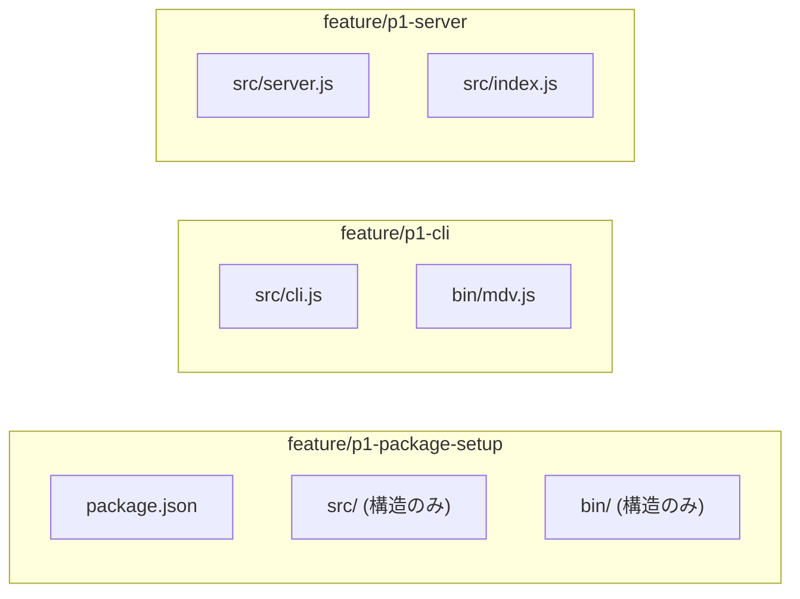
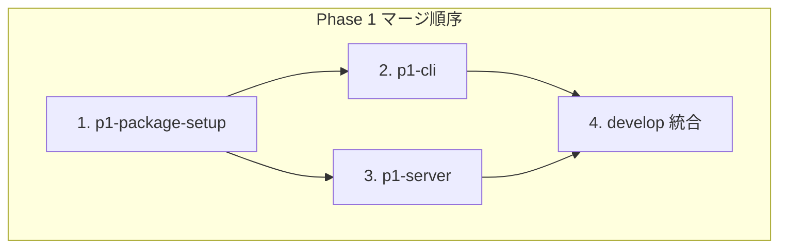
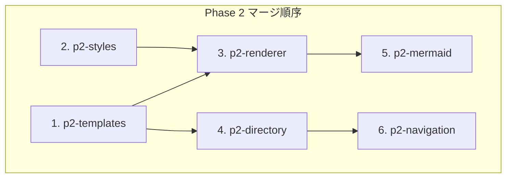

# コンフリクト防止戦略

## ディレクトリ・ファイル所有権マッピング

並列処理時のコンフリクトを防ぐため、各ブランチが編集可能なファイル/ディレクトリを明確に定義します。

### Phase 1 所有権マップ



| ブランチ | 所有ファイル | 参照のみ |
|---------|-------------|---------|
| `feature/p1-package-setup` | `package.json`, `src/` (構造), `bin/` (構造) | - |
| `feature/p1-cli` | `src/cli.js`, `bin/mdv.js` | `package.json` |
| `feature/p1-server` | `src/server.js`, `src/index.js` | `package.json` |

### Phase 2 所有権マップ

| ブランチ | 所有ファイル | 参照のみ |
|---------|-------------|---------|
| `feature/p2-templates` | `templates/**` | - |
| `feature/p2-styles` | `public/styles/base.css` | - |
| `feature/p2-renderer` | `src/routes/markdown.js` | `templates/`, `public/styles/` |
| `feature/p2-directory` | `src/routes/directory.js` | `templates/` |
| `feature/p2-navigation` | `src/utils/navigation.js` | `src/routes/markdown.js` |
| `feature/p2-mermaid` | `public/js/app.js` | `templates/` |

### Phase 3 所有権マップ

| ブランチ | 所有ファイル | 参照のみ |
|---------|-------------|---------|
| `feature/p3-port-finder` | `src/utils/port.js` | `src/server.js` |
| `feature/p3-raw-viewer` | `src/routes/raw.js` | `src/routes/markdown.js` |
| `feature/p3-modern-ui` | `public/styles/modern.css` | `templates/` |
| `feature/p3-favicon` | `public/favicon.ico`, `public/favicon.svg` | - |
| `feature/p3-breadcrumb` | `public/js/navigation.js` | `templates/` |
| `feature/p3-search` | `src/routes/api.js`, `public/js/search.js` | 全体 |

### Phase 4 所有権マップ

| ブランチ | 所有ファイル | 参照のみ |
|---------|-------------|---------|
| `feature/p4-security` | `src/utils/path.js`, `src/middleware/security.js` | `src/**` |
| `feature/p4-error-handling` | `src/middleware/error.js`, `src/utils/logger.js` | `src/**` |
| `feature/p4-unit-tests` | `tests/unit/**` | `src/**` |
| `feature/p4-integration-tests` | `tests/integration/**` | `src/**`, `tests/unit/**` |
| `feature/p4-docs` | `docs/**`, `.github/**`, `CONTRIBUTING.md` | - |

### Phase 5 所有権マップ

| ブランチ | 所有ファイル | 参照のみ |
|---------|-------------|---------|
| `feature/p5-readme` | `README.md` | 全体 |
| `feature/p5-changelog` | `CHANGELOG.md` | git log |
| `feature/p5-npm-config` | `package.json` (メタデータのみ) | - |
| `feature/p5-license` | `LICENSE` | - |

---

## コンフリクト回避ルール

### 1. 共有ファイル編集ルール

**`package.json` の編集**

```json
// 各ブランチが編集可能なセクション
{
  // p1-package-setup のみ
  "name": "...",
  "version": "...",
  "type": "module",
  "main": "...",
  "bin": {},
  "engines": {},

  // p1-package-setup + 各フェーズで追加
  "dependencies": {},
  "devDependencies": {},

  // p5-npm-config のみ
  "description": "...",
  "keywords": [],
  "author": "...",
  "repository": {},
  "bugs": {},
  "homepage": "..."
}
```

### 2. マージ順序ルール

同一ファイルを編集する可能性があるブランチのマージ順序を定義：





### 3. レビュー前チェックリスト

並列開発ブランチをマージする前に確認：

```bash
# 1. develop の最新を取得
git fetch origin develop

# 2. コンフリクトの事前確認
git merge-tree $(git merge-base HEAD origin/develop) HEAD origin/develop

# 3. 所有権外のファイル変更がないか確認
git diff origin/develop --name-only | grep -v "^<所有ファイルパターン>"

# 4. リベースして最新化
git rebase origin/develop
```

### 4. 自動コンフリクト検出 (CI)

`.github/workflows/conflict-check.yml` で自動チェック：

```yaml
# 推奨設定（Phase 4 で実装）
name: Conflict Check
on: [pull_request]

jobs:
  ownership-check:
    runs-on: ubuntu-latest
    steps:
      - name: Check file ownership
        run: |
          # 変更されたファイルが所有権マップに準拠しているか確認
          # 違反があれば警告を出力
```

---

## 並列開発ワークフロー

### 開始時

```bash
# 1. develop から最新を取得
git checkout develop
git pull origin develop

# 2. 新しいブランチを作成
git checkout -b feature/p2-renderer

# 3. 担当ファイルのみ編集
# src/renderer.js のみ編集可能
```

### 作業中

```bash
# 定期的に develop をマージ（1日1回推奨）
git fetch origin develop
git merge origin/develop

# コンフリクトがあれば即座に解決
```

### 完了時

```bash
# 1. 最終リベース
git fetch origin develop
git rebase origin/develop

# 2. 所有権外の変更がないことを確認
git diff origin/develop --name-only

# 3. PR 作成
gh pr create --base develop --title "feat(renderer): implement markdown rendering"
```
