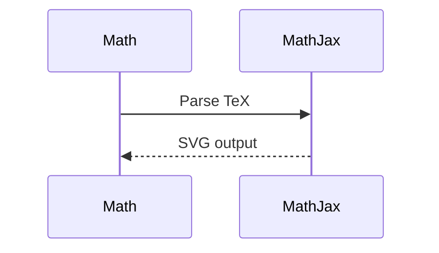

# Combined Test: Mermaid + MathJax

## Flowchart with Math Reference

The relationship between x and y is: $y = f(x) = x^2 + 2x + 1$

## Math Formulas

Euler's identity: $e^{i\pi} + 1 = 0$

$$\frac{d}{dx}\left(\int_a^x f(t)dt\right) = f(x)$$

## Another Diagram

This demonstrates that both Mermaid diagrams and MathJax formulas can coexist on the same page.
