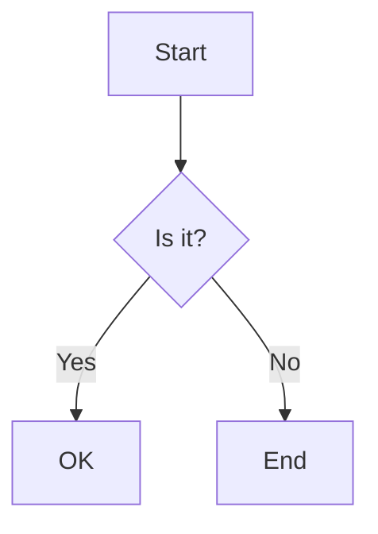
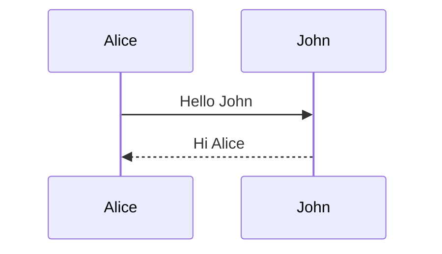

# Mermaid Test

## Flowchart

```mermaid
flowchart TD
    A[Start] --> B{Is it?}
    B -->|Yes| C[OK]
    B -->|No| D[End]
```

## Sequence Diagram

```mermaid
sequenceDiagram
    Alice->>John: Hello John
    John-->>Alice: Hi Alice
```

## Multiple Diagrams

Above are multiple Mermaid diagrams that should render correctly.
